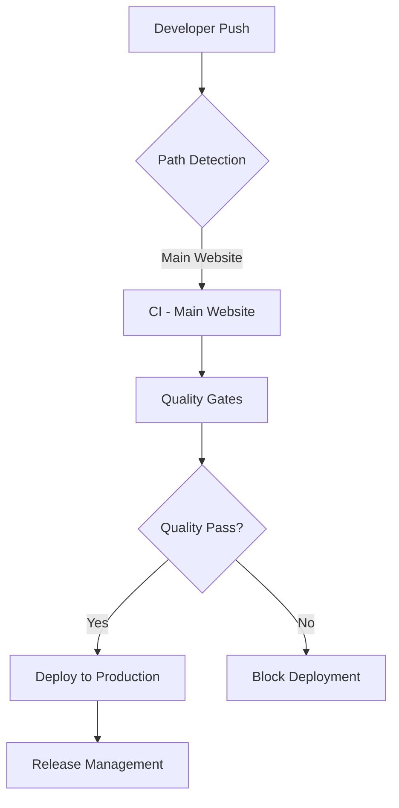
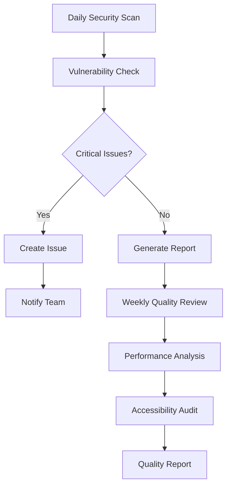

# GitHub Workflows Documentation

## 🚀 GitHub Actions Automation Suite

This repository implements a comprehensive GitHub Actions workflow system designed for the **Escola Habilidade** educational website.

### 📋 Repository Structure

- **Main Website**: React 19 + Vite (root directory)

## 🔄 Available Workflows

### 1. CI - Main Website (`ci-main-website.yml`)

**Trigger**: Push/PR to main/develop affecting main website files
**Purpose**: Continuous Integration for React + Vite application

**Features**:
- ✅ Path-based change detection
- 🧹 ESLint validation with detailed reporting
- 🧪 Jest testing with coverage reports
- 🏗️ Production build verification
- ⚡ Lighthouse performance audits
- ♿ Accessibility testing with Axe
- 🔒 Security scanning (npm audit, Snyk)
- 📊 Bundle size analysis

**Quality Gates**:
- All tests must pass
- No ESLint errors
- Successful production build
- Security vulnerabilities addressed

---


### 3. Production Deployment (`cd-production.yml`)

**Trigger**: Push to main, tags (v*), or manual dispatch
**Purpose**: Automated production deployment

**Features**:
- 🔍 Pre-deployment validation
- 📦 Automated version management
- 🌐 GitHub Pages deployment (main website)
- 🎓 Vercel deployment (learning platform)
- 🗄️ Supabase Edge Functions deployment
- 🔄 Post-deployment health checks
- 📊 Deployment status tracking
- 🚨 Automatic rollback on failure

**Deployment Target**:
- **Main Website**: https://stelarow.github.io/habilidade

---

### 4. Security Audit (`security-audit.yml`)

**Trigger**: Daily at 2 AM UTC, dependency changes, manual dispatch
**Purpose**: Comprehensive security monitoring

**Features**:
- 🔍 Dependency vulnerability scanning (npm audit, Snyk, OWASP)
- 🔒 Static code security analysis (CodeQL, Semgrep)
- 🕵️ Secrets detection (TruffleHog, GitLeaks)
- 📜 License compliance checking
- 📊 Security metrics dashboard
- 🚨 Automated issue creation for critical findings
- 📧 Team notifications for security alerts

**Scan Coverage**:
- Both main website and learning platform
- All dependency trees
- Source code security patterns
- Configuration files
- Git history for leaked secrets

---

### 5. Quality Gates (`quality-gates.yml`)

**Trigger**: Push/PR to main/develop, weekly schedule, manual dispatch
**Purpose**: Code quality and standards enforcement

**Features**:
- 📊 Code quality analysis (ESLint, SonarJS, complexity)
- 🧪 Test coverage analysis with quality gates (80% minimum)
- ⚡ Performance benchmarking with Lighthouse
- ♿ Accessibility compliance testing (WCAG 2.1 AA)
- 📈 Quality metrics tracking
- 📋 Comprehensive quality reports
- 🎯 Configurable quality thresholds

**Quality Standards**:
- **Coverage**: 80% minimum
- **Performance**: 85+ Lighthouse score
- **Accessibility**: 90+ Lighthouse score
- **Maintainability**: Grade A required

---

### 6. Release Management (`release-management.yml`)

**Trigger**: Version tags (v*) or manual dispatch
**Purpose**: Automated release creation and management

**Features**:
- 📦 Semantic version management
- 📝 Automated changelog generation
- 🏗️ Release asset building and packaging
- 📋 Comprehensive release notes
- 🚀 Automated production deployment
- 📢 Release announcements
- 🧹 Old release cleanup
- 📊 Release metrics tracking

**Release Types**:
- **Patch**: Bug fixes and minor updates
- **Minor**: New features and enhancements
- **Major**: Breaking changes and major updates
- **Prerelease**: Alpha/beta versions

---

### 7. GitHub Pages Deployment (`deploy.yml` - Enhanced)

**Trigger**: Push to main affecting website files, manual dispatch
**Purpose**: Optimized GitHub Pages deployment for main website

**Features**:
- 🔍 Smart change detection
- 🏗️ Optimized build process
- ✅ Build verification and health checks
- 🌐 Deployment verification
- 📊 Deployment summaries
- ⚡ Fast deployment with caching

## 🎯 Workflow Integration Strategy

### Development Workflow



### Security & Quality Monitoring



## 🔧 Configuration & Secrets

### Required Secrets

**General**:
- `GITHUB_TOKEN` - Automatic (GitHub provides)

**Security Scanning**:
- `SNYK_TOKEN` - Snyk vulnerability scanning
- `SEMGREP_APP_TOKEN` - Semgrep security analysis
- `GITLEAKS_LICENSE` - GitLeaks secrets detection

**Performance Monitoring**:
- `LHCI_GITHUB_APP_TOKEN` - Lighthouse CI integration

### Environment Variables

**Development**:
```bash
NODE_VERSION=20
QUALITY_GATE_COVERAGE=80
QUALITY_GATE_MAINTAINABILITY=A
QUALITY_GATE_RELIABILITY=A
QUALITY_GATE_SECURITY=A
```

**Production**:
```bash
CI=false
NODE_ENV=production
DEPLOYMENT_TIMEOUT=10m
```

## 📊 Monitoring & Reporting

### Workflow Status Dashboard

Each workflow provides comprehensive reporting:

- ✅ **Status Badges**: Real-time workflow status
- 📊 **Quality Metrics**: Coverage, performance, accessibility scores
- 🔒 **Security Reports**: Vulnerability assessments
- 📈 **Performance Trends**: Historical performance data
- 📋 **Deployment Logs**: Detailed deployment information

### Notification System

Automated notifications for:
- 🚨 Critical security vulnerabilities
- ❌ Failed deployments
- 📉 Quality gate failures
- 🎉 Successful releases
- 📊 Weekly quality reports

## 🛠️ Maintenance & Updates

### Weekly Maintenance Tasks

1. **Review Security Reports**: Check for new vulnerabilities
2. **Update Dependencies**: Keep packages current
3. **Monitor Performance**: Track performance trends
4. **Review Quality Metrics**: Ensure quality standards are met
5. **Clean Old Artifacts**: Remove outdated build artifacts

### Monthly Reviews

1. **Workflow Optimization**: Identify improvement opportunities
2. **Security Policy Updates**: Update security configurations
3. **Performance Baselines**: Adjust performance thresholds
4. **Documentation Updates**: Keep documentation current

## 🚀 Getting Started

### For Developers

1. **Clone Repository**: Standard git clone
2. **Install Dependencies**: `npm install` in both directories
3. **Set Environment Variables**: Copy `.env.example` files
4. **Run Local Development**: `npm run dev`
5. **Create Feature Branch**: Follow Git Flow methodology
6. **Submit Pull Request**: Automated CI will run

### For Maintainers

1. **Configure Secrets**: Add required secrets in GitHub Settings
2. **Set Branch Protection**: Configure main branch protection rules
3. **Review Workflow Permissions**: Ensure proper security settings
4. **Monitor First Runs**: Watch initial workflow executions
5. **Tune Quality Gates**: Adjust thresholds based on project needs

## 📋 Troubleshooting

### Common Issues

**Build Failures**:
- Check Node.js version compatibility
- Verify all dependencies are installed
- Review environment variable configuration

**Deployment Issues**:
- Confirm secrets are properly configured
- Check branch protection rules
- Verify GitHub Pages settings

**Security Scan Failures**:
- Review vulnerability reports
- Update dependencies with known issues
- Configure security tool tokens

**Quality Gate Failures**:
- Check test coverage requirements
- Review code quality metrics
- Address accessibility violations

### Support Resources

- **GitHub Actions Documentation**: https://docs.github.com/actions
- **Workflow Logs**: Available in GitHub Actions tab
- **Issue Tracking**: Use repository issues for workflow problems
- **Security Alerts**: Automated via GitHub Security tab

---

## 🔄 Continuous Improvement

This workflow system is designed to evolve with the project needs. Regular reviews and updates ensure optimal performance, security, and quality standards are maintained.

**Last Updated**: Generated by GitHub Actions Workflow Automation
**Version**: v1.0.0
**Maintainer**: GitHub Actions Team