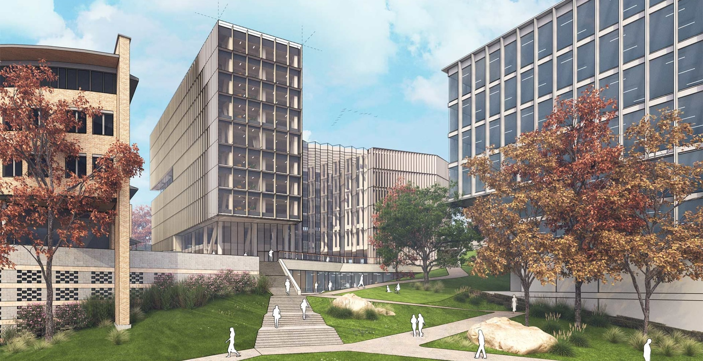
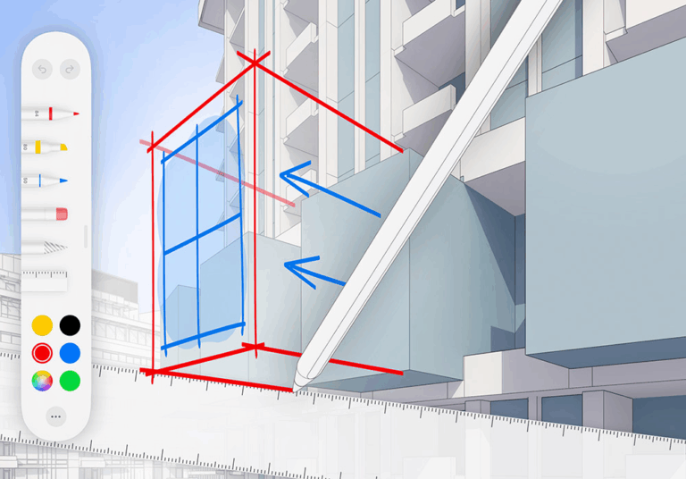
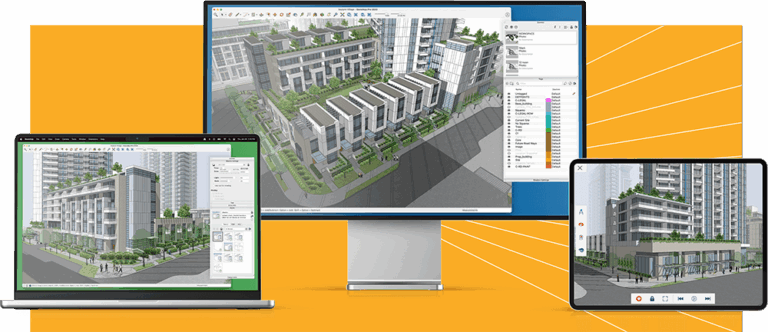

# Como Usar SketchUp para Design Conceitual Arquitetônico: Guia Completo

Quando se trata de explorar ideias iniciais em arquitetura, os profissionais precisam de uma ferramenta que seja rápida, intuitiva e flexível o suficiente para capturar a criatividade bruta. O **SketchUp para design conceitual** é exatamente essa ferramenta — uma plataforma leve, mas poderosa, que ajuda a transformar ideias abstratas em conceitos arquitetônicos viáveis.

Seja para estudos de massa, testes de arranjos espaciais ou esboços de volumes iniciais, o SketchUp oferece o equilíbrio ideal entre velocidade e precisão para o design esquemático. Neste artigo, apresentamos um **guia passo a passo** para aproveitar ao máximo as funcionalidades do SketchUp durante as fases iniciais de seu fluxo de trabalho arquitetônico.

## Objetivos de Aprendizagem

Ao final deste tutorial, você será capaz de:
- Configurar um ambiente de trabalho otimizado para design conceitual
- Criar estudos de massa usando geometrias simples
- Organizar projetos com layers e tags eficientemente  
- Utilizar ferramentas de sombra para análise solar
- Exportar apresentações profissionais de conceitos

## Pré-requisitos

- Conhecimento básico do SketchUp
- Familiaridade com conceitos de design arquitetônico
- SketchUp instalado (versão Free ou Pro)

---

## Passo 1: Comece com um Template em Branco ou Template de Design Conceitual

A maneira mais simples de começar é com uma tela em branco. Abra o SketchUp e escolha o template **Architectural Design – Feet and Inches** ou **Millimeters**, dependendo da sua região.

### Dica Pro: Templates Gratuitos
Você pode baixar templates gratuitos de design conceitual do **SketchUp 3D Warehouse** ou Extension Warehouse para acelerar seu fluxo de trabalho. Estes frequentemente incluem:
- Cenas predefinidas
- Layers organizadas
- Blocos de massa customizados
- Configurações otimizadas para fases iniciais

**💡 Exercício Prático:** Configure um template personalizado com suas configurações preferidas de unidades, estilos visuais e cenas básicas para reutilizar em projetos futuros.

---

## Passo 2: Crie o Contexto do Terreno ou Base

Antes de mergulhar nos conceitos arquitetônicos, é importante definir o terreno. Importe um mapa, topografia ou planta do edifício usando:
- Ferramentas de geolocalização
- Imagens de referência
- Dados topográficos existentes

### Ferramentas Essenciais:
- **Rectangle Tool**: Para definir limites básicos
- **Push/Pull Tool**: Para extrudar elementos
- **Sandbox Tools**: Para modelagem de contornos em terrenos irregulares

**🎯 Dica de Especialista:** Use a ferramenta "Sandbox" para modelagem de contornos se seu projeto estiver em terreno irregular. Isso criará uma base realista para seu design.

---

## Passo 3: Inicie a Massificação com Geometria Simples

Use formas 3D básicas como cubos, cilindros e extrusões para explorar diferentes ideias de modelagem conceitual. Pense nisso como sua fase de "argila digital" — neste ponto, é menos sobre detalhes e mais sobre:

- **Forma e proporção**
- **Escala apropriada** 
- **Relações espaciais**

### Técnicas de Massa:
1. **Combinação de volumes**: Using Push/Pull e faces intersectantes
2. **Subtração de elementos**: Criando vazios e aberturas
3. **Iteração rápida**: Testando múltiplas configurações

**✨ Por que o SketchUp se destaca:** Permite iteração rápida sem complicar desnecessariamente o processo, ideal para a fase conceitual.

---

## Passo 4: Aplique Layers e Tags para Organização

Organizar seu modelo desde cedo é crucial, especialmente se você está trabalhando com múltiplas opções de design ou colaborando com outros profissionais.

### Estratégias de Organização:
- **Tags por programa**: Separe áreas públicas vs privadas
- **Elementos de paisagismo**: Mantenha separado da arquitetura
- **Iterações de design**: Versões diferentes do mesmo projeto
- **Componentes repetidos**: Agrupe e componentize para reduzir peso do arquivo

**🔧 Funcionalidades Avançadas:**
- Grouping para elementos relacionados
- Components para elementos que se repetem
- Layers para controle de visibilidade

---

## Passo 5: Experimente com Sombras e Orientação

Nas fases conceituais, o acesso solar e a orientação frequentemente guiam decisões críticas. Ative o recurso **Shadows** no SketchUp e ajuste os controles deslizantes de data/hora para testar como a luz interage com seu design.

### Benefícios da Análise Solar:
- **Aquecimento solar passivo**: Identificar oportunidades
- **Estratégias de sombreamento**: Áreas que precisam de proteção
- **Eficiência energética**: Considerações desde o primeiro dia
- **Conforto térmico**: Análise de insolação

**📊 Análise Prática:** Teste seu design em diferentes épocas do ano (solstício de verão/inverno) para validar estratégias de iluminação natural.

---

## Passo 6: Use Estilos do SketchUp para Apresentações Expressivas

O design conceitual não é apenas sobre pensamento — é sobre **comunicar ideias** efetivamente. A biblioteca de Estilos do SketchUp permite apresentar seus modelos em diferentes estilos visuais:

### Estilos Recomendados para Conceitual:
- **Hand-drawn sketch**: Mantém o aspecto criativo
- **Graphite**: Apresentação técnica elegante  
- **Blueprint**: Estilo arquitetônico tradicional
- **Watercolor**: Para apresentações artísticas

**🎨 Dica de Apresentação:** Para apresentações esquemáticas, escolha estilos não-fotorrealísticos para manter a sensação solta e criativa das ideias iniciais.

---

## Passo 7: Salve Cenas para Iterações de Design

Salve cenas diferentes para cada direção ou fase de design. Por exemplo:

### Organização de Cenas:
- **Estudo de Massa 1**: Primeira abordagem volumétrica
- **Opção Pátio**: Variante com espaço central
- **Teste Volume Dupla Altura**: Exploração vertical

**⚡ Vantagem Competitiva:** Isso permite alternar rapidamente entre conceitos de design e compartilhar opções durante críticas ou discussões com stakeholders.

---

## Passo 8: Exporte ou Transfira para Layout para Pranchas de Apresentação

Uma vez que sua modelagem conceitual esteja completa, você pode:

### Opções de Exportação:
1. **Exportação direta**: Imagens PNG/JPEG de alta qualidade
2. **LayOut Integration**: Ferramenta de apresentação do SketchUp
3. **Storyboards**: Sequências narrativas do processo
4. **Documentação inicial**: Plantas e cortes básicos

**📋 LayOut Advantages:**
- Criação de storyboards profissionais
- Anotações e dimensionamento
- Desenvolvimento de documentação inicial
- Transição suave para fases posteriores

---

## Do Esboço ao Conceito: Maximizando o Potencial

Usar o SketchUp para design conceitual capacita arquitetos a testar, iterar e visualizar suas ideias rapidamente — uma necessidade durante a fase esquemática. Seu equilíbrio entre simplicidade e poder o torna ideal para moldar a direção do design sem se atoliar em detalhes prematuramente.

Seja você um estudante testando seus primeiros conceitos arquitetônicos ou um designer experiente explorando opções volumétricas, o SketchUp oferece a liberdade de projetar com clareza e velocidade.

---

## Perguntas Frequentes

### Como iniciar um design no SketchUp?
Comece selecionando um template que corresponda às unidades do seu projeto (mm, polegadas, etc.). Use formas simples e a ferramenta push/pull para definir massas, depois refine suas formas e organize com layers.

### Existem templates gratuitos para design conceitual no SketchUp?
Sim! Você pode baixar templates gratuitos do SketchUp 3D Warehouse ou Extension Warehouse. Estes frequentemente incluem vistas predefinidas, estilos e geometria adequada para design inicial.

### Posso usar o SketchUp Free para trabalho conceitual arquitetônico?
Absolutamente. O SketchUp Free (versão web) suporta modelagem básica e desenvolvimento conceitual. Porém, para recursos avançados como estilos, estudos de sombra e integração com LayOut, o SketchUp Pro é recomendado.

### Por que o SketchUp é bom para design esquemático?
O SketchUp facilita a exploração de escala, forma e proporção rapidamente. Suporte fluxos de trabalho iterativos, testes de sombra e saídas de apresentação simples — tudo ideal para a fase esquemática.

---

## Glossário

**Design Conceitual**: Fase inicial do processo de design focada em ideias e conceitos gerais, antes do detalhamento técnico.

**Estudo de Massa**: Análise volumétrica básica que explora formas, proporções e relações espaciais sem detalhamento arquitetônico.

**LayOut**: Software de apresentação integrado ao SketchUp Pro para criação de documentação e pranchas técnicas.

**Sandbox Tools**: Conjunto de ferramentas do SketchUp para modelagem de terrenos e superfícies orgânicas.

**Tags/Layers**: Sistema de organização do SketchUp que permite controlar visibilidade e agrupar elementos relacionados.

---

## Recursos Adicionais

### Documentação Oficial
- [SketchUp Help Center](https://help.sketchup.com) - Documentação completa
- [SketchUp Campus](https://campus.sketchup.com) - Cursos oficiais gratuitos

### Extensões Recomendadas
- **Enscape**: Renderização em tempo real
- **V-Ray**: Renders fotorrealísticos profissionais  
- **Sandbox Tools**: Modelagem de terrenos avançada
- **CleanUp³**: Otimização de modelos

### Comunidade e Recursos
- **SketchUp 3D Warehouse**: Biblioteca de modelos gratuitos
- **Extension Warehouse**: Plugins e ferramentas especializadas
- **SketchUp Forum**: Comunidade ativa de usuários

---

*Este tutorial foi desenvolvido para estudantes e profissionais que desejam dominar o SketchUp para design conceitual arquitetônico. Continue praticando os exercícios propostos e explorando as possibilidades criativas desta ferramenta poderosa.*