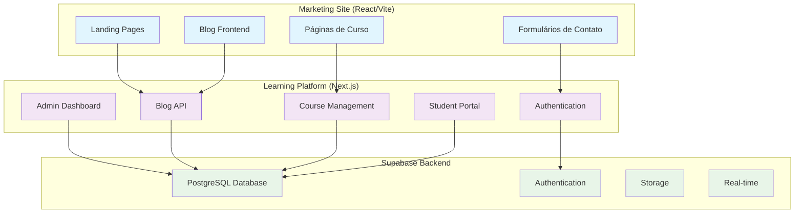
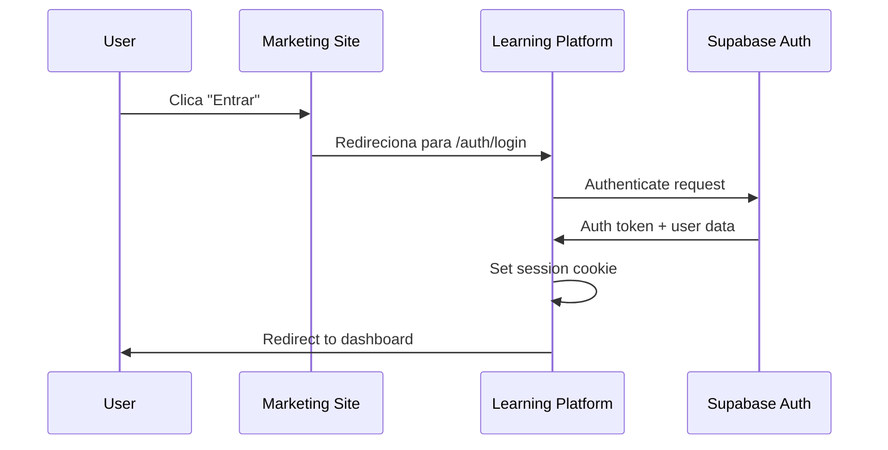
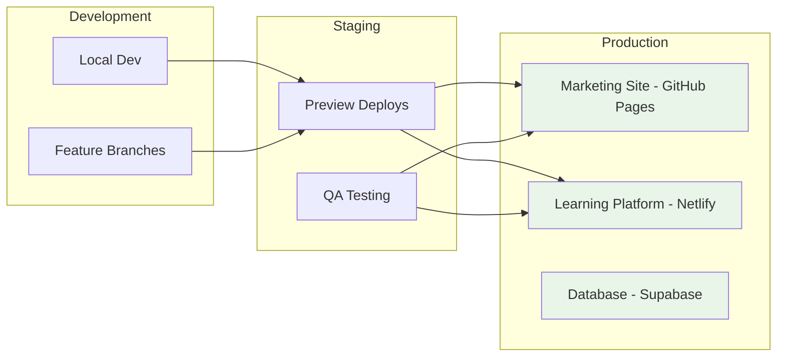

# 🏗️ VISÃO GERAL DA ARQUITETURA - ESCOLA HABILIDADE

## 📋 ARQUITETURA DUAL

O sistema da Escola Habilidade utiliza uma **arquitetura dual** que separa responsabilidades entre:

### 🎯 Marketing Site (Frontend Público)
**Localização**: `/` (raiz do projeto)  
**Tecnologia**: React 19 + Vite 7 + Tailwind CSS 4  
**Propósito**: Website institucional, landing pages, blog público

### 🎓 Learning Platform (Aplicação Completa)
**Localização**: `/plataforma-ensino/`  
**Tecnologia**: Next.js 14 + Supabase + TypeScript  
**Propósito**: Plataforma de ensino, admin, gestão de cursos

---

## 🔀 FLUXO DE DADOS ENTRE SISTEMAS



---

## 🎨 DESIGN SYSTEM UNIFICADO

### Cores Principais
```css
:root {
  /* Escola Habilidade Brand Colors */
  --habilidade-primary: #d400ff;    /* Roxo Principal */
  --habilidade-secondary: #00c4ff;  /* Azul Secundário */
  --habilidade-accent: #a000ff;     /* Roxo Accent */
  
  /* Status Colors */
  --success: #10b981;
  --warning: #f59e0b;
  --error: #ef4444;
  --info: #3b82f6;
  
  /* Neutral Colors */
  --background: #ffffff;
  --foreground: #0f172a;
  --muted: #f1f5f9;
  --border: #e2e8f0;
}
```

### Tipografia Consistente
- **Headers**: Inter, system-ui, -apple-system
- **Body**: Inter, system-ui, -apple-system
- **Code**: 'Fira Code', 'Cascadia Code', monospace

### Componentes Compartilhados
- **Marketing Site**: Componentes React nativos + Tailwind
- **Learning Platform**: Shadcn/ui (tema violet) + Tailwind

---

## 🔐 AUTENTICAÇÃO E SEGURANÇA

### Fluxo de Autenticação


### Níveis de Acesso
1. **Público**: Marketing site, blog posts, páginas de curso
2. **Estudante**: Portal do aluno, cursos matriculados, progresso
3. **Instrutor**: Gerenciamento de cursos próprios, calendário
4. **Admin**: Acesso completo ao sistema, dashboards, configurações

---

## 📊 BANCO DE DADOS (SUPABASE)

### Schema Principal
```sql
-- Usuários e perfis
auth.users          -- Tabela do Supabase Auth
profiles            -- Perfis estendidos dos usuários

-- Cursos e conteúdo
courses             -- Catálogo de cursos
lessons             -- Aulas individuais
exercises           -- Exercícios práticos
quizzes             -- Questionários e avaliações

-- Matrículas e progresso
enrollments         -- Matrículas dos estudantes
lesson_progress     -- Progresso individual nas aulas
quiz_attempts       -- Tentativas de questionários

-- Blog e marketing
blog_posts          -- Posts do blog
blog_categories     -- Categorias do blog
blog_tags           -- Tags para organização

-- Sistema administrativo
instructors         -- Dados dos instrutores
admin_settings      -- Configurações do sistema
```

### Row Level Security (RLS)
- **Políticas granulares** para cada tabela
- **Filtros automáticos** baseados no papel do usuário
- **Segurança por padrão** - deny by default, allow explicitly

---

## 🚀 DEPLOYMENT E INFRAESTRUTURA

### Ambientes


### URLs de Produção
- **Marketing**: `https://stelarow.github.io/habilidade/`
- **Platform**: `https://plataformahabilidade.netlify.app/`
- **Database**: Supabase (PostgreSQL managed)

---

## 📦 ESTRUTURA DE PASTAS

```
habilidade/
├── 📁 src/                          # Marketing Site (React/Vite)
│   ├── components/                  # Componentes React
│   ├── pages/                       # Páginas SPA
│   ├── hooks/                       # Custom hooks
│   ├── services/                    # APIs e integrações
│   └── utils/                       # Utilitários
│
├── 📁 plataforma-ensino/            # Learning Platform (Next.js)
│   ├── src/
│   │   ├── app/                     # App Router (Next.js 14)
│   │   ├── components/              # Componentes React + Shadcn/ui
│   │   ├── lib/                     # Bibliotecas e configurações
│   │   ├── hooks/                   # Custom hooks
│   │   ├── types/                   # Definições TypeScript
│   │   └── utils/                   # Utilitários
│   ├── database/                    # Migrations e schemas
│   └── public/                      # Assets estáticos
│
├── 📁 docs/                         # Documentação técnica
│   ├── 01-architecture/            # Arquitetura do sistema
│   ├── 02-features/                # Funcionalidades
│   ├── 03-apis/                    # Documentação de APIs
│   ├── 04-components/              # Guia de componentes
│   ├── 05-deployment/              # Deploy e infraestrutura
│   └── 06-development/             # Guias de desenvolvimento
│
└── 📁 public/                       # Assets públicos do marketing
```

---

## 🔄 INTEGRAÇÕES EXTERNAS

### Serviços Utilizados
- **EmailJS**: Sistema de contato do marketing site
- **Supabase**: Backend completo (DB + Auth + Storage + Realtime)
- **Netlify**: Hosting da plataforma de ensino
- **GitHub Pages**: Hosting do marketing site
- **Vimeo/YouTube**: Player de vídeo para aulas
- **WhatsApp Business**: Integração de contato

### APIs Externas
- **Payment Gateway**: Integração futura para pagamentos
- **Email Service**: Sistema de newsletters e notificações
- **Analytics**: Google Analytics e métricas customizadas
- **CDN**: Cloudflare para otimização de assets

---

## 📈 PERFORMANCE E OTIMIZAÇÃO

### Marketing Site
- **Build otimizado** com Vite
- **Code splitting** automático
- **Lazy loading** de componentes
- **Cache de assets** via GitHub Pages
- **Otimização de imagens** automática

### Learning Platform  
- **Server-side rendering** com Next.js
- **API Routes** otimizadas
- **Caching estratégico** de queries
- **Componentes lazy** para UX fluida
- **Database indexing** no Supabase

---

## 🔍 MONITORAMENTO E LOGS

### Métricas Coletadas
- **Performance**: Page load times, API response times
- **Erros**: JavaScript errors, API failures, 404s
- **Usuário**: Page views, conversions, user journeys
- **Sistema**: Database performance, storage usage

### Ferramentas
- **Console logs**: Development debugging
- **Supabase Dashboard**: Database metrics
- **Netlify Analytics**: Platform performance
- **GitHub Actions**: Build and deployment status

---

## 🚨 DISASTER RECOVERY

### Backup Strategy
- **Database**: Automatic daily backups via Supabase
- **Code**: Git repository with full history
- **Assets**: Versioned in git and CDN cached
- **Configurations**: Environment variables documented

### Recovery Procedures
1. **Database**: Point-in-time recovery via Supabase
2. **Application**: Redeploy from latest stable branch
3. **DNS**: Update records if needed
4. **Monitoring**: Verify all systems operational

---

*Documentação atualizada em: 30/07/2025*