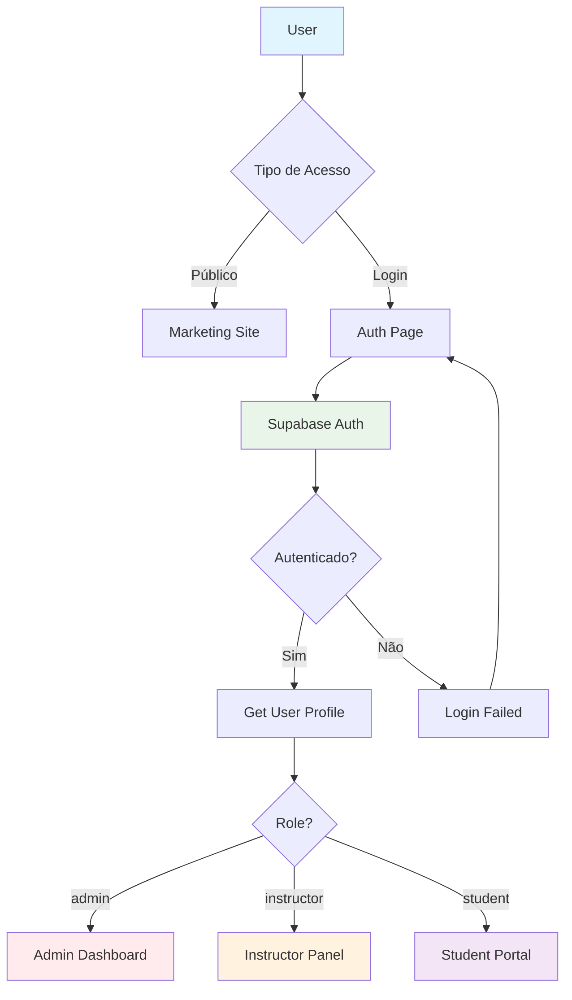

# 🔐 SISTEMA DE AUTENTICAÇÃO - ESCOLA HABILIDADE

## 📋 VISÃO GERAL

O sistema de autenticação utiliza **Supabase Auth** com implementação customizada para diferentes níveis de acesso e integração entre o marketing site e a plataforma de ensino.

---

## 🏗️ ARQUITETURA DE AUTENTICAÇÃO

### Fluxo Principal


---

## 👥 NÍVEIS DE ACESSO

### 1. **Público** (Unauthenticated)
- **Acesso**: Marketing site completo
- **Funcionalidades**: 
  - Navegação em páginas públicas
  - Leitura de blog posts
  - Visualização de catálogo de cursos
  - Formulários de contato
- **Restrições**: Sem acesso à plataforma de ensino

### 2. **Estudante** (Role: `student`)
- **Acesso**: Portal do estudante
- **Funcionalidades**:
  - Dashboard pessoal
  - Cursos matriculados
  - Progresso individual
  - Exercícios e quizzes
  - Download de materiais
- **Restrições**: Sem acesso administrativo

### 3. **Instrutor** (Role: `instructor`)
- **Acesso**: Painel do instrutor
- **Funcionalidades**:
  - Gerenciar cursos próprios
  - Criar/editar aulas
  - Acompanhar progresso dos alunos
  - Calendário de disponibilidade
  - Analytics básico
- **Restrições**: Sem acesso administrativo global

### 4. **Administrador** (Role: `admin`)
- **Acesso**: Sistema completo
- **Funcionalidades**:
  - Dashboard administrativo
  - Gestão de usuários
  - Configurações do sistema
  - Analytics avançado
  - Gerenciamento de blog
  - Configurações de pagamento

---

## 🔧 IMPLEMENTAÇÃO TÉCNICA

### Configuração Supabase
```typescript
// lib/supabase/client.ts
import { createClientComponentClient } from '@supabase/auth-helpers-nextjs'

export const supabase = createClientComponentClient({
  supabaseUrl: process.env.NEXT_PUBLIC_SUPABASE_URL,
  supabaseKey: process.env.NEXT_PUBLIC_SUPABASE_ANON_KEY,
})
```

### Middleware de Proteção
```typescript
// middleware.ts
import { createMiddlewareClient } from '@supabase/auth-helpers-nextjs'
import { NextResponse } from 'next/server'
import type { NextRequest } from 'next/server'

export async function middleware(req: NextRequest) {
  const res = NextResponse.next()
  const supabase = createMiddlewareClient({ req, res })

  // Verificar sessão para rotas protegidas
  if (req.nextUrl.pathname.startsWith('/admin')) {
    const { data: { session } } = await supabase.auth.getSession()
    
    if (!session) {
      return NextResponse.redirect(new URL('/auth/login', req.url))
    }

    // Verificar se é admin
    const { data: profile } = await supabase
      .from('profiles')
      .select('role')
      .eq('id', session.user.id)
      .single()

    if (profile?.role !== 'admin') {
      return NextResponse.redirect(new URL('/dashboard', req.url))
    }
  }

  return res
}

export const config = {
  matcher: ['/admin/:path*', '/dashboard/:path*', '/course/:path*']
}
```

---

## 📊 SCHEMA DO BANCO DE DADOS

### Tabela de Perfis
```sql
-- Extensão da tabela auth.users do Supabase
CREATE TABLE profiles (
  id UUID REFERENCES auth.users(id) PRIMARY KEY,
  email VARCHAR(255) NOT NULL,
  full_name VARCHAR(100),
  avatar_url TEXT,
  role VARCHAR(20) DEFAULT 'student' CHECK (role IN ('student', 'instructor', 'admin')),
  phone VARCHAR(20),
  bio TEXT,
  created_at TIMESTAMP WITH TIME ZONE DEFAULT NOW(),
  updated_at TIMESTAMP WITH TIME ZONE DEFAULT NOW()
);

-- RLS Policy para profiles
CREATE POLICY "Users can view own profile" ON profiles
  FOR SELECT USING (auth.uid() = id);

CREATE POLICY "Users can update own profile" ON profiles
  FOR UPDATE USING (auth.uid() = id);

CREATE POLICY "Admins can view all profiles" ON profiles
  FOR SELECT USING (
    EXISTS (
      SELECT 1 FROM profiles 
      WHERE id = auth.uid() AND role = 'admin'
    )
  );
```

### Função para Verificar Admin
```sql
-- Função reutilizável para verificar se usuário é admin
CREATE OR REPLACE FUNCTION is_admin()
RETURNS BOOLEAN AS $$
BEGIN
  RETURN EXISTS (
    SELECT 1 FROM profiles 
    WHERE id = auth.uid() AND role = 'admin'
  );
END;
$$ LANGUAGE plpgsql SECURITY DEFINER;
```

---

## 🔐 COMPONENTES DE AUTENTICAÇÃO

### Hook de Autenticação
```typescript
// hooks/useAuth.ts
import { useEffect, useState } from 'react'
import { User, Session } from '@supabase/supabase-js'
import { supabase } from '@/lib/supabase/client'

interface Profile {
  id: string
  email: string
  full_name?: string
  role: 'student' | 'instructor' | 'admin'
  avatar_url?: string
}

export function useAuth() {
  const [user, setUser] = useState<User | null>(null)
  const [profile, setProfile] = useState<Profile | null>(null)
  const [session, setSession] = useState<Session | null>(null)
  const [loading, setLoading] = useState(true)

  useEffect(() => {
    // Get initial session
    supabase.auth.getSession().then(({ data: { session } }) => {
      setSession(session)
      setUser(session?.user ?? null)
      if (session?.user) {
        fetchProfile(session.user.id)
      } else {
        setLoading(false)
      }
    })

    // Listen for auth changes
    const { data: { subscription } } = supabase.auth.onAuthStateChange(
      async (event, session) => {
        setSession(session)
        setUser(session?.user ?? null)
        
        if (session?.user) {
          await fetchProfile(session.user.id)
        } else {
          setProfile(null)
          setLoading(false)
        }
      }
    )

    return () => subscription.unsubscribe()
  }, [])

  const fetchProfile = async (userId: string) => {
    try {
      const { data, error } = await supabase
        .from('profiles')
        .select('*')
        .eq('id', userId)
        .single()

      if (error) throw error
      setProfile(data)
    } catch (error) {
      console.error('Error fetching profile:', error)
    } finally {
      setLoading(false)
    }
  }

  const signIn = async (email: string, password: string) => {
    const { data, error } = await supabase.auth.signInWithPassword({
      email,
      password,
    })
    return { data, error }
  }

  const signUp = async (email: string, password: string, fullName?: string) => {
    const { data, error } = await supabase.auth.signUp({
      email,
      password,
      options: {
        data: {
          full_name: fullName,
        },
      },
    })
    return { data, error }
  }

  const signOut = async () => {
    const { error } = await supabase.auth.signOut()
    return { error }
  }

  const updateProfile = async (updates: Partial<Profile>) => {
    if (!user) throw new Error('No user logged in')

    const { data, error } = await supabase
      .from('profiles')
      .update(updates)
      .eq('id', user.id)
      .select()
      .single()

    if (!error) setProfile(data)
    return { data, error }
  }

  return {
    user,
    profile,
    session,
    loading,
    signIn,
    signUp,
    signOut,
    updateProfile,
    isAdmin: profile?.role === 'admin',
    isInstructor: profile?.role === 'instructor',
    isStudent: profile?.role === 'student',
  }
}
```

### Componente de Login
```typescript
// components/auth/LoginForm.tsx
'use client'

import { useState } from 'react'
import { useRouter } from 'next/navigation'
import { Button } from '@/components/ui/button'
import { Input } from '@/components/ui/input'
import { Label } from '@/components/ui/label'
import { Card, CardContent, CardHeader, CardTitle } from '@/components/ui/card'
import { Alert, AlertDescription } from '@/components/ui/alert'
import { useAuth } from '@/hooks/useAuth'

export function LoginForm() {
  const [email, setEmail] = useState('')
  const [password, setPassword] = useState('')
  const [loading, setLoading] = useState(false)
  const [error, setError] = useState<string | null>(null)
  
  const { signIn } = useAuth()
  const router = useRouter()

  const handleSubmit = async (e: React.FormEvent) => {
    e.preventDefault()
    setLoading(true)
    setError(null)

    const { data, error } = await signIn(email, password)

    if (error) {
      setError(error.message)
    } else {
      // Redirect based on user role
      const { data: profile } = await supabase
        .from('profiles')
        .select('role')
        .eq('id', data.user?.id)
        .single()

      switch (profile?.role) {
        case 'admin':
          router.push('/admin')
          break
        case 'instructor':
          router.push('/instructor')
          break
        default:
          router.push('/dashboard')
      }
    }

    setLoading(false)
  }

  return (
    <Card className="w-full max-w-md mx-auto">
      <CardHeader>
        <CardTitle className="text-2xl text-center text-primary">
          Entrar na Plataforma
        </CardTitle>
      </CardHeader>
      <CardContent>
        <form onSubmit={handleSubmit} className="space-y-4">
          {error && (
            <Alert variant="destructive">
              <AlertDescription>{error}</AlertDescription>
            </Alert>
          )}
          
          <div>
            <Label htmlFor="email">Email</Label>
            <Input
              id="email"
              type="email"
              value={email}
              onChange={(e) => setEmail(e.target.value)}
              required
            />
          </div>
          
          <div>
            <Label htmlFor="password">Senha</Label>
            <Input
              id="password"
              type="password"
              value={password}
              onChange={(e) => setPassword(e.target.value)}
              required
            />
          </div>
          
          <Button 
            type="submit" 
            className="w-full" 
            disabled={loading}
          >
            {loading ? 'Entrando...' : 'Entrar'}
          </Button>
        </form>
      </CardContent>
    </Card>
  )
}
```

---

## 🛡️ SEGURANÇA E PROTEÇÃO

### Row Level Security (RLS)
```sql
-- Políticas de segurança para cursos
CREATE POLICY "Students can view enrolled courses" ON courses
  FOR SELECT USING (
    EXISTS (
      SELECT 1 FROM enrollments 
      WHERE course_id = courses.id 
      AND student_id = auth.uid()
    ) OR 
    is_admin() OR 
    courses.instructor_id = auth.uid()
  );

-- Políticas para progresso de aulas
CREATE POLICY "Students can view own progress" ON lesson_progress
  FOR SELECT USING (student_id = auth.uid());

CREATE POLICY "Students can update own progress" ON lesson_progress
  FOR UPDATE USING (student_id = auth.uid());
```

### Rate Limiting
```typescript
// lib/rate-limit.ts
import { NextRequest } from 'next/server'

const rateLimit = new Map<string, { count: number; resetTime: number }>()

export function checkRateLimit(
  req: NextRequest,
  limit: number = 10,
  windowMs: number = 60000
): boolean {
  const ip = req.ip || req.headers.get('x-forwarded-for') || 'unknown'
  const now = Date.now()
  const windowStart = now - windowMs

  const record = rateLimit.get(ip)
  
  if (!record || record.resetTime < windowStart) {
    rateLimit.set(ip, { count: 1, resetTime: now })
    return true
  }

  if (record.count >= limit) {
    return false
  }

  record.count++
  return true
}
```

---

## 🔄 INTEGRAÇÃO COM MARKETING SITE

### Redirecionamento para Login
```javascript
// src/utils/authRedirect.js (Marketing Site)
export const redirectToLogin = (returnUrl = null) => {
  const baseUrl = 'https://plataformahabilidade.netlify.app'
  const loginUrl = `${baseUrl}/auth/login`
  
  if (returnUrl) {
    window.location.href = `${loginUrl}?returnUrl=${encodeURIComponent(returnUrl)}`
  } else {
    window.location.href = loginUrl
  }
}

// Componente de botão "Entrar"
export function LoginButton({ className = '' }) {
  return (
    <button
      onClick={() => redirectToLogin()}
      className={`bg-primary hover:bg-primary/90 text-white px-4 py-2 rounded-lg transition-colors ${className}`}
    >
      Entrar na Plataforma
    </button>
  )
}
```

---

## 🐛 TROUBLESHOOTING

### Problemas Comuns

#### 1. "Session not found"
**Causa**: Cookie de sessão perdido ou expirado  
**Solução**:
```typescript
// Verificar e renovar sessão
const { data: { session } } = await supabase.auth.getSession()
if (!session) {
  await supabase.auth.refreshSession()
}
```

#### 2. "RLS policy violation"
**Causa**: Usuário tentando acessar dados sem permissão  
**Solução**: Verificar políticas RLS e role do usuário

#### 3. "Redirect loop"
**Causa**: Middleware redirecionando indefinidamente  
**Solução**: Verificar configuração do matcher no middleware

### Logs e Debugging
```typescript
// Hook para debug de auth
export function useAuthDebug() {
  const { user, profile, session } = useAuth()
  
  useEffect(() => {
    console.log('Auth Debug:', {
      user: user?.id,
      role: profile?.role,
      session: !!session,
      timestamp: new Date().toISOString()
    })
  }, [user, profile, session])
}
```

---

## 📧 INTEGRAÇÃO COM EMAIL

### Confirmação de Cadastro
```sql
-- Template de email personalizado no Supabase
-- Auth > Email Templates > Confirm signup

<h2>Bem-vindo à Escola Habilidade!</h2>
<p>Clique no link abaixo para confirmar seu email:</p>
<a href="{{ .ConfirmationURL }}">Confirmar Email</a>
```

### Reset de Senha
```sql
-- Template de email para reset
-- Auth > Email Templates > Reset password

<h2>Redefinir Senha</h2>
<p>Clique no link abaixo para redefinir sua senha:</p>
<a href="{{ .ConfirmationURL }}">Redefinir Senha</a>
```

---

*Documentação atualizada em: 30/07/2025*