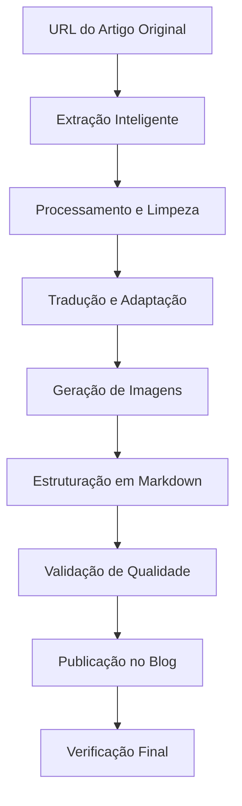

# Guia Completo: Fluxo de Extração e Publicação de Artigos no Blog por IA

## Visão Geral do Processo

Este documento unifica todo o fluxo de trabalho para que uma IA extraia conteúdo de artigos externos e publique no blog da Escola Habilidade, desde a extração inteligente até a publicação final.

## Arquitetura do Fluxo Completo



## FASE 1: EXTRAÇÃO INTELIGENTE DO CONTEÚDO

### 1.1 Preparação para Extração

1. **Receber URL do artigo**
   ```typescript
   const articleUrl = "https://exemplo.com/artigo-original";
   ```

2. **Buscar e analisar HTML**
   ```typescript
   const html = await fetchHTML(articleUrl);
   const doc = parseHTML(html);
   ```

### 1.2 Identificação do Conteúdo Principal

**Seletores prioritários para localizar o artigo:**
```typescript
const CONTENT_SELECTORS = [
  'article',                    // Tag semântica HTML5
  'main',                       // Conteúdo principal
  '[role="main"]',              // ARIA principal
  '[role="article"]',           // ARIA artigo
  '.post-content',              // Classes comuns
  '.article-content',
  '.entry-content',
  '[itemprop="articleBody"]'    // Schema.org
];
```

### 1.3 Remoção de Ruídos

**Elementos a remover completamente:**
```typescript
const NOISE_SELECTORS = [
  // Navegação
  'nav', 'header', 'footer', '.navigation', '.menu',
  
  // Anúncios
  '.ad', '.ads', '[class*="ad-"]', '.sponsor',
  
  // Sidebars
  'aside', '.sidebar', '.widget', '.related-posts',
  
  // Pop-ups
  '.modal', '.popup', '.newsletter-signup',
  
  // Social e comentários
  '.comments', '.social-share', '.disqus',
  
  // Scripts e ocultos
  'script', 'style', '[style*="display:none"]'
];
```

### 1.4 Extração de Componentes

**Estrutura de dados extraídos:**
```typescript
interface ExtractedArticle {
  // Metadados
  title: string;
  author: string;
  publishDate: string;
  
  // Conteúdo
  introduction: string;
  mainContent: string;
  sections: Section[];
  
  // Mídia
  images: ArticleImage[];
  codeBlocks: CodeBlock[];
  
  // Qualidade
  qualityScore: number;
}
```

### 1.5 Processamento de Imagens

```typescript
function extractRelevantImages(article) {
  const images = [];
  
  article.querySelectorAll('img').forEach(img => {
    // Ignorar ícones e imagens pequenas
    if (img.width < 100 || img.height < 100) return;
    
    // Ignorar logos e avatares
    if (img.src.includes('logo') || img.src.includes('avatar')) return;
    
    images.push({
      src: img.src,
      alt: img.alt || extractImageContext(img),
      caption: findImageCaption(img),
      isHero: isHeroImage(img)
    });
  });
  
  return images;
}
```

## FASE 2: PROCESSAMENTO E ADAPTAÇÃO

### 2.1 Tradução Inteligente

1. **Traduzir conteúdo preservando formatação**
   ```typescript
   async function translateContent(content, targetLang = 'pt-BR') {
     // Preservar:
     // - Estrutura de parágrafos
     // - Formatação (negrito, itálico)
     // - Links e referências
     // - Blocos de código
     
     return translatedContent;
   }
   ```

2. **Adaptar contexto cultural**
   - Converter exemplos para realidade brasileira
   - Ajustar referências culturais
   - Manter tom educacional e acessível

### 2.2 Enriquecimento do Conteúdo

1. **Adicionar seções educacionais**
   ```markdown
   ## Objetivos de Aprendizagem
   - Objetivo 1 extraído do conteúdo
   - Objetivo 2 baseado nos tópicos
   - Objetivo 3 relacionado às habilidades
   
   ## Aplicação Prática
   [Exemplos práticos relevantes para o público brasileiro]
   ```

2. **Identificar e vincular curso relacionado**
   - Analisar tema do artigo
   - Mapear para cursos disponíveis
   - Selecionar curso mais relevante para CTA

### 2.3 Geração de Imagens Locais

1. **Hero Image (se necessário)**
   - Resolução: 1200x630px
   - Formato: JPG ou WebP
   - Tema visual consistente com o conteúdo

2. **Imagens de suporte**
   - Diagramas explicativos
   - Screenshots relevantes
   - Infográficos adaptados

## FASE 3: ESTRUTURAÇÃO E PREPARAÇÃO

### 3.1 Criar Estrutura de Arquivos

```bash
# 1. Criar diretório para imagens
mkdir -p /mnt/c/Habilidade/public/images/blog/[slug-do-artigo]/

# 2. Criar arquivo Markdown
touch /mnt/c/Habilidade/blog-posts/[slug-do-artigo].md
```

### 3.2 Formato do Arquivo Markdown

```markdown
# [Título Traduzido e Otimizado]

**Publicado em:** [Data atual]  
**Tempo de leitura:** [Calculado automaticamente]  
**Categoria:** [Categoria apropriada]  
**Tags:** [tag1, tag2, tag3 relevantes]  
**CTA Course:** [slug-do-curso-relacionado]  
**Featured Image URL:** /images/blog/[slug-do-artigo]/hero-image.jpg

## Resumo

[Resumo de 150-160 caracteres extraído ou gerado]

---

## Objetivos de Aprendizagem

- [Objetivo 1 baseado no conteúdo]
- [Objetivo 2 extraído dos tópicos]
- [Objetivo 3 relacionado às habilidades]

---

[Conteúdo principal traduzido e adaptado...]

### [Seções preservadas e organizadas]

[Conteúdo com imagens referenciadas corretamente]

## Conclusão

[Conclusão adaptada ou gerada]

## Próximos Passos

[Sugestões de aprendizado continuado]
```

### 3.3 Processamento de Imagens

```javascript
// Para cada imagem extraída ou gerada
async function processImage(imageData, slug, index) {
  const imagePath = `/images/blog/${slug}/image-${index}.jpg`;
  
  // 1. Download ou geração
  const imageBuffer = await downloadOrGenerate(imageData);
  
  // 2. Otimização
  const optimized = await optimizeImage(imageBuffer, {
    quality: 85,
    maxWidth: 1200,
    format: 'jpeg'
  });
  
  // 3. Salvar no diretório correto
  await saveFile(
    `/mnt/c/Habilidade/public${imagePath}`,
    optimized
  );
  
  return imagePath;
}
```

## FASE 4: VALIDAÇÃO E QUALIDADE

### 4.1 Checklist de Validação

```typescript
interface ValidationChecklist {
  // Conteúdo
  hasTitle: boolean;              // Título presente e adequado
  hasIntroduction: boolean;       // Introdução clara
  hasObjectives: boolean;         // Objetivos de aprendizagem
  contentLength: boolean;         // Mínimo 500 palavras
  
  // Estrutura
  hasProperSections: boolean;     // Seções bem organizadas
  hasConclusion: boolean;         // Conclusão presente
  
  // Metadados
  hasValidSlug: boolean;          // Slug único e válido
  hasCategory: boolean;           // Categoria existe no banco
  hasCourseLink: boolean;         // Curso para CTA válido
  
  // Imagens
  hasHeroImage: boolean;          // Imagem principal presente
  imagesOptimized: boolean;       // Imagens < 500KB
  
  // SEO
  hasMetaDescription: boolean;    // Descrição SEO
  hasTags: boolean;               // Tags relevantes
}
```

### 4.2 Correções Automáticas

```typescript
function autoCorrect(article) {
  // Remover CTAs duplicados
  article.content = removeDuplicateCTAs(article.content);
  
  // Corrigir formatação
  article.content = fixFormatting(article.content);
  
  // Validar links de imagens
  article.content = validateImagePaths(article.content);
  
  // Gerar slug se necessário
  if (!article.slug) {
    article.slug = generateSlug(article.title);
  }
  
  return article;
}
```

## FASE 5: PUBLICAÇÃO NO SISTEMA

### 5.1 Preparar Dados para o Banco

```javascript
const articleData = {
  // Dados principais
  title: article.title,
  slug: article.slug,
  excerpt: article.excerpt,
  content: article.content,
  status: 'published',
  
  // Imagens
  featured_image: article.heroImagePath,
  image_url: article.heroImagePath,
  
  // SEO
  seo_title: `${article.title} - Escola Habilidade`,
  seo_description: article.excerpt,
  
  // Relações
  author_id: '[UUID do autor IA]',
  category_id: '[UUID da categoria]',
  
  // Timestamps
  published_at: new Date().toISOString()
};
```

### 5.2 Inserção via Supabase

```sql
-- 1. Inserir artigo
INSERT INTO blog_posts (
  title, slug, excerpt, content, status,
  featured_image, image_url, seo_title, seo_description,
  author_id, category_id, published_at
) VALUES (
  $1, $2, $3, $4, $5, $6, $7, $8, $9, $10, $11, $12
) RETURNING id;

-- 2. Inserir CTA do curso
INSERT INTO blog_course_ctas (
  post_id, course_id, course_name, course_slug
) VALUES (
  $1, $2, $3, $4
);
```

### 5.3 Verificação Final

```typescript
async function verifyPublication(slug) {
  // 1. Verificar artigo no banco
  const post = await getPostBySlug(slug);
  if (!post) throw new Error('Artigo não encontrado');
  
  // 2. Testar renderização
  const rendered = await testRender(`/blog/${slug}`);
  if (!rendered.success) throw new Error('Erro na renderização');
  
  // 3. Verificar imagens
  const images = await checkImages(post);
  if (images.missing.length > 0) {
    throw new Error(`Imagens faltando: ${images.missing}`);
  }
  
  // 4. Validar CTA
  const cta = await checkCTA(post.id);
  if (!cta) throw new Error('CTA não configurado');
  
  return { success: true, url: `/blog/${slug}` };
}
```

## FASE 6: MONITORAMENTO E MANUTENÇÃO

### 6.1 Logs de Extração

```typescript
interface ExtractionLog {
  sourceUrl: string;
  extractionDate: Date;
  qualityScore: number;
  componentsExtracted: {
    title: boolean;
    content: boolean;
    images: number;
    sections: number;
  };
  errors: string[];
  warnings: string[];
}
```

### 6.2 Métricas de Sucesso

- Taxa de extração bem-sucedida
- Qualidade média do conteúdo
- Tempo médio de processamento
- Engajamento dos artigos publicados

## Fluxo Completo em Código

```typescript
async function extractAndPublishArticle(sourceUrl: string) {
  try {
    // FASE 1: Extração
    console.log('🔍 Iniciando extração...');
    const extracted = await extractArticleFromURL(sourceUrl);
    
    if (extracted.qualityScore < 60) {
      throw new Error('Qualidade do conteúdo insuficiente');
    }
    
    // FASE 2: Processamento
    console.log('🔄 Processando conteúdo...');
    const processed = await processContent(extracted);
    const translated = await translateContent(processed);
    const enriched = await enrichContent(translated);
    
    // FASE 3: Estruturação
    console.log('📝 Estruturando artigo...');
    const structured = await structureArticle(enriched);
    const imagesProcessed = await processAllImages(structured);
    
    // FASE 4: Validação
    console.log('✅ Validando qualidade...');
    const validated = await validateArticle(imagesProcessed);
    const corrected = await autoCorrect(validated);
    
    // FASE 5: Publicação
    console.log('🚀 Publicando no blog...');
    const published = await publishToDatabase(corrected);
    await createCTA(published.id, corrected.courseSlug);
    
    // FASE 6: Verificação
    console.log('🔎 Verificando publicação...');
    const verified = await verifyPublication(corrected.slug);
    
    console.log('✨ Artigo publicado com sucesso!');
    console.log(`📖 URL: ${verified.url}`);
    
    return verified;
    
  } catch (error) {
    console.error('❌ Erro no processo:', error);
    await logError(sourceUrl, error);
    throw error;
  }
}
```

## Comandos Úteis para o Processo

```bash
# Testar extração
node scripts/test-extraction.js "https://exemplo.com/artigo"

# Verificar estrutura de arquivos
ls -la /mnt/c/Habilidade/blog-posts/
ls -la /mnt/c/Habilidade/public/images/blog/

# Verificar artigo no banco
npm run supabase:query "SELECT * FROM blog_posts WHERE slug = 'meu-artigo'"

# Limpar cache de imagens
rm -rf /mnt/c/Habilidade/.cache/images/

# Logs de publicação
tail -f /mnt/c/Habilidade/logs/blog-publication.log
```

## Considerações Finais

### Melhores Práticas

1. **Sempre verificar direitos autorais** antes de extrair conteúdo
2. **Adicionar atribuição** quando necessário
3. **Adaptar, não apenas traduzir** - contexto brasileiro é importante
4. **Testar renderização** antes de marcar como publicado
5. **Manter logs detalhados** de todo o processo

### Políticas Importantes

- **CTAs**: Usar apenas o CTA final do curso (evitar duplicação)
- **Imagens**: Sempre otimizar e usar caminhos locais
- **SEO**: Manter descrições entre 150-160 caracteres
- **Qualidade**: Não publicar se score < 60%

### Suporte e Troubleshooting

Para problemas comuns:
- Verificar logs em `/logs/`
- Confirmar permissões de arquivos
- Validar conexão com Supabase
- Testar em ambiente local primeiro

---

*Última atualização: Agosto 2025*
*Versão: 1.0.0*