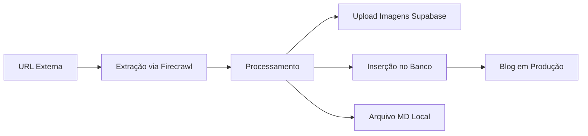

# Guia Definitivo: Criação de Artigos para Blog via IA - Escola Habilidade

## 📋 Visão Geral do Sistema

Este guia documenta o processo **EXATO** para que IAs criem artigos no blog da Escola Habilidade a partir de URLs fornecidas. O sistema utiliza Supabase como backend principal e mantém arquivos MD locais como backup.

## 🏗️ Arquitetura Atual



### Componentes do Sistema

1. **Banco de Dados**: Supabase (projeto: `vfpdyllwquaturpcifpl`)
2. **Storage de Imagens**: Supabase Storage (bucket: `imagens-blog`)
3. **API**: `supabaseBlogAPI` em `src/services/`
4. **Arquivos Locais**: `blog-posts/` (backup/referência)
5. **Frontend**: React + Vite com SSG

## 📊 Estrutura do Banco de Dados

### Tabela: `blog_posts`

| Campo | Tipo | Obrigatório | Descrição |
|-------|------|-------------|-----------|
| `id` | uuid | ✅ | ID único gerado automaticamente |
| `slug` | varchar | ✅ | URL amigável (ex: `editor-materiais-sketchup`) |
| `title` | varchar | ✅ | Título do artigo |
| `excerpt` | text | ✅ | Resumo de 150-160 caracteres |
| `content` | text | ✅ | Conteúdo completo em Markdown |
| `category_id` | uuid | ❌ | FK para blog_categories |
| `author_id` | uuid | ❌ | FK para blog_authors |
| `image_url` | text | ❌ | URL da imagem principal |
| `reading_time` | integer | ❌ | Tempo de leitura em minutos |
| `views` | integer | ❌ | Contador de visualizações |
| `published_at` | timestamp | ❌ | Data de publicação |
| `created_at` | timestamp | ❌ | Data de criação |
| `updated_at` | timestamp | ❌ | Data de atualização |
| `seo_title` | varchar | ❌ | Título para SEO |
| `seo_description` | text | ❌ | Descrição para SEO |
| `og_image` | text | ❌ | Imagem para Open Graph |
| `canonical_url` | text | ❌ | URL canônica |

## 🚀 PROCESSO COMPLETO DE CRIAÇÃO

### PASSO 1: Extração de Conteúdo

```javascript
// Usar Firecrawl MCP para extrair conteúdo
mcp__firecrawl__firecrawl_scrape({
  url: "https://exemplo.com/artigo-original",
  formats: ["markdown", "html"],
  onlyMainContent: true,
  includeImages: true
})
```

**IMPORTANTE**: 
- Extrair TODAS as imagens reais do artigo
- NÃO usar placeholders ou imagens genéricas
- Preservar legendas e contexto das imagens

### PASSO 2: Processamento do Conteúdo

```javascript
// Estrutura esperada após processamento
{
  slug: "titulo-amigavel-para-url",
  title: "Título Completo do Artigo",
  excerpt: "Resumo de 150-160 caracteres...",
  content: "# Conteúdo em Markdown\n\n...",
  seo_title: "Título SEO - Escola Habilidade",
  seo_description: "Descrição SEO...",
  reading_time: 8, // calculado automaticamente
  category_id: "uuid-da-categoria",
  published_at: new Date().toISOString()
}
```

### PASSO 3: Upload de Imagens - PROCESSO CORRETO ⚠️

> **PROBLEMA COMUM**: Imagens aparecem como "Imagem não encontrada" no frontend quando os caminhos não estão corretos.

#### 3.1 Padrão de Nomenclatura OBRIGATÓRIO

```javascript
// IMPORTANTE: Nome do arquivo NO STORAGE deve seguir este padrão:
// [slug-do-artigo]-[descricao].jpg

// Exemplos CORRETOS:
"guia-completo-enscape-sketchup-iniciantes-hero.jpg"
"guia-completo-enscape-sketchup-iniciantes-interface.jpg"
"guia-completo-enscape-sketchup-iniciantes-toolbar.png"

// NÃO usar subpastas no storage:
// ❌ ERRADO: "guia-completo-enscape/hero.jpg"
// ✅ CERTO: "guia-completo-enscape-hero.jpg"
```

#### 3.2 Upload para Supabase Storage

```javascript
// 1. Fazer upload direto para o bucket 'imagens-blog'
const fileName = `${slug}-${imageDescription}.jpg`;

const { data, error } = await supabase.storage
  .from('imagens-blog')
  .upload(fileName, imageBuffer, {
    contentType: 'image/jpeg',
    cacheControl: '3600',
    upsert: true
  });

// 2. URL pública resultante (SEM subpastas)
const publicUrl = `https://vfpdyllwquaturpcifpl.supabase.co/storage/v1/object/public/imagens-blog/${fileName}`;
```

#### 3.3 URLs no Conteúdo do Artigo

```markdown
<!-- NO CONTEÚDO DO ARTIGO, usar URLs COMPLETAS do Supabase -->

<!-- ✅ CORRETO: URL completa do Supabase Storage -->


<!-- ❌ ERRADO: Caminho local -->

```

### PASSO 4: Campos de Imagem no Banco de Dados

```sql
-- Ao inserir no banco, usar as URLs completas do Supabase
INSERT INTO blog_posts (
  slug,
  title,
  content,
  image_url,  -- Imagem principal (hero)
  og_image    -- Mesma imagem para Open Graph
) VALUES (
  'guia-completo-enscape-sketchup-iniciantes',
  'Guia Completo: Como Começar com Enscape para SketchUp',
  '# Conteúdo com URLs do Supabase...',
  'https://vfpdyllwquaturpcifpl.supabase.co/storage/v1/object/public/imagens-blog/guia-completo-enscape-sketchup-iniciantes-hero.jpg',
  'https://vfpdyllwquaturpcifpl.supabase.co/storage/v1/object/public/imagens-blog/guia-completo-enscape-sketchup-iniciantes-hero.jpg'
);
```

### PASSO 5: Verificação IMPORTANTE

```javascript
// SEMPRE verificar após upload:
// 1. Testar se a URL da imagem está acessível
const testUrl = publicUrl;
const response = await fetch(testUrl);
if (!response.ok) {
  throw new Error(`Imagem não acessível: ${testUrl}`);
}

// 2. Verificar que o conteúdo não tem paths locais
if (content.includes('/images/blog/')) {
  console.warn('⚠️ AVISO: Conteúdo contém paths locais! Corrigir para URLs do Supabase.');
}
```

### PASSO 6: Inserir no Banco via MCP Supabase

```javascript
mcp__supabase__execute_sql({
  project_id: "vfpdyllwquaturpcifpl",
  query: `
    INSERT INTO blog_posts (
      slug, title, excerpt, content, 
      image_url, og_image, seo_title, seo_description,
      reading_time, published_at, created_at, updated_at
    ) VALUES (
      $1, $2, $3, $4, $5, $6, $7, $8, $9,
      CURRENT_TIMESTAMP, CURRENT_TIMESTAMP, CURRENT_TIMESTAMP
    )
  `,
  values: [slug, title, excerpt, content, imageUrl, imageUrl, seoTitle, seoDescription, readingTime]
})
```

### PASSO 7: Criar Arquivo MD Local (Backup)

```markdown
# [Título do Artigo]

**Publicado em:** [Data]  
**Tempo de leitura:** [X] minutos  
**Categoria:** Design 3D e Renderização  
**Tags:** tag1, tag2, tag3  
**CTA Course:** sketchup-enscape  
**Featured Image URL:** https://vfpdyllwquaturpcifpl.supabase.co/storage/v1/object/public/imagens-blog/[slug]-hero.jpg

## Resumo

[Excerpt de 150-160 caracteres]

---

[Conteúdo completo com URLs do Supabase]
```

## 🔍 Frontend: Como as Imagens São Buscadas

### Mapeamento de Campos (API → Frontend)

```javascript
// src/services/supabaseBlogAPI.js
const transformBlogPost = (post) => {
  return {
    // ...outros campos
    imageUrl: post.image_url,
    featuredImage: post.image_url ? {
      url: post.image_url,
      alt: post.title
    } : null,
    // ...
  }
}
```

### Ordem de Prioridade no Frontend

```javascript
// BlogCard.jsx busca nesta ordem:
1. post.featured_image_url
2. post.featuredImage.url (objeto)
3. post.featuredImage (string)
4. post.imageUrl

// BlogPostSSG.jsx usa:
post.featuredImage?.url || post.imageUrl
```

## ⚠️ ERROS COMUNS E SOLUÇÕES

### Erro 1: "Imagem não encontrada"

**Causa**: Usar caminhos locais ao invés de URLs do Supabase
```markdown
❌ 
✅ 
```

### Erro 2: Imagem principal não aparece

**Causa**: Campo `image_url` vazio ou com path local
```sql
-- Verificar:
SELECT image_url, og_image FROM blog_posts WHERE slug = 'seu-slug';

-- Corrigir:
UPDATE blog_posts 
SET image_url = 'https://vfpdyllwquaturpcifpl.supabase.co/storage/v1/object/public/imagens-blog/slug-hero.jpg',
    og_image = 'https://vfpdyllwquaturpcifpl.supabase.co/storage/v1/object/public/imagens-blog/slug-hero.jpg'
WHERE slug = 'seu-slug';
```

### Erro 3: Upload falhou no Supabase

**Causa**: Nome de arquivo com caracteres especiais ou espaços
```javascript
// Limpar nome do arquivo:
const cleanFileName = fileName
  .toLowerCase()
  .replace(/[^a-z0-9-]/g, '-')
  .replace(/-+/g, '-');
```

## 📝 CHECKLIST FINAL

Antes de publicar um artigo, verifique:

- [ ] **Slug único** e amigável para URL
- [ ] **Título** claro e otimizado para SEO
- [ ] **Excerpt** com 150-160 caracteres
- [ ] **Imagens uploadadas** no Supabase Storage
- [ ] **URLs das imagens** usando caminho completo do Supabase
- [ ] **image_url** e **og_image** preenchidos no banco
- [ ] **Conteúdo** sem paths locais (/images/blog/)
- [ ] **Categoria** associada (se aplicável)
- [ ] **Reading time** calculado corretamente
- [ ] **Arquivo MD** criado como backup

## 🚨 RESUMO: REGRAS DE OURO

1. **SEMPRE** use URLs completas do Supabase para imagens
2. **NUNCA** use caminhos locais como `/images/blog/`
3. **SEMPRE** teste se as URLs das imagens estão acessíveis
4. **SEMPRE** preencha `image_url` e `og_image` com a mesma URL
5. **NUNCA** use subpastas no Supabase Storage - use prefixo no nome do arquivo

---

**Última atualização:** 09/08/2025
**Versão:** 2.0 - Correção do processo de imagens