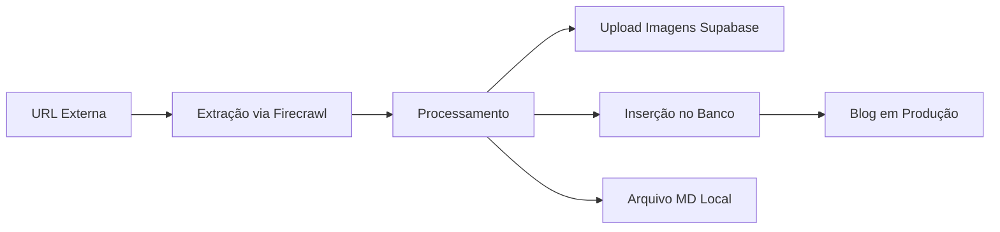

# Guia Definitivo: Criação de Artigos para Blog via IA - Escola Habilidade

## 📋 Visão Geral do Sistema

Este guia documenta o processo **EXATO** para que IAs criem artigos no blog da Escola Habilidade a partir de URLs fornecidas. O sistema utiliza Supabase como backend principal e mantém arquivos MD locais como backup.

## 🏗️ Arquitetura Atual



### Componentes do Sistema

1. **Banco de Dados**: Supabase (projeto: `vfpdyllwquaturpcifpl`)
2. **Storage de Imagens**: Supabase Storage (bucket: `imagens-blog`)
3. **API**: `supabaseBlogAPI` em `src/services/`
4. **Arquivos Locais**: `blog-posts/` (backup/referência)
5. **Frontend**: React + Vite com SSG

## 📊 Estrutura do Banco de Dados

### Tabela: `blog_posts`

| Campo | Tipo | Obrigatório | Descrição |
|-------|------|-------------|-----------|
| `id` | uuid | ✅ | ID único gerado automaticamente |
| `slug` | varchar | ✅ | URL amigável (ex: `editor-materiais-sketchup`) |
| `title` | varchar | ✅ | Título do artigo |
| `excerpt` | text | ✅ | Resumo de 150-160 caracteres |
| `content` | text | ✅ | Conteúdo completo em Markdown |
| `category_id` | uuid | ❌ | FK para blog_categories |
| `author_id` | uuid | ❌ | FK para blog_authors |
| `image_url` | text | ❌ | URL da imagem principal |
| `reading_time` | integer | ❌ | Tempo de leitura em minutos |
| `views` | integer | ❌ | Contador de visualizações |
| `published_at` | timestamp | ❌ | Data de publicação |
| `created_at` | timestamp | ❌ | Data de criação |
| `updated_at` | timestamp | ❌ | Data de atualização |
| `seo_title` | varchar | ❌ | Título para SEO |
| `seo_description` | text | ❌ | Descrição para SEO |
| `og_image` | text | ❌ | Imagem para Open Graph |
| `canonical_url` | text | ❌ | URL canônica |

## 🚀 PROCESSO COMPLETO DE CRIAÇÃO

### PASSO 1: Extração de Conteúdo

```javascript
// Usar Firecrawl MCP para extrair conteúdo
mcp__firecrawl__firecrawl_scrape({
  url: "https://exemplo.com/artigo-original",
  formats: ["markdown", "html"],
  onlyMainContent: true,
  includeImages: true
})
```

**IMPORTANTE**: 
- Extrair TODAS as imagens reais do artigo
- NÃO usar placeholders ou imagens genéricas
- Preservar legendas e contexto das imagens

### PASSO 2: Processamento do Conteúdo

#### 2.1 Estrutura Básica

```javascript
// Estrutura esperada após processamento
{
  slug: "titulo-amigavel-para-url",
  title: "Título Completo do Artigo",
  excerpt: "Resumo de 150-160 caracteres...",
  content: "# Conteúdo em Markdown\n\n...",
  seo_title: "Título SEO - Escola Habilidade",
  seo_description: "Descrição SEO...",
  reading_time: 8, // calculado automaticamente
  category_id: "uuid-da-categoria",
  published_at: new Date().toISOString()
}
```

#### 2.2 REGRAS DE FORMATAÇÃO DE TEXTO ⚠️

**PROBLEMA IDENTIFICADO**: Texto muito denso e mal espaçado causa má experiência de leitura.

**REGRAS OBRIGATÓRIAS:**

```markdown
# Título Principal (H1)
[LINHA EM BRANCO OBRIGATÓRIA]
Parágrafo introdutório curto (máximo 3 linhas). Deve ser engajante e explicar o que o leitor vai aprender.
[LINHA EM BRANCO OBRIGATÓRIA]
Segundo parágrafo se necessário. Máximo 4 linhas por parágrafo.
[LINHA EM BRANCO OBRIGATÓRIA]

## Seção Principal (H2)
[LINHA EM BRANCO OBRIGATÓRIA]
Texto explicativo da seção. Máximo 4 linhas por parágrafo.
[LINHA EM BRANCO OBRIGATÓRIA]

### Subseção (H3)
[LINHA EM BRANCO OBRIGATÓRIA]
Conteúdo da subseção. Dividir em parágrafos curtos.
[LINHA EM BRANCO OBRIGATÓRIA]

**Texto em negrito** para destacar pontos importantes.
[LINHA EM BRANCO OBRIGATÓRIA]

- Lista com itens
- Cada item deve ser conciso
- Máximo 1-2 linhas por item
[LINHA EM BRANCO OBRIGATÓRIA]

1. Lista numerada quando há sequência
2. Processos paso-a-paso
3. Instrucões sequenciais
[LINHA EM BRANCO OBRIGATÓRIA]

> **Dica importante:** Use blockquotes para destacar dicas valiosas.
[LINHA EM BRANCO OBRIGATÓRIA]
```

**REGRAS ESPECÍFICAS:**

- **Parágrafos**: Máximo 4 linhas (approximately 150-200 caracteres)
- **Títulos**: SEMPRE seguidos por linha em branco
- **Listas**: SEMPRE precedidas e seguidas por linha em branco  
- **Imagens**: SEMPRE precedidas e seguidas por linha em branco
- **Código**: SEMPRE precedido e seguido por linha em branco
- **Blockquotes**: SEMPRE precedidos e seguidos por linha em branco

**ESPAÇAMENTO ENTRE SEÇÕES:**
```markdown
## Fim da Seção Anterior
[LINHA EM BRANCO]
Último parágrafo da seção.
[LINHA EM BRANCO]
[LINHA EM BRANCO] ← SEGUNDA linha em branco entre seções
## Nova Seção Principal
[LINHA EM BRANCO]
Primeiro parágrafo da nova seção.
```

### PASSO 3: Upload de Imagens - PROCESSO CORRETO ⚠️

> **PROBLEMA CRÍTICO IDENTIFICADO**: NUNCA inventar nomes de imagens ou usar URLs de imagens que não existem!

#### 3.1 IDENTIFICAÇÃO DAS IMAGENS REAIS ⚠️

**PROCESSO OBRIGATÓRIO:**

1. **Analisar o conteúdo extraído** - identificar TODAS as imagens presentes no HTML/Markdown
2. **Listar as URLs originais** - extrair os src das imagens do site original  
3. **Fazer download das imagens reais** - baixar cada imagem do site fonte
4. **NUNCA inventar nomes** - usar apenas imagens que realmente existem

```javascript
// ❌ ERRADO - NUNCA FAÇA ISSO:
// Inventar URLs como: "guia-completo-enscape-hero.jpg" sem ter a imagem

// ✅ CORRETO - PROCESSO REAL:
// 1. Identificar imagens no HTML original:
// 
// 2. Baixar a imagem real do site
// 3. Fazer upload no Supabase Storage
// 4. Usar a URL real do Supabase
```

#### 3.2 Download e Verificação das Imagens

```javascript
// 1. Extrair URLs reais das imagens do conteúdo original
const imageUrls = extractImagesFromContent(originalContent);

// 2. Baixar cada imagem
for (const originalUrl of imageUrls) {
  try {
    const response = await fetch(originalUrl);
    if (!response.ok) {
      console.warn(`⚠️ Imagem não acessível: ${originalUrl}`);
      continue; // Pular esta imagem
    }
    const imageBuffer = await response.arrayBuffer();
    
    // 3. Fazer upload real no Supabase
    const fileName = `${slug}-image-${index}.jpg`;
    const uploadResult = await uploadToSupabase(fileName, imageBuffer);
    
    // 4. Substituir URL no conteúdo
    content = content.replace(originalUrl, uploadResult.publicUrl);
  } catch (error) {
    console.error(`Erro no download da imagem: ${error.message}`);
  }
}
```

#### 3.3 Padrão de Nomenclatura OBRIGATÓRIO

```javascript
// IMPORTANTE: Nome do arquivo NO STORAGE deve seguir este padrão:
// [slug-do-artigo]-[descricao-ou-numero].jpg

// Exemplos CORRETOS (apenas após download real):
"guia-completo-enscape-sketchup-iniciantes-hero.jpg"        // Imagem principal
"guia-completo-enscape-sketchup-iniciantes-interface.jpg"   // Interface do software
"guia-completo-enscape-sketchup-iniciantes-toolbar.png"     // Barra de ferramentas
"guia-completo-enscape-sketchup-iniciantes-image-1.jpg"     // Numeração sequencial

// NÃO usar subpastas no storage:
// ❌ ERRADO: "guia-completo-enscape/hero.jpg"
// ✅ CERTO: "guia-completo-enscape-hero.jpg"
```

#### 3.4 Upload para Supabase Storage

```javascript
// 1. Fazer upload direto para o bucket 'imagens-blog'
const fileName = `${slug}-${imageDescription}.jpg`;

const { data, error } = await supabase.storage
  .from('imagens-blog')
  .upload(fileName, imageBuffer, {
    contentType: 'image/jpeg',
    cacheControl: '3600',
    upsert: true
  });

// 2. URL pública resultante (SEM subpastas)
const publicUrl = `https://vfpdyllwquaturpcifpl.supabase.co/storage/v1/object/public/imagens-blog/${fileName}`;

// 3. SEMPRE testar a URL antes de usar
const testResponse = await fetch(publicUrl);
if (!testResponse.ok) {
  throw new Error(`❌ FALHA: Imagem não está acessível em ${publicUrl}`);
}
```

#### 3.3 URLs no Conteúdo do Artigo

```markdown
<!-- NO CONTEÚDO DO ARTIGO, usar URLs COMPLETAS do Supabase -->

<!-- ✅ CORRETO: URL completa do Supabase Storage -->


<!-- ❌ ERRADO: Caminho local -->

```

### PASSO 4: Campos de Imagem no Banco de Dados

```sql
-- Ao inserir no banco, usar as URLs completas do Supabase
INSERT INTO blog_posts (
  slug,
  title,
  content,
  image_url,  -- Imagem principal (hero)
  og_image    -- Mesma imagem para Open Graph
) VALUES (
  'guia-completo-enscape-sketchup-iniciantes',
  'Guia Completo: Como Começar com Enscape para SketchUp',
  '# Conteúdo com URLs do Supabase...',
  'https://vfpdyllwquaturpcifpl.supabase.co/storage/v1/object/public/imagens-blog/guia-completo-enscape-sketchup-iniciantes-hero.jpg',
  'https://vfpdyllwquaturpcifpl.supabase.co/storage/v1/object/public/imagens-blog/guia-completo-enscape-sketchup-iniciantes-hero.jpg'
);
```

### PASSO 5: Verificação IMPORTANTE

```javascript
// SEMPRE verificar após upload:
// 1. Testar se a URL da imagem está acessível
const testUrl = publicUrl;
const response = await fetch(testUrl);
if (!response.ok) {
  throw new Error(`Imagem não acessível: ${testUrl}`);
}

// 2. Verificar que o conteúdo não tem paths locais
if (content.includes('/images/blog/')) {
  console.warn('⚠️ AVISO: Conteúdo contém paths locais! Corrigir para URLs do Supabase.');
}
```

### PASSO 6: Inserir no Banco via MCP Supabase

```javascript
mcp__supabase__execute_sql({
  project_id: "vfpdyllwquaturpcifpl",
  query: `
    INSERT INTO blog_posts (
      slug, title, excerpt, content, 
      image_url, og_image, seo_title, seo_description,
      reading_time, published_at, created_at, updated_at
    ) VALUES (
      $1, $2, $3, $4, $5, $6, $7, $8, $9,
      CURRENT_TIMESTAMP, CURRENT_TIMESTAMP, CURRENT_TIMESTAMP
    )
  `,
  values: [slug, title, excerpt, content, imageUrl, imageUrl, seoTitle, seoDescription, readingTime]
})
```

### PASSO 7: Criar Arquivo MD Local (Backup)

```markdown
# [Título do Artigo]

**Publicado em:** [Data]  
**Tempo de leitura:** [X] minutos  
**Categoria:** Design 3D e Renderização  
**Tags:** tag1, tag2, tag3  
**CTA Course:** sketchup-enscape  
**Featured Image URL:** https://vfpdyllwquaturpcifpl.supabase.co/storage/v1/object/public/imagens-blog/[slug]-hero.jpg

## Resumo

[Excerpt de 150-160 caracteres]

---

[Conteúdo completo com URLs do Supabase]
```

## 🔍 Frontend: Como as Imagens São Buscadas

### Mapeamento de Campos (API → Frontend)

```javascript
// src/services/supabaseBlogAPI.js
const transformBlogPost = (post) => {
  return {
    // ...outros campos
    imageUrl: post.image_url,
    featuredImage: post.image_url ? {
      url: post.image_url,
      alt: post.title
    } : null,
    // ...
  }
}
```

### Ordem de Prioridade no Frontend

```javascript
// BlogCard.jsx busca nesta ordem:
1. post.featured_image_url
2. post.featuredImage.url (objeto)
3. post.featuredImage (string)
4. post.imageUrl

// BlogPostSSG.jsx usa:
post.featuredImage?.url || post.imageUrl
```

## ⚠️ ERROS COMUNS E SOLUÇÕES

### Erro 1: "Imagem não encontrada"

**Causa**: Usar caminhos locais ao invés de URLs do Supabase
```markdown
❌ 
✅ 
```

### Erro 2: Imagem principal não aparece

**Causa**: Campo `image_url` vazio ou com path local
```sql
-- Verificar:
SELECT image_url, og_image FROM blog_posts WHERE slug = 'seu-slug';

-- Corrigir:
UPDATE blog_posts 
SET image_url = 'https://vfpdyllwquaturpcifpl.supabase.co/storage/v1/object/public/imagens-blog/slug-hero.jpg',
    og_image = 'https://vfpdyllwquaturpcifpl.supabase.co/storage/v1/object/public/imagens-blog/slug-hero.jpg'
WHERE slug = 'seu-slug';
```

### Erro 3: Upload falhou no Supabase

**Causa**: Nome de arquivo com caracteres especiais ou espaços
```javascript
// Limpar nome do arquivo:
const cleanFileName = fileName
  .toLowerCase()
  .replace(/[^a-z0-9-]/g, '-')
  .replace(/-+/g, '-');
```

## 📝 CHECKLIST FINAL DE VALIDAÇÃO

**VALIDAÇÃO CRÍTICA - NUNCA PULE ESTAS ETAPAS:**

### ✅ IMAGENS - VERIFICAÇÃO OBRIGATÓRIA
- [ ] **Imagens reais identificadas** no conteúdo original
- [ ] **Download realizado** de todas as imagens do site fonte
- [ ] **Upload confirmado** no Supabase Storage (bucket: imagens-blog)
- [ ] **URLs testadas** - todas as imagens acessíveis via navegador
- [ ] **ZERO URLs inventadas** - apenas imagens que realmente existem
- [ ] **image_url** e **og_image** preenchidos com URLs reais do Supabase
- [ ] **Conteúdo sem paths locais** (/images/blog/) - apenas URLs do Supabase

### ✅ FORMATAÇÃO - VERIFICAÇÃO OBRIGATÓRIA
- [ ] **Parágrafos curtos** - máximo 4 linhas cada
- [ ] **Espaçamento correto** - linha em branco após títulos
- [ ] **Seções separadas** - duas linhas em branco entre seções principais
- [ ] **Listas formatadas** - precedidas e seguidas por linha em branco
- [ ] **Blockquotes usados** para dicas importantes
- [ ] **Texto legível** - não denso demais

### ✅ CONTEÚDO - VERIFICAÇÃO GERAL
- [ ] **Slug único** e amigável para URL
- [ ] **Título** claro e otimizado para SEO
- [ ] **Excerpt** com 150-160 caracteres
- [ ] **Reading time** calculado corretamente
- [ ] **Categoria** associada (se aplicável)
- [ ] **Arquivo MD** criado como backup

### ✅ TESTE FINAL - ANTES DE PUBLICAR
- [ ] **Abrir cada URL de imagem** no navegador - confirmar que carrega
- [ ] **Verificar espaçamento** no arquivo MD - deve estar bem formatado
- [ ] **Conteúdo completo** - artigo faz sentido e tem informação útil
- [ ] **Links funcionais** - todos os links externos funcionam

## 🚨 RESUMO: REGRAS DE OURO

1. **NUNCA INVENTAR URLS DE IMAGENS** - apenas usar imagens que realmente existem
2. **SEMPRE BAIXAR IMAGENS REAIS** do site original antes de fazer upload
3. **SEMPRE TESTAR URLS** - todas as imagens devem estar acessíveis
4. **NUNCA usar caminhos locais** como `/images/blog/` - apenas URLs do Supabase
5. **FORMATAÇÃO OBRIGATÓRIA** - parágrafos curtos com espaçamento adequado
6. **LINHAS EM BRANCO** após títulos, listas, imagens e blockquotes
7. **VALIDAÇÃO COMPLETA** antes de publicar - seguir checklist rigorosamente

---

**Última atualização:** 10/08/2025
**Versão:** 3.0 - Correção crítica de imagens e formatação de texto