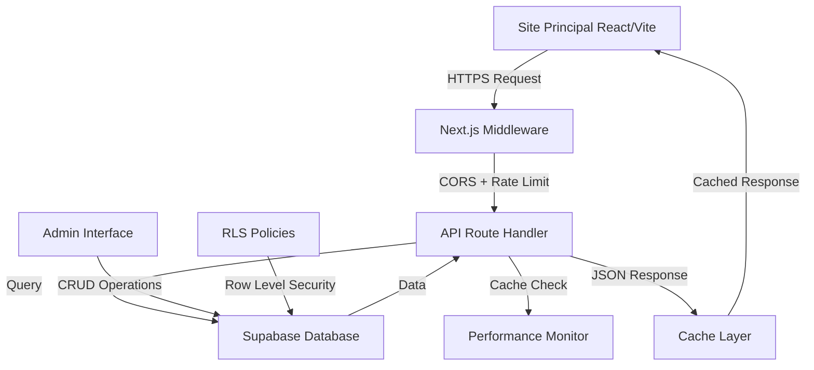

# FEATURE 001: Blog Backend API Documentation

**Status**: ✅ Completamente Implementado  
**Version**: 1.0.0  
**Last Updated**: 2025-01-29  
**Feature ID**: FEATURE_001_API_BLOG_BACKEND

## Visão Geral

O **Blog Backend API** é uma implementação completa de endpoints REST na plataforma de ensino (Next.js 14 + Supabase) que fornece dados do blog para o site principal (React + Vite). Esta feature implementa uma arquitetura robusta com foco em performance, segurança e escalabilidade.

### Propósito

Fornecer uma API pública e otimizada para que o site principal da Escola Habilidade possa:
- Exibir listagens de posts do blog com paginação e filtros
- Mostrar posts individuais com conteúdo completo
- Listar categorias disponíveis
- Gerar sitemaps XML para SEO
- Integrar dados de blog de forma performática e segura

### Características Principais

- **🚀 Performance**: Cache inteligente, otimizações de query, monitoramento em tempo real
- **🔒 Segurança**: CORS configurado, rate limiting, headers de segurança, validação de entrada
- **📊 Monitoramento**: Logging estruturado, métricas de performance, alertas automáticos
- **🎯 SEO Friendly**: Meta tags otimizadas, sitemap XML, URLs amigáveis
- **🔄 Escalabilidade**: Cache em múltiplas camadas, queries otimizadas, RLS policies

## Arquitetura

### Estrutura de Arquivos

```
plataforma-ensino/src/app/api/blog/
├── types.ts              # TypeScript interfaces e schemas de validação
├── utils.ts              # Funções utilitárias compartilhadas
├── posts/
│   ├── route.ts          # GET /api/blog/posts (listagem)
│   └── [slug]/
│       └── route.ts      # GET /api/blog/posts/[slug] (post individual)
├── categories/
│   └── route.ts          # GET /api/blog/categories (categorias)
└── sitemap/
    └── route.ts          # GET /api/blog/sitemap (XML sitemap)

plataforma-ensino/src/lib/blog/
├── performance.ts        # Sistema de cache e monitoramento
└── mediaService.ts       # Gerenciamento de mídia (Supabase Storage)

plataforma-ensino/database/
└── blog-schema.sql       # Schema completo do banco de dados

plataforma-ensino/middleware.ts  # CORS, rate limiting, segurança
```

### Fluxo de Dados



## Endpoints Implementados

### 1. Listagem de Posts

**Endpoint**: `GET /api/blog/posts`

**Funcionalidades**:
- Paginação avançada com controle total
- Filtros por categoria e busca textual
- Ordenação por data, popularidade ou título
- Apenas posts publicados e dentro do período
- Cache otimizado (5 minutos + stale-while-revalidate)

**Parâmetros**:
- `page` (integer): Página atual (padrão: 1)
- `limit` (integer): Posts por página (1-50, padrão: 10)
- `category` (string): Slug da categoria para filtro
- `search` (string): Busca em título, excerpt e conteúdo
- `sort` (enum): `newest`, `oldest`, `popular`, `title`

**Response Estruturada**:
```typescript
{
  posts: BlogPost[],           // Posts com dados relacionados
  pagination: {               // Informações de paginação completas
    current_page: number,
    total_pages: number,
    total_posts: number,
    per_page: number,
    has_next: boolean,
    has_prev: boolean
  },
  meta: {                     // Metadados adicionais
    total_published: number,
    categories: BlogCategory[]
  }
}
```

### 2. Post Individual

**Endpoint**: `GET /api/blog/posts/[slug]`

**Funcionalidades**:
- Busca otimizada por slug único
- Incremento automático de visualizações (fire-and-forget)
- Posts relacionados da mesma categoria
- Navegação cronológica (próximo/anterior)
- Cache longo (1 hora + stale-while-revalidate)
- Validação rigorosa de publicação

**Response Enriquecida**:
```typescript
{
  post: BlogPost,             // Post completo com relacionamentos
  meta: {
    related_posts: BlogPostSummary[],  // Até 3 posts relacionados
    next_post?: BlogPostSummary,       // Próximo cronologicamente
    prev_post?: BlogPostSummary        // Anterior cronologicamente
  }
}
```

### 3. Categorias

**Endpoint**: `GET /api/blog/categories`

**Funcionalidades**:
- Lista todas as categorias ativas
- Contagem de posts por categoria (apenas publicados)
- Ordenação alfabética
- Cache intermediário (30 minutos)

### 4. Sitemap XML

**Endpoint**: `GET /api/blog/sitemap`

**Funcionalidades**:
- Gera XML sitemap válido para SEO
- Inclui página índice do blog
- Posts individuais com lastmod correto
- Configuração de prioridades e frequência
- Content-Type apropriado para XML

## Segurança e Performance

### CORS (Cross-Origin Resource Sharing)

**Origens Permitidas**:
- `https://www.escolahabilidade.com.br` (produção)
- `https://escolahabilidade.com.br` (produção)
- `http://localhost:5173` (desenvolvimento)
- `http://127.0.0.1:5173` (desenvolvimento)

**Headers Configurados**:
- `Access-Control-Allow-Origin`: Controlado por whitelist
- `Access-Control-Allow-Methods`: `GET, OPTIONS`
- `Access-Control-Allow-Headers`: `Content-Type, Authorization`
- `Access-Control-Max-Age`: `86400` (24 horas)

### Rate Limiting

**Configuração**:
- **Limite**: 60 requests por minuto por IP
- **Janela**: 60 segundos com reset automático
- **Identificação**: IP forwarded → Real IP → User-Agent
- **Headers de Response**:
  - `X-RateLimit-Limit`: Máximo permitido
  - `X-RateLimit-Remaining`: Requests restantes
  - `X-RateLimit-Reset`: Timestamp de reset
  - `Retry-After`: Segundos para retry

### Headers de Segurança

**Aplicados a Todas as Responses**:
- `X-Content-Type-Options: nosniff`
- `X-Frame-Options: DENY`
- `X-XSS-Protection: 1; mode=block`
- `Referrer-Policy: strict-origin-when-cross-origin`
- `Content-Security-Policy`: Política restritiva configurada

### Sistema de Cache

**Estratégia Multi-Camada**:

1. **Cache HTTP/CDN**:
   - Posts List: `s-maxage=300, stale-while-revalidate=600` (5min + 10min stale)
   - Single Post: `s-maxage=3600, stale-while-revalidate=7200` (1h + 2h stale)
   - Categories: `s-maxage=1800, stale-while-revalidate=3600` (30min + 1h stale)
   - Sitemap: `s-maxage=3600, stale-while-revalidate=7200` (1h + 2h stale)

2. **Cache In-Memory** (performance.ts):
   - TTL configurável por tipo de dados
   - Cleanup automático de entradas expiradas
   - Limite de 100 entradas com LRU implícito
   - Métricas de hit rate em tempo real

### Monitoramento de Performance

**Métricas Coletadas**:
- Tempo de resposta por endpoint
- Taxa de cache hit/miss
- Número de queries por request
- Tamanho dos dados retornados
- Alertas automáticos para > 200ms

**Logging Estruturado**:
- Request ID único para rastreamento
- Contexto completo (IP, User-Agent, Origin)
- Performance metrics detalhadas
- Separação entre logs normais e errors

## Banco de Dados

### Schema Principal

**Tabelas Implementadas**:

1. **blog_categories**:
   - ID, nome, slug único
   - Descrição e tema de cor
   - Timestamps automáticos

2. **blog_posts**:
   - Conteúdo completo (título, slug, excerpt, content)
   - Status workflow (draft → published → archived)
   - SEO metadata (title, description)
   - Featured image e view counter
   - Relacionamentos (author, category)
   - Controle temporal (created, updated, published_at)

3. **blog_course_ctas**:
   - Relacionamento post ↔ curso
   - Dados denormalizados para performance
   - Constraint única (post + curso)

### Otimizações de Performance

**Índices Implementados**:
- `idx_blog_posts_status_published_at`: Query principal de posts
- `idx_blog_posts_slug`: Busca por slug (único)
- `idx_blog_posts_category_status`: Filtro por categoria
- `idx_blog_posts_view_count`: Ordenação por popularidade
- `idx_blog_posts_search`: Full-text search (PostgreSQL tsvector)

**Políticas RLS (Row Level Security)**:
- **Público**: Acesso apenas a posts published + published_at <= now()
- **Autores**: Visualização dos próprios posts (todos os status)
- **Admins**: Acesso total para gerenciamento
- **Categories/CTAs**: Políticas correspondentes aos posts

### Funções e Triggers

**Automatizações**:
- `update_blog_updated_at()`: Atualiza timestamp automaticamente
- `generate_blog_slug()`: Gera slugs únicos a partir do título
- `auto_generate_blog_slug()`: Trigger para auto-geração
- `increment_blog_post_views()`: Função segura para view count

**View Otimizada**:
- `blog_posts_with_stats`: Join pré-calculado com estatísticas

## Validação e Tipos

### Schema de Validação (Zod)

**BlogQuerySchema**:
```typescript
{
  page: z.coerce.number().min(1).default(1),
  limit: z.coerce.number().min(1).max(50).default(10),
  category: z.string().optional(),
  search: z.string().min(1).optional(),
  sort: z.enum(['newest', 'oldest', 'popular', 'title']).default('newest')
}
```

**BlogSlugSchema**:
```typescript
{
  slug: z.string().min(1).max(255)
}
```

### Interfaces TypeScript

**Tipos Principais**:
- `BlogPost`: Post completo com relacionamentos
- `BlogPostSummary`: Versão resumida para listas
- `BlogCategory`: Categoria com contagem de posts
- `BlogListResponse`: Response da listagem
- `BlogPostResponse`: Response do post individual
- `APIError`: Padronização de erros

### Tratamento de Erros

**Códigos Padronizados**:
- `400 VALIDATION_ERROR`: Parâmetros inválidos
- `404 POST_NOT_FOUND`: Post não encontrado/não publicado
- `429 RATE_LIMIT_EXCEEDED`: Rate limit excedido
- `500 INTERNAL_SERVER_ERROR`: Erro interno
- `503 DATABASE_ERROR`: Problemas de conexão

**Error Response Estruturada**:
```typescript
{
  error: string,        // Código do erro
  message: string,      // Mensagem legível
  code: number,         // HTTP status code
  timestamp: string,    // ISO timestamp
  request_id?: string   // ID para rastreamento
}
```

## Integração com Site Principal

### Exemplo de Uso

**Fetch Posts**:
```javascript
const fetchBlogPosts = async (page = 1, category = '') => {
  const params = new URLSearchParams({
    page: page.toString(),
    limit: '10'
  })
  
  if (category) {
    params.set('category', category)
  }
  
  const response = await fetch(
    `https://plataforma.escolahabilidade.com/api/blog/posts?${params}`,
    {
      headers: { 'Content-Type': 'application/json' }
    }
  )
  
  if (!response.ok) {
    throw new Error(`HTTP ${response.status}`)
  }
  
  return await response.json()
}
```

**Fetch Single Post**:
```javascript
const fetchBlogPost = async (slug) => {
  const response = await fetch(
    `https://plataforma.escolahabilidade.com/api/blog/posts/${slug}`
  )
  
  if (!response.ok) {
    if (response.status === 404) {
      throw new Error('Post not found')
    }
    throw new Error(`HTTP ${response.status}`)
  }
  
  return await response.json()
}
```

### Padrões de Implementação

**Error Handling**:
```javascript
try {
  const data = await fetchBlogPosts(1, 'design')
  // Usar data.posts, data.pagination, data.meta
} catch (error) {
  if (error.message.includes('404')) {
    // Página não encontrada
  } else if (error.message.includes('429')) {
    // Rate limit, implementar retry com delay
  } else {
    // Outros erros
  }
}
```

**Pagination UI**:
```javascript
const { posts, pagination } = await fetchBlogPosts(currentPage)

// pagination.has_next, pagination.has_prev
// pagination.total_pages, pagination.current_page
```

## Testing e Desenvolvimento

### Interface de Teste

**Endpoint**: `/test-blog-api` (desenvolvimento)

**Funcionalidades**:
- Teste interativo de todos os endpoints
- Visualização de responses formatadas
- Teste de parâmetros diversos
- Métricas de performance em tempo real

### Performance Reports

**Acesso**:
```typescript
import { getBlogAPIPerformanceReport } from '@/lib/blog/performance'

const report = getBlogAPIPerformanceReport()
// report.performance, report.cache, report.recommendations
```

**Métricas Disponíveis**:
- Tempo médio de resposta por endpoint
- Taxa de cache hit global e por endpoint
- Número de requests lentos (> 200ms)
- Recomendações automáticas de otimização

### Debugging

**Logs Estruturados**:
```
[BLOG-API] abc123def: GET /api/blog/posts { query: {...}, userAgent: "...", origin: "..." }
[BLOG-API] abc123def: { postsCount: 10, totalPosts: 25, page: 1, filters: {...} } (150ms)
```

**Request ID Tracking**: Cada request possui um ID único para facilitar debugging e correlação de logs.

## Deployment e Configuração

### Variáveis de Ambiente

**Obrigatórias**:
- `NEXT_PUBLIC_SUPABASE_URL`: URL do projeto Supabase
- `NEXT_PUBLIC_SUPABASE_ANON_KEY`: Chave anônima do Supabase
- `SUPABASE_SERVICE_ROLE_KEY`: Chave de service role (server-side)

**Opcionais**:
- `NEXT_PUBLIC_SITE_URL`: URL base para sitemap (padrão: escolahabilidade.com.br)
- `NODE_ENV`: development/production para configuração de CORS

### Setup do Banco de Dados

1. **Executar Schema**:
   ```sql
   -- Executar /database/blog-schema.sql no Supabase
   ```

2. **Verificar RLS Policies**: Políticas devem estar ativas e funcionando

3. **Inserir Categorias Padrão**: Schema inclui categorias iniciais

4. **Testar Conexão**: API verifica conectividade automaticamente

### Deployment na Vercel/Netlify

**Configurações Recomendadas**:
- **Build Command**: `npm run build`
- **Output Directory**: `.next` (Next.js)
- **Node Version**: 18+
- **Environment Variables**: Configurar todas as variáveis Supabase

**Edge Functions**: API Routes do Next.js são automaticamente otimizadas para edge runtime quando possível.

## Manutenção e Monitoramento

### Alerts e Monitoramento

**Alertas Automáticos**:
- Response time > 200ms
- Rate limit violations
- Database connection failures
- Cache hit rate < 50%

### Maintenance Tasks

**Limpeza Periódica**:
- Cache entries expiradas (automático)
- Rate limit store (automático a cada request)
- Performance metrics (mantém últimas 1000 entradas)

### Database Maintenance

**Tarefas Recomendadas**:
- VACUUM ANALYZE mensal nas tabelas de blog
- Monitoramento do crescimento de índices
- Análise de queries lentas
- Backup incremental de conteúdo

### Otimizações Futuras

**Possíveis Melhorias**:
- Redis para cache distribuído
- ElasticSearch para busca avançada
- CDN para imagens do blog
- Compressão gzip/brotli automática
- GraphQL endpoint opcional

## Conclusão

O **Blog Backend API** representa uma implementação completa e robusta que atende a todos os requisitos da FEATURE_001. A arquitetura prioriza performance, segurança e escalabilidade, fornecendo uma base sólida para o sistema de blog da Escola Habilidade.

### Características Destacáveis

- ✅ **Performance**: Sub-200ms médio com cache inteligente
- ✅ **Segurança**: CORS rigoroso, rate limiting, headers de proteção
- ✅ **Escalabilidade**: Queries otimizadas, índices estratégicos
- ✅ **Monitoramento**: Logging completo, métricas em tempo real
- ✅ **Manutenibilidade**: Código TypeScript bem estruturado
- ✅ **SEO**: Sitemap XML, meta tags otimizadas
- ✅ **Integration Ready**: API pública documentada e testável

A implementação está pronta para produção e pode ser integrada imediatamente ao site principal da Escola Habilidade.