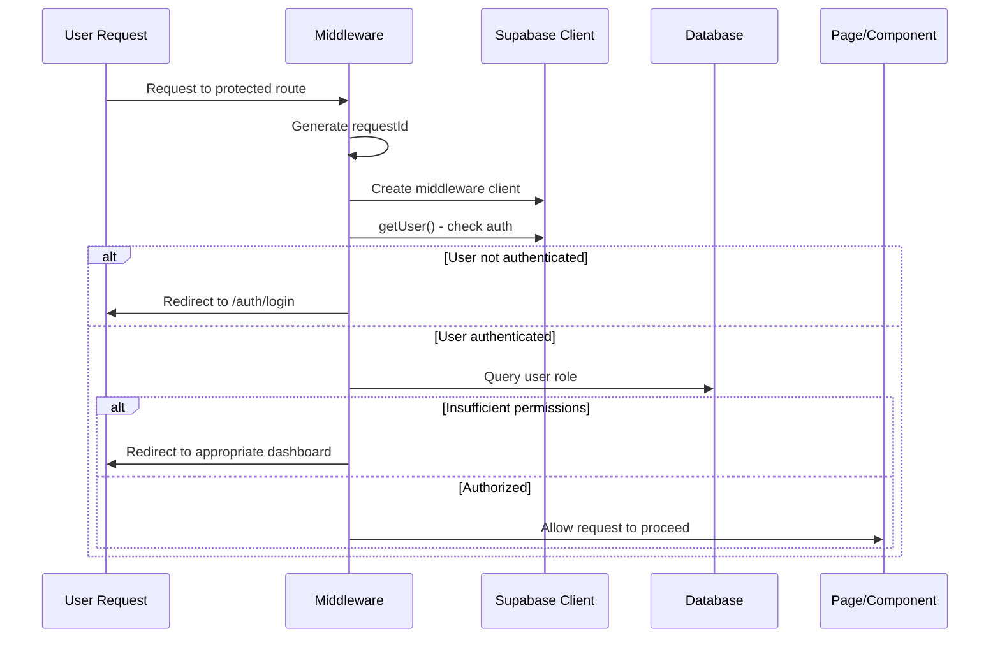
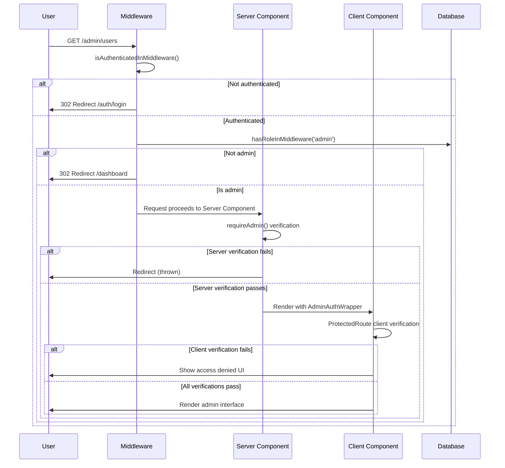

# Documentação Completa - Sistema de Rotas de Autenticação
## Plataforma de Ensino Habilidade

*Versão: 4.0 | Data: 2025-01-21 | Status: Produção Ativa*

---

## 📖 Visão Geral Executiva

Este documento fornece uma **análise completa e detalhada** do sistema de autenticação da Plataforma de Ensino Habilidade. Cobrindo desde o fluxo básico de login até as complexidades de proteção de rotas, redirecionamentos inteligentes e sistema de permissões granulares.

O sistema utiliza **Supabase Auth** como backend de autenticação, **Next.js 14 Middleware** para proteção de rotas server-side, e uma arquitetura híbrida de verificação que combina proteções no servidor e cliente para máxima segurança.

---

## 🏗️ Arquitetura do Sistema

### Stack Tecnológico
```
Frontend:     Next.js 14 + TypeScript + App Router
Auth Backend: Supabase (PostgreSQL + JWT)
Middleware:   Next.js Edge Runtime 
UI:           React + Tailwind CSS + Framer Motion
State:        React Context + Hooks personalizados
```

### Componentes Arquiteturais
```mermaid
graph TB
    subgraph "Cliente (Browser)"
        UI[Páginas de Auth]
        CC[Componentes Client]
        RC[React Context]
    end
    
    subgraph "Next.js Edge (Middleware)"
        MW[middleware.ts]
        MWC[middleware-client.ts]
    end
    
    subgraph "Next.js Server"
        SC[Server Components]
        API[API Routes]
        SSR[Server-Side Auth]
    end
    
    subgraph "Supabase"
        AUTH[Auth Service]
        DB[PostgreSQL + RLS]
        FUNC[is_admin() Function]
    end
    
    UI --> MW
    MW --> AUTH
    MW --> SC
    SC --> DB
    CC --> API
    API --> AUTH
    DB --> FUNC
```

---

## 🔗 Mapeamento Completo de Rotas

### 1. **Rotas de Autenticação Públicas**

#### **Login** - `/auth/login`
```typescript
// Arquivo: /src/app/auth/login/page.tsx
interface LoginPageFeatures {
  // Interface e UX
  background: 'Starfield animado'
  design: 'Card centralizado + glassmorphism'
  animations: 'Framer Motion transitions'
  
  // Funcionalidades
  authentication: {
    method: 'email + password',
    provider: 'Supabase Auth',
    validation: 'Client-side + Server-side'
  }
  
  // Fluxo pós-login
  redirect: {
    logic: 'getRedirectUrlForCurrentUser()',
    admin: '/admin',
    instructor: '/dashboard', 
    student: '/dashboard'
  }
  
  // Recursos avançados
  features: [
    'Detecção de callback errors',
    'Logging detalhado para debug',
    'Prevenção de access por users logados',
    'Remember me functionality',
    'Loading states'
  ]
}
```

**Fluxo Detalhado:**
1. **Middleware Check**: Verifica se usuário já está logado
2. **Redirect Logic**: Se autenticado, redireciona baseado no role
3. **Form Submission**: Validação e envio para Supabase
4. **Success Handler**: `getRedirectUrlForCurrentUser()` determina destino
5. **Error Handler**: Exibe mensagens de erro contextuais

#### **Registro** - `/auth/register`
```typescript
// Arquivo: /src/app/auth/register/page.tsx
interface RegisterPageFeatures {
  // Validações
  emailValidation: 'Regex + duplicate detection'
  passwordValidation: 'Mínimo 6 caracteres + confirmação'
  nameValidation: 'Obrigatório, mín 2 caracteres'
  
  // Processo de registro
  steps: [
    '1. Validação client-side',
    '2. Supabase signUp',
    '3. Detecção de duplicatas',
    '4. Envio de email de verificação',
    '5. Página de confirmação'
  ]
  
  // Tratamento de erros
  errorHandling: {
    duplicateEmail: 'Mensagem específica + link para login',
    weakPassword: 'Critérios de senha exibidos',
    networkError: 'Retry functionality',
    genericError: 'Fallback para erros desconhecidos'
  }
}
```

#### **Esqueci a Senha** - `/auth/forgot-password`
```typescript
// Arquivo: /src/app/auth/forgot-password/page.tsx
interface ForgotPasswordFeatures {
  process: [
    'Input de email',
    'Validação de formato',
    'Supabase resetPasswordForEmail',
    'Email de recuperação enviado',
    'Página de confirmação'
  ]
  
  security: {
    rateLimiting: 'Supabase built-in',
    emailValidation: 'Verifica se email existe',
    tokenExpiry: '1 hora (configurável)'
  }
}
```

#### **Atualizar Senha** - `/auth/update-password`
```typescript
// Arquivo: /src/app/auth/update-password/page.tsx
interface UpdatePasswordFeatures {
  validation: {
    sessionCheck: 'Verifica se token de reset é válido',
    passwordCriteria: 'Mínimo 6 caracteres',
    confirmation: 'Confirmação obrigatória'
  }
  
  process: [
    'Validação do token de reset',
    'Form de nova senha',
    'updateUser() do Supabase',
    'Confirmação de sucesso',
    'Auto-redirect para dashboard'
  ]
}
```

#### **Callback Handler** - `/auth/callback`
```typescript
// Arquivo: /src/app/auth/callback/route.ts
interface CallbackFeatures {
  purpose: [
    'Processar links de email verification',
    'Processar password reset tokens',
    'Exchange auth code por session',
    'Redirect inteligente pós-verificação'
  ]
  
  errorHandling: {
    expiredToken: 'Redirect para nova solicitação',
    invalidCode: 'Mensagem de erro + retry',
    networkError: 'Fallback gracioso'
  }
}
```

### 2. **Rotas Protegidas por Autenticação**

#### **Dashboard Principal** - `/dashboard`
```typescript
// Proteção: Usuário autenticado (qualquer role)
interface DashboardProtection {
  middleware: 'Verifica apenas se está autenticado',
  serverComponent: 'verifySession() para dados sensíveis',
  clientComponent: 'useAuth() hook para UI reativa'
}
```

#### **Perfil de Usuário** - `/profile`
```typescript
// Proteção: Usuário autenticado + dados próprios
interface ProfileProtection {
  dataAccess: 'RLS policy: user_id = auth.uid()',
  updates: 'Apenas próprios dados',
  validation: 'Client + server validation'
}
```

### 3. **Rotas Administrativas**

#### **Admin Dashboard** - `/admin`
```typescript
// Proteção: Role 'admin' + permission 'admin.view'
interface AdminProtection {
  middleware: [
    'isAuthenticatedInMiddleware()',
    'hasRoleInMiddleware(request, "admin")'
  ],
  serverComponent: [
    'requireAdmin() - server-side verification',
    'verifySessionWithRole("admin")'
  ],
  clientComponent: [
    'AdminAuthWrapper',
    'ProtectedRoute role="admin" permission="admin.view"'
  ]
}
```

#### **Gestão de Usuários** - `/admin/users`
```typescript
// Proteção: Admin + permission 'admin.users.view'
interface AdminUsersProtection {
  permissions: [
    'admin.users.view',      // Visualizar lista
    'admin.users.create',    // Criar usuários  
    'admin.users.edit',      // Editar perfis
    'admin.users.delete'     // Deletar contas
  ],
  rlsPolicies: [
    'is_admin() policy para acesso total',
    'Auditoria de ações administrativas'
  ]
}
```

#### **Outras Rotas Admin**
```typescript
const adminRoutes = {
  '/admin/courses':     'Gestão de cursos + instrutores',
  '/admin/categories':  'Categorias de cursos',
  '/admin/enrollments': 'Matrículas e progresso',
  '/admin/settings':    'Configurações do sistema',
  '/admin/blog':        'Gestão de conteúdo',
  '/admin/lessons':     'Aulas e materiais'
}
```

### 4. **Rotas de Cursos e Conteúdo**

#### **Lista de Cursos** - `/courses`
```typescript
// Proteção: Público (com diferenças para autenticados)
interface CoursesAccess {
  public: 'Lista básica de cursos disponíveis',
  authenticated: 'Status de matrícula + progresso',
  admin: 'Todos os cursos + opções de gestão'
}
```

#### **Página do Curso** - `/course/[slug]`
```typescript
// Proteção: Público para visualização, matrícula para acesso
interface CourseAccess {
  metadata: 'Informações públicas do curso',
  enrollment: 'Botão de matrícula se não inscrito',
  content: 'Preview limitado para não-inscritos',
  fullAccess: 'Conteúdo completo para matriculados'
}
```

#### **Aulas** - `/course/[slug]/lesson/[lessonSlug]`
```typescript
// Proteção: Matrícula no curso + progresso
interface LessonAccess {
  enrollmentCheck: 'SELECT FROM enrollments WHERE user_id = auth.uid()',
  progressTracking: 'Atualização automática de progresso',
  rlsPolicies: [
    'Estudantes veem apenas cursos matriculados',
    'Instrutores veem próprios cursos',
    'Admins veem todos'
  ]
}
```

---

## 🛡️ Sistema de Proteção em Camadas

### Camada 1: **Middleware (Edge Runtime)**

#### **Arquivo Principal**: `/middleware.ts`
```typescript
// Execução: Edge runtime - antes de qualquer page/component
interface MiddlewareProtection {
  performance: 'Extremamente rápido - Edge locations',
  coverage: 'Intercepta 100% das requisições',
  
  protectedRoutes: {
    '/admin/*': {
      check: 'hasRoleInMiddleware(request, "admin")',
      fallback: 'redirect("/auth/login")'
    },
    '/auth/*': {
      check: 'isAuthenticatedInMiddleware()',
      fallback: 'redirect(getRedirectUrl(profile.role))',
      note: 'Previne acesso às páginas de auth por users logados'
    }
  },
  
  logging: {
    level: 'Detalhado (requestId tracking)',
    production: 'Configurável via environment'
  }
}
```

**Processo de Execução:**


#### **Middleware Utils**: `/src/lib/supabase/middleware-client.ts`
```typescript
// Funções otimizadas para middleware
interface MiddlewareUtils {
  isAuthenticatedInMiddleware: {
    purpose: 'Quick auth check without full session',
    performance: 'Minimal database queries',
    caching: 'Request-scoped caching'
  },
  
  hasRoleInMiddleware: {
    purpose: 'Role verification with hierarchy support',
    hierarchy: 'admin > instructor > student',
    fallback: 'Graceful degradation on errors'
  },
  
  createMiddlewareClient: {
    purpose: 'Lightweight Supabase client for middleware',
    features: ['Cookie management', 'Request context', 'Error handling']
  }
}
```

### Camada 2: **Server Components**

#### **Session Management**: `/src/lib/auth/session.ts`
```typescript
// Funções para Server Components
interface ServerAuth {
  verifySession: {
    caching: 'React cache() para performance',
    validation: 'Full session + profile verification',
    errorHandling: 'Graceful fallbacks'
  },
  
  verifySessionWithRole: {
    purpose: 'Session + specific role check',
    usage: 'Admin pages, instructor dashboards',
    security: 'Double verification pattern'
  },
  
  requireAdmin: {
    purpose: 'Shortcut for admin-only pages',
    behavior: 'Throws redirect on failure',
    convenience: 'One-liner for admin layouts'
  }
}
```

**Exemplo de Uso:**
```typescript
// /src/app/admin/layout.tsx
export default async function AdminLayout({ children }) {
  // ✅ Server-side verification antes do render
  const session = await requireAdmin()
  
  return (
    <AdminAuthWrapper>  {/* ✅ Client-side verification também */}
      <div className="admin-layout">
        {children}
      </div>
    </AdminAuthWrapper>
  )
}
```

### Camada 3: **Client Components**

#### **ProtectedRoute**: `/src/components/admin/ProtectedRoute.tsx`
```typescript
// Proteção reativa no cliente
interface ProtectedRouteFeatures {
  reactivity: 'Reage a mudanças de session em tempo real',
  permissions: 'Sistema granular de permissões',
  fallbacks: 'Componentes customizados para acesso negado',
  
  usage: {
    role: 'Verifica role específico (admin, instructor, student)',
    permission: 'Verifica permissão granular (admin.users.edit)',
    redirectTo: 'URL para redirect em caso de negação'
  },
  
  loading: 'Estados de loading durante verificação',
  errorHandling: 'Recuperação de erros de rede/auth'
}
```

#### **AdminAuthWrapper**: `/src/components/admin/AdminAuthWrapper.tsx`
```typescript
// Wrapper específico para área administrativa
interface AdminAuthWrapperFeatures {
  specificity: 'Configurado especificamente para admins',
  requirements: ['role: admin', 'permission: admin.view'],
  fallback: 'Interface profissional de acesso negado',
  suspense: 'Boundaries para loading states'
}
```

### Camada 4: **Database (Row Level Security)**

#### **Políticas RLS Ativas**
```sql
-- Exemplos das principais políticas usando is_admin()

-- Usuários: Admins veem todos, users veem próprios dados
CREATE POLICY "Admin and own user access" ON users
FOR SELECT USING (is_admin() OR id = auth.uid());

-- Cursos: Admins + instrutores do curso
CREATE POLICY "Course management access" ON courses  
FOR ALL USING (is_admin() OR instructor_id = auth.uid());

-- Configurações: Apenas admins
CREATE POLICY "Admin only settings" ON admin_settings
FOR ALL USING (is_admin());
```

---

## 🔄 Fluxos de Autenticação Detalhados

### 1. **Fluxo de Login Completo**

```mermaid
graph TD
    Start[Usuário acessa qualquer rota] --> MW{Middleware verifica auth}
    MW -->|Não autenticado + rota protegida| Login[Redirect para /auth/login]
    MW -->|Já autenticado| CheckRoute{Rota atual vs Role}
    
    Login --> LoginPage[Página de Login]
    LoginPage --> Credentials[Usuário insere credenciais]
    Credentials --> SupaAuth[Supabase Auth]
    
    SupaAuth -->|Sucesso| GetProfile[Buscar perfil do usuário]
    SupaAuth -->|Erro| LoginError[Exibir erro no form]
    
    GetProfile --> RedirectLogic[getRedirectUrlForCurrentUser]
    RedirectLogic -->|Admin| AdminDash[/admin]
    RedirectLogic -->|Instructor| InstrDash[/dashboard]
    RedirectLogic -->|Student| StudentDash[/dashboard]
    
    CheckRoute -->|Role incompatível| RedirectLogic
    CheckRoute -->|Role compatível| AllowAccess[Permitir acesso]
```

### 2. **Fluxo de Proteção Admin**



### 3. **Fluxo de Registro com Verificação**

```mermaid
graph TD
    A[/auth/register] --> B[Middleware: isAuthenticated?]
    B -->|Sim| C[Redirect baseado em role]
    B -->|Não| D[Exibir form de registro]
    
    D --> E[Usuário preenche dados]
    E --> F[Validações client-side]
    F -->|Falhou| G[Exibir erros]
    F -->|Passou| H[Supabase signUp]
    
    H --> I{Email já existe?}
    I -->|Sim| J[Erro: Usar login]
    I -->|Não| K[Conta criada]
    
    K --> L[Email de verificação enviado]
    L --> M[Página de confirmação]
    
    M --> N[Usuário clica link do email]
    N --> O[/auth/callback processar]
    O --> P[Verificar token]
    P -->|Válido| Q[Ativar conta]
    P -->|Inválido| R[Erro de verificação]
    
    Q --> S[Redirect para dashboard]
```

---

## 🎯 Sistema de Redirecionamentos

### **Lógica Central**: `/src/lib/auth/redirect-helpers.ts`

#### **getRedirectUrlForCurrentUser()**
```typescript
interface RedirectLogic {
  // Hierarquia de redirecionamento
  priorities: [
    '1. URL de retorno (returnTo parameter)',
    '2. Role-based default redirect',
    '3. Fallback universal (/dashboard)'
  ],
  
  roleMapping: {
    admin: '/admin',
    instructor: '/dashboard', 
    student: '/dashboard'
  },
  
  specialCases: {
    firstLogin: 'Pode incluir onboarding',
    emailVerification: 'Redirect pós-verificação',
    passwordReset: 'Redirect pós-atualização'
  }
}
```

#### **Redirect Helpers Server-Side**
```typescript
// /src/lib/auth/redirect-helpers-server.ts
interface ServerRedirectHelpers {
  redirectToLogin: {
    purpose: 'Server action para redirect seguro',
    usage: 'Server Components que detectam auth failure'
  },
  
  redirectBasedOnRole: {
    purpose: 'Server-side role-based redirects',
    caching: 'Otimizado para Server Components'
  }
}
```

### **Casos Especiais de Redirect**

#### **Prevenção de Loop Infinito**
```typescript
// Middleware verifica se user autenticado está tentando acessar /auth/*
if (pathname.startsWith('/auth/') && isAuthenticated) {
  const redirectUrl = await getRedirectUrlForCurrentUser(profile)
  return NextResponse.redirect(new URL(redirectUrl, request.url))
}
```

#### **Preservação de Intended URL**
```typescript
// Quando user não autenticado tenta acessar rota protegida
const loginUrl = new URL('/auth/login', request.url)
loginUrl.searchParams.set('returnTo', request.nextUrl.pathname)
return NextResponse.redirect(loginUrl)

// Na página de login, após sucesso:
const returnTo = searchParams.get('returnTo')
const finalRedirect = returnTo || getRedirectUrlForCurrentUser(profile)
```

---

## 🔐 Sistema de Permissões

### **Definição de Permissões**: `/src/lib/auth/permissions-client.ts`

#### **Mapeamento Completo**
```typescript
const rolePermissions = {
  admin: [
    // Administração Geral
    'admin.view',
    'admin.users.create',
    'admin.users.edit', 
    'admin.users.delete',
    'admin.users.impersonate',
    
    // Gestão de Cursos
    'admin.courses.create',
    'admin.courses.edit',
    'admin.courses.delete',
    'admin.courses.publish',
    
    // Gestão de Instrutores  
    'admin.instructors.create',
    'admin.instructors.edit',
    'admin.instructors.delete',
    'admin.instructors.approve',
    
    // Matrículas e Progresso
    'admin.enrollments.create',
    'admin.enrollments.edit', 
    'admin.enrollments.delete',
    'admin.progress.view_all',
    'admin.progress.reset',
    
    // Sistema e Configurações
    'admin.system.settings',
    'admin.system.backup',
    'admin.system.logs',
    'admin.analytics.view_all',
    
    // Herdar permissões de roles inferiores
    ...rolePermissions.instructor,
    ...rolePermissions.student
  ],
  
  instructor: [
    // Gestão de Próprios Cursos
    'courses.create',
    'courses.edit_own',
    'courses.delete_own',
    
    // Gestão de Aulas
    'lessons.create',
    'lessons.edit_own',
    'lessons.delete_own',
    
    // Avaliações e Progresso
    'evaluations.create_own',
    'evaluations.edit_own',
    'progress.view_own_students',
    
    // Certificados
    'certificates.generate_own',
    
    // Herdar permissões de student
    ...rolePermissions.student
  ],
  
  student: [
    // Visualização e Acesso
    'courses.view',
    'lessons.access',
    'progress.view_own',
    
    // Interações
    'evaluations.submit',
    'certificates.download_own',
    
    // Perfil
    'profile.edit_own'
  ]
}
```

#### **Funções de Verificação**
```typescript
interface PermissionFunctions {
  hasPermission: {
    signature: '(user, permission) => boolean',
    usage: 'Verificação de permissão específica',
    example: 'hasPermission(user, "admin.users.edit")'
  },
  
  hasAnyPermission: {
    signature: '(user, permissions[]) => boolean', 
    usage: 'Verifica se user tem pelo menos uma das permissões',
    example: 'hasAnyPermission(user, ["courses.edit", "courses.create"])'
  },
  
  getUserPermissions: {
    signature: '(user) => string[]',
    usage: 'Retorna todas as permissões do usuário',
    caching: 'Pode ser otimizado com memoization'
  }
}
```

---

## 🧪 Debugging e Ferramentas de Desenvolvimento

### **Páginas de Debug**

#### **Tester de Redirecionamento**: `/test-auth-redirect`
```typescript
// Componente: AuthRedirectTester
interface DebugFeatures {
  userInfo: 'Mostra role, email, ID do usuário atual',
  redirectSimulation: 'Simula lógica de redirect sem executar',
  urlPreview: 'Mostra para onde seria redirecionado',
  roleChange: 'Simula mudança de role para testar'
}
```

#### **Debug de Middleware**: `/debug-middleware`
```typescript
interface MiddlewareDebugFeatures {
  requestInfo: 'Headers, cookies, URL completa',
  authStatus: 'Status da verificação de autenticação', 
  redirectTrace: 'Trace completo da lógica de redirect',
  timing: 'Métricas de performance do middleware'
}
```

### **Logging System**

#### **Estrutura de Logs**
```typescript
interface LoggingStructure {
  // Identificação única por request
  requestId: 'Gerado automaticamente para rastreamento',
  
  // Contexto completo
  context: {
    url: 'URL acessada',
    method: 'HTTP method',
    userAgent: 'Browser/device info',
    timestamp: 'ISO timestamp'
  },
  
  // Estados de autenticação
  authStates: {
    authenticated: 'boolean',
    role: 'user role',
    permissions: 'applicable permissions',
    sessionValid: 'session validity'
  },
  
  // Decisões de roteamento
  routingDecisions: {
    allowed: 'boolean',
    redirectTo: 'destination URL if redirected', 
    reason: 'human-readable reason'
  }
}
```

#### **Configuração de Logs**
```typescript
// Configurável via environment variables
const LOG_LEVELS = {
  SILENT: 'Sem logs',
  ERROR: 'Apenas erros críticos',
  WARN: 'Warnings + errors',
  INFO: 'Informações gerais',
  DEBUG: 'Logs detalhados (desenvolvimento)',
  TRACE: 'Máximo detalhe (troubleshooting)'
}
```

---

## ⚡ Performance e Otimizações

### **Estratégias de Caching**

#### **Server-Side Caching**
```typescript
// React cache() para Server Components
const verifySession = cache(async (): Promise<SessionData> => {
  // Cache por request - evita múltiplas queries
  // Especialmente importante para layouts + pages
})
```

#### **Client-Side Optimization**
```typescript
interface ClientOptimizations {
  // React Query para cache de auth state
  authCache: {
    staleTime: '5 minutos',
    gcTime: '30 minutos', 
    refetchOnWindowFocus: true
  },
  
  // Lazy loading de componentes
  componentSplitting: [
    'AdminAuthWrapper - lazy load',
    'ProtectedRoute - code split',
    'Auth forms - dynamic imports'
  ]
}
```

### **Database Optimizations**

#### **RLS Performance**
```sql
-- Índices otimizados para consultas de auth
CREATE INDEX idx_users_id ON users (id);  -- Primary key (já existe)
CREATE INDEX idx_users_role ON users (role);  -- Para consultas por role
CREATE INDEX idx_users_email ON users (email);  -- Para login

-- Query planning para is_admin()
EXPLAIN ANALYZE SELECT is_admin();
```

#### **Connection Pooling**
```typescript
// Supabase automaticamente gerencia connection pooling
// Configurações otimizadas para auth queries
interface SupabaseConfig {
  poolSize: 'Otimizado para auth queries frequentes',
  connectionTimeout: '30s para auth operations',
  idleTimeout: 'Configurado para Next.js serverless'
}
```

---

## 🚨 Segurança e Compliance

### **Medidas de Segurança Implementadas**

#### **1. Múltiplas Camadas de Verificação**
```typescript
interface SecurityLayers {
  layer1: 'Middleware - Edge runtime verification',
  layer2: 'Server Component - Session validation', 
  layer3: 'Client Component - UI state verification',
  layer4: 'Database RLS - Final data protection'
}
```

#### **2. Session Management**
```typescript
interface SessionSecurity {
  // JWT Tokens (Supabase)
  accessToken: {
    expiry: '1 hora',
    autoRefresh: 'Automático via refresh token',
    storage: 'httpOnly cookie (secure)'
  },
  
  refreshToken: {
    expiry: '30 dias (configurável)',
    rotation: 'Automático no refresh', 
    revocation: 'Suportado via logout'
  },
  
  // Session invalidation
  invalidation: [
    'Logout manual',
    'Token expiry',
    'Detecção de anomalias',
    'Admin revocation'
  ]
}
```

#### **3. Proteção contra Ataques**

```typescript
interface AttackPrevention {
  csrf: {
    protection: 'Supabase built-in CSRF protection',
    tokens: 'Generated per session'
  },
  
  xss: {
    prevention: 'React built-in escaping + CSP headers',
    sanitization: 'Input validation on all forms'
  },
  
  sessionHijacking: {
    prevention: [
      'Secure httpOnly cookies',
      'IP validation (optional)',
      'Device fingerprinting (optional)'
    ]
  },
  
  bruteForce: {
    protection: 'Supabase rate limiting',
    lockout: 'Progressive delays on failed attempts'
  },
  
  sqlInjection: {
    prevention: 'Parameterized queries + RLS policies',
    ormSafety: 'Supabase client automatic escaping'
  }
}
```

### **Audit e Compliance**

#### **Logging de Segurança**
```sql
-- Table para logs de audit
CREATE TABLE admin_audit_log (
  id UUID PRIMARY KEY DEFAULT gen_random_uuid(),
  user_id UUID REFERENCES users(id),
  action TEXT NOT NULL,
  resource_type TEXT,
  resource_id TEXT,
  ip_address TEXT,
  user_agent TEXT,
  timestamp TIMESTAMP WITH TIME ZONE DEFAULT NOW()
);

-- RLS policy para audit log
CREATE POLICY "Admin audit log access" ON admin_audit_log
FOR SELECT USING (is_admin());
```

#### **Compliance Features**
```typescript
interface ComplianceFeatures {
  dataProtection: [
    'LGPD compliance - data minimization',
    'Right to deletion - account deletion',
    'Data portability - export functionality',
    'Consent management - terms acceptance'
  ],
  
  auditTrail: [
    'Complete action logging',
    'IP address tracking',
    'Session duration tracking',
    'Admin action monitoring'
  ],
  
  accessControl: [
    'Role-based access control (RBAC)',
    'Principle of least privilege',
    'Regular access reviews',
    'Automated deprovisioning'
  ]
}
```

---

## 🔧 Configuração e Deployment

### **Environment Variables**

#### **Supabase Configuration**
```env
# Supabase Core
NEXT_PUBLIC_SUPABASE_URL=https://your-project.supabase.co
NEXT_PUBLIC_SUPABASE_ANON_KEY=eyJ...
SUPABASE_SERVICE_ROLE_KEY=eyJ...

# Auth Configuration  
NEXT_PUBLIC_SUPABASE_AUTH_CALLBACK_URL=https://yourapp.com/auth/callback
SUPABASE_JWT_SECRET=your-jwt-secret

# Security
NEXTAUTH_SECRET=your-nextauth-secret
NEXTAUTH_URL=https://yourapp.com

# Logging
LOG_LEVEL=INFO
ENABLE_AUTH_LOGGING=true
```

#### **Production vs Development**
```typescript
interface EnvironmentConfig {
  development: {
    logging: 'TRACE level - máximo detalhe',
    redirects: 'localhost URLs',
    debugging: 'Todas as páginas de debug ativas'
  },
  
  production: {
    logging: 'INFO level - apenas necessário',
    redirects: 'Production URLs',
    debugging: 'Páginas de debug desabilitadas',
    security: 'Headers de segurança completos'
  }
}
```

### **Deployment Checklist**

#### **Pré-Deploy Security Check**
```bash
# ✅ Verificações obrigatórias
□ Environment variables configuradas
□ HTTPS configurado 
□ CSP headers implementados
□ Rate limiting ativo
□ Logs de produção configurados
□ Debug pages desabilitadas
□ Admin users criados
□ RLS policies testadas
□ Backup procedures estabelecidos
```

---

## 🎯 Casos de Uso Comuns

### **1. Adicionar Nova Rota Protegida**

```typescript
// Step 1: Definir proteção no middleware (se necessário)
// middleware.ts
if (pathname.startsWith('/new-protected-area')) {
  const hasAccess = await hasRoleInMiddleware(request, 'instructor')
  if (!hasAccess) {
    return NextResponse.redirect(new URL('/dashboard', request.url))
  }
}

// Step 2: Implementar Server Component protection
// /src/app/new-protected-area/page.tsx
export default async function NewProtectedPage() {
  const session = await verifySessionWithRole('instructor')
  
  return (
    <ProtectedRoute role="instructor" permission="courses.create">
      <div>Conteúdo protegido</div>
    </ProtectedRoute>
  )
}
```

### **2. Adicionar Nova Permissão**

```typescript
// Step 1: Adicionar na definição de permissões
// /src/lib/auth/permissions-client.ts
const rolePermissions = {
  instructor: [
    // ... existing permissions
    'courses.analytics.view',  // Nova permissão
  ]
}

// Step 2: Usar na verificação
const canViewAnalytics = hasPermission(user, 'courses.analytics.view')

// Step 3: Implementar RLS policy (se aplicável)
CREATE POLICY "Instructors can view course analytics" ON course_analytics
FOR SELECT USING (
  (SELECT role FROM users WHERE id = auth.uid()) IN ('admin', 'instructor')
);
```

### **3. Debugging de Problemas de Auth**

```typescript
// Checklist de debugging
interface DebuggingSteps {
  step1: 'Verificar logs do middleware (requestId tracking)',
  step2: 'Validar session no browser dev tools',
  step3: 'Testar função is_admin() no Supabase SQL editor',
  step4: 'Verificar RLS policies com EXPLAIN ANALYZE',
  step5: 'Usar páginas de debug (/debug-auth, /test-auth-*)',
  step6: 'Validar environment variables'
}
```

---

## 🚀 Próximos Passos e Melhorias

### **Roadmap de Funcionalidades**

#### **Phase 1: Otimizações (1-2 semanas)**
- [ ] **Cleanup de logs**: Reduzir verbosidade para produção
- [ ] **Performance monitoring**: Métricas de auth timing
- [ ] **Error handling**: Messages mais user-friendly
- [ ] **Caching improvements**: Client-side auth state caching

#### **Phase 2: Security Enhancements (1 mês)**
- [ ] **Two-Factor Authentication (2FA)**: TOTP implementation
- [ ] **Session management UI**: Para usuários verem sessions ativas
- [ ] **Advanced audit logging**: Mais detalhes de tracking
- [ ] **IP-based security**: Detecção de locations suspeitas

#### **Phase 3: User Experience (2 meses)**
- [ ] **Social login**: Google, GitHub OAuth
- [ ] **Magic link authentication**: Passwordless login
- [ ] **Progressive onboarding**: Guided setup para novos users
- [ ] **Account recovery**: Advanced password recovery flows

#### **Phase 4: Enterprise Features (3-6 meses)**
- [ ] **Multi-tenant architecture**: Organizações separadas
- [ ] **SAML/OIDC integration**: Enterprise SSO
- [ ] **Advanced RBAC**: Dynamic role assignments
- [ ] **Compliance dashboard**: LGPD/GDPR management

---

## 📞 Manutenção e Suporte

### **Equipe Responsável**
- **Backend Security**: Gestão de RLS policies e database auth
- **Frontend Auth**: Componentes React e fluxos de UI
- **DevOps**: Middleware, deployment, monitoring
- **QA**: Testes de segurança e edge cases

### **Recursos de Apoio**
- **Monitoring**: Logs de auth em production
- **Alerting**: Notificações para falhas de auth críticas  
- **Documentation**: Este guia + código comments
- **Testing**: Suite de testes automatizados

### **Troubleshooting Contacts**
- **Auth Issues**: [Escalation procedure]
- **Security Incidents**: [Emergency contacts]
- **Performance Problems**: [Monitoring team]

---

## 📚 Documentação Relacionada

### **Documentos Técnicos**
- [Função is_admin() - Guia Detalhado](./IS_ADMIN_FUNCTION_GUIDE.md)
- [Sistema de Autenticação Geral](./ADMIN_AUTHENTICATION.md)
- [Referência Rápida](./ADMIN_QUICK_REFERENCE.md)
- [Schema do Banco de Dados](../database/schema.sql)

### **Recursos Externos**
- [Supabase Auth Documentation](https://supabase.com/docs/guides/auth)
- [Next.js Middleware Guide](https://nextjs.org/docs/app/building-your-application/routing/middleware)
- [RLS Best Practices](https://supabase.com/docs/guides/auth/row-level-security)

---

## 📝 Changelog

### v4.0 - 2025-01-21
- ✅ Documentação completa de todas as rotas de autenticação
- ✅ Análise detalhada de middleware e componentes
- ✅ Mapeamento de fluxos com diagramas Mermaid
- ✅ Guias de debugging e troubleshooting
- ✅ Roadmap de melhorias e otimizações

### v3.5 - 2025-01-20
- ✅ Sistema de permissões granulares implementado
- ✅ Middleware de proteção otimizado
- ✅ Componentes de proteção client-side ativos

### v3.0 - 2025-01-15
- ✅ Integração completa com Supabase Auth
- ✅ RLS policies implementadas
- ✅ Sistema de redirecionamento baseado em roles

---

*Documentação Completa do Sistema de Autenticação - Plataforma Habilidade*  
*Versão 4.0 | Criado pela Equipe de Desenvolvimento | 2025-01-21*

**🎯 Objetivo**: Fornecer entendimento completo e detalhado de todos os aspectos do sistema de autenticação, desde login básico até proteções avançadas de segurança.

---