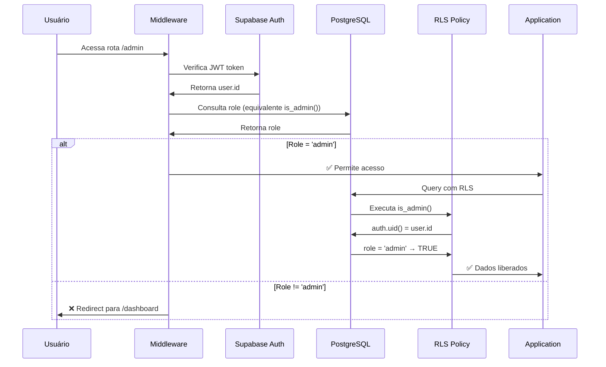

# Documentação Completa - Função `is_admin()`
## Sistema de Autenticação da Plataforma Habilidade

*Versão: 3.0 | Data: 2025-01-21 | Status: Em Produção*

---

## 📖 Visão Geral

A função `public.is_admin()` é o **núcleo central** do sistema de autenticação administrativa da Plataforma Habilidade. Esta função PostgreSQL/PL-pgSQL é responsável por verificar se o usuário autenticado atual possui privilégios administrativos, sendo utilizada extensivamente em Row Level Security (RLS) policies e verificações de permissão em toda a aplicação.

---

## 🔬 Análise Técnica da Função

### Definição Completa
```sql
CREATE OR REPLACE FUNCTION public.is_admin()
RETURNS BOOLEAN
LANGUAGE plpgsql
SECURITY DEFINER
VOLATILE
AS $$
BEGIN
  RETURN (
    SELECT role = 'admin' 
    FROM public.users 
    WHERE id = auth.uid()
  );
END;
$$;

-- Permissões de acesso
GRANT EXECUTE ON FUNCTION public.is_admin() TO authenticated;
GRANT EXECUTE ON FUNCTION public.is_admin() TO anon;
GRANT EXECUTE ON FUNCTION public.is_admin() TO service_role;
```

### Características Técnicas

#### **Security Definer**
```sql
SECURITY DEFINER
```
- ✅ **Executa com privilégios do proprietário** (postgres)
- ✅ **Segurança elevada** - Não pode ser comprometida por usuários comuns
- ✅ **Acesso garantido** à tabela `users` independente das permissões do usuário atual

#### **Volatility: VOLATILE**
```sql
VOLATILE
```
- ⚡ **Não cacheable** - Sempre executa a consulta
- 🔄 **Reflexão em tempo real** - Mudanças de role são imediatamente refletidas
- 📊 **Trade-off**: Mais lenta, mas sempre atual

#### **Dependência do `auth.uid()`**
```sql
WHERE id = auth.uid()
```
- 🔑 **Contexto de autenticação** - Usa o ID do usuário da sessão atual
- ✅ **Thread-safe** - Cada conexão tem seu próprio contexto
- ⚠️ **Retorna NULL** se não há usuário autenticado

---

## 🏗️ Como Funciona (Passo a Passo)

### 1. **Contexto de Execução**
```mermaid
graph TD
    A[Usuário faz requisição] --> B[Supabase Auth verifica JWT]
    B --> C[auth.uid() definido na sessão]
    C --> D[is_admin() acessível via RLS/API]
    D --> E{Usuário autenticado?}
    E -->|Sim| F[Consulta tabela users]
    E -->|Não| G[Retorna NULL/false]
    F --> H{Role = 'admin'?}
    H -->|Sim| I[Retorna TRUE]
    H -->|Não| J[Retorna FALSE]
```

### 2. **Processo de Verificação**
```sql
-- Passo 1: Obter ID do usuário autenticado
SELECT auth.uid(); -- Ex: 'e638dcc0-b42a-4fb0-a1b5-af4dfc61469c'

-- Passo 2: Buscar role na tabela users  
SELECT role 
FROM public.users 
WHERE id = auth.uid(); -- Ex: 'admin'

-- Passo 3: Comparar com 'admin'
SELECT role = 'admin' 
FROM public.users 
WHERE id = auth.uid(); -- Ex: true
```

### 3. **Possíveis Retornos**
| Situação | `auth.uid()` | Usuário existe? | Role | `is_admin()` |
|----------|-------------|-----------------|------|-------------|
| 🔐 Admin logado | UUID válido | ✅ Sim | 'admin' | **TRUE** |
| 👨‍🏫 Instructor logado | UUID válido | ✅ Sim | 'instructor' | **FALSE** |
| 🎓 Student logado | UUID válido | ✅ Sim | 'student' | **FALSE** |
| 👻 Usuário não autenticado | NULL | - | - | **NULL** |
| 🚨 Usuário deletado | UUID válido | ❌ Não | - | **NULL** |

---

## 🛡️ Implementação na Aplicação

### 1. **Row Level Security (RLS) Policies**

A função é usada em **9 políticas RLS** diferentes:

#### **Tabela `users` - Gestão de Usuários**
```sql
-- Admins podem gerenciar todos os usuários
CREATE POLICY "Admins can manage all users" ON users
FOR ALL USING (is_admin()) WITH CHECK (is_admin());

-- Admins podem ver todos os usuários (ou usuário vê próprio perfil)
CREATE POLICY "Admins can view all users" ON users
FOR SELECT USING (is_admin() OR (id = auth.uid()));
```

#### **Tabela `courses` - Gestão de Cursos**
```sql
-- Admins e instrutores podem gerenciar cursos
CREATE POLICY "Admins can manage all courses" ON courses
FOR ALL USING (is_admin() OR (instructor_id = auth.uid()))
WITH CHECK (is_admin() OR (instructor_id = auth.uid()));
```

#### **Tabela `enrollments` - Gestão de Matrículas**
```sql
-- Apenas admins podem deletar matrículas
CREATE POLICY "Admins can manage enrollments delete" ON enrollments
FOR DELETE USING (is_admin());

-- Admins veem todas, usuários veem próprias matrículas
CREATE POLICY "Admins can view all enrollments" ON enrollments
FOR SELECT USING (is_admin() OR (user_id = auth.uid()));
```

#### **Tabela `admin_settings` - Configurações do Sistema**
```sql
-- Configurações são exclusivas para admins
CREATE POLICY "Only admins can access settings" ON admin_settings
FOR ALL USING (is_admin()) WITH CHECK (is_admin());
```

#### **Tabela `admin_audit_log` - Logs de Auditoria**
```sql
-- Logs de auditoria são visíveis apenas para admins
CREATE POLICY "Only admins can view audit log" ON admin_audit_log
FOR SELECT USING (is_admin());
```

### 2. **Middleware de Proteção (Server-Side)**

O sistema atual **não usa `is_admin()` diretamente** no middleware, mas implementa uma verificação equivalente:

```typescript
// /mnt/c/habilidade/plataforma-ensino/middleware.ts
export async function hasRoleInMiddleware(
  request: NextRequest,
  requiredRole: 'admin' | 'instructor' | 'student'
): Promise<boolean> {
  try {
    const supabase = createMiddlewareClient(request)
    
    // Equivalente ao auth.uid()
    const { data: { user }, error: authError } = await supabase.auth.getUser()
    if (authError || !user) return false

    // Equivalente à consulta na função is_admin()
    const { data: profile, error: profileError } = await supabase
      .from('users')
      .select('role')
      .eq('id', user.id)  // <- Equivalente ao auth.uid()
      .single()

    if (profileError || !profile) return false

    // Verificação hierárquica de roles
    if (requiredRole === 'admin') {
      return profile.role === 'admin'  // <- Equivalente ao role = 'admin'
    }
    
    return false
  } catch (error) {
    console.error('[MIDDLEWARE_ROLE] Error checking role:', error)
    return false
  }
}
```

### 3. **Componentes Client-Side**

#### **ProtectedRoute Component**
```typescript
// /mnt/c/habilidade/plataforma-ensino/src/components/admin/ProtectedRoute.tsx
export default function ProtectedRoute({ role, permission, children }) {
  useEffect(() => {
    const checkAccess = async () => {
      const currentUser = await getCurrentUserClient()
      
      // Verificação equivalente ao is_admin() no client
      if (role && currentUser.role !== role) {
        setHasAccess(false)
        router.push(redirectTo)
        return
      }

      // Verificação de permissões baseada no role
      if (permission && !hasPermission(currentUser, permission)) {
        setHasAccess(false)
        router.push(redirectTo)
        return
      }

      setHasAccess(true)
    }

    checkAccess()
  }, [role, permission])

  return hasAccess ? children : <AccessDenied />
}
```

#### **Sistema de Permissões Client-Side**
```typescript
// /mnt/c/habilidade/plataforma-ensino/src/lib/auth/permissions-client.ts
export async function getCurrentUserClient(): Promise<User | null> {
  const supabase = createClient()
  
  // Equivalente ao auth.uid() no client
  const { data: { user } } = await supabase.auth.getUser()
  if (!user) return null

  // Equivalente à consulta da função is_admin()
  const { data: profile } = await supabase
    .from('users')
    .select('*')
    .eq('id', user.id)  // <- user.id é equivalente ao auth.uid()
    .single()

  return profile
}

export function hasPermission(user: User | null, permission: Permission): boolean {
  if (!user) return false
  
  // Verificação de admin equivalente ao is_admin() = true
  const userPermissions = rolePermissions[user.role] || []
  return userPermissions.includes(permission)
}
```

---

## 🔄 Integração com o Sistema de Autenticação

### 1. **Fluxo Completo de Autenticação**



### 2. **Consistency Check: Middleware vs is_admin()**

O middleware e a função `is_admin()` implementam a **mesma lógica**, mas em contextos diferentes:

| Aspecto | Middleware (Server-Side) | `is_admin()` (Database) |
|---------|-------------------------|------------------------|
| **Contexto** | Next.js Request | PostgreSQL Session |
| **User ID** | `supabase.auth.getUser().id` | `auth.uid()` |
| **Consulta** | `SELECT role FROM users WHERE id = ?` | `SELECT role = 'admin' FROM users WHERE id = auth.uid()` |
| **Retorno** | `profile.role === 'admin'` | `role = 'admin'` (boolean) |
| **Caching** | Sem cache | Sem cache (VOLATILE) |
| **Segurança** | Depende do client Supabase | SECURITY DEFINER |

### 3. **Vantagens da Função `is_admin()`**

#### **🔒 Segurança Superior**
- **Security Definer**: Executa com privilégios elevados
- **Imutável**: Não pode ser modificada por usuários
- **Centralizada**: Uma única fonte de verdade

#### **⚡ Performance em RLS**
- **Otimizada**: PostgreSQL pode otimizar consultas RLS
- **Indexada**: Consulta por `id` usa índice primário
- **Compilada**: PL/pgSQL compilado é mais rápido que consultas ad-hoc

#### **🎯 Consistência Garantida**
- **Atomic**: Sempre consistente com o estado atual
- **Transaction-safe**: Respeita transações
- **Real-time**: Mudanças de role são imediatamente refletidas

---

## 🧪 Testes e Debugging

### 1. **Testando a Função Manualmente**

#### **Via Supabase SQL Editor**
```sql
-- Teste básico (sem autenticação - retorna NULL)
SELECT public.is_admin();

-- Teste com contexto de usuário específico (como service_role)
SET ROLE postgres;
SELECT public.is_admin();

-- Verificar usuários admin existentes
SELECT 
  id, 
  email, 
  full_name, 
  role,
  public.is_admin() as would_be_admin -- Só funciona se auth.uid() estiver definido
FROM public.users 
WHERE role = 'admin';
```

#### **Via API Route (Next.js)**
```typescript
// /api/test-admin.ts
export async function GET() {
  const supabase = createRouteHandlerClient({ cookies })
  
  // Testar função is_admin() via RPC
  const { data: isAdmin, error } = await supabase.rpc('is_admin')
  
  return Response.json({ 
    isAdmin, 
    error: error?.message,
    authUser: (await supabase.auth.getUser()).data.user?.id
  })
}
```

### 2. **Debugging Common Issues**

#### **Problema: `is_admin()` retorna NULL**
```sql
-- Diagnosticar
SELECT 
  auth.uid() as current_auth_uid,
  (SELECT COUNT(*) FROM users WHERE id = auth.uid()) as user_exists,
  (SELECT role FROM users WHERE id = auth.uid()) as current_role,
  public.is_admin() as is_admin_result;
```

**Possíveis Causas:**
- ❌ Usuário não autenticado (`auth.uid()` é NULL)
- ❌ Usuário não existe na tabela `users`
- ❌ Campo `role` é NULL

#### **Problema: Middleware passa, mas RLS bloqueia**
```javascript
// Debug no browser console
const { data: user } = await supabase.auth.getUser()
const { data: profile } = await supabase
  .from('users')
  .select('*')
  .eq('id', user.id)
  .single()

console.log('Auth User ID:', user.id)
console.log('Profile Role:', profile.role)

// Testar função is_admin()
const { data: isAdmin } = await supabase.rpc('is_admin')
console.log('is_admin() result:', isAdmin)
```

### 3. **Performance Monitoring**

#### **Análise de Uso da Função**
```sql
-- Ver onde is_admin() é mais utilizada
SELECT 
  schemaname,
  tablename,
  policyname,
  cmd,
  qual
FROM pg_policies 
WHERE qual LIKE '%is_admin%' 
   OR with_check LIKE '%is_admin%'
ORDER BY schemaname, tablename;
```

#### **Impacto na Performance**
```sql
-- Verificar plano de execução
EXPLAIN ANALYZE 
SELECT role = 'admin' 
FROM public.users 
WHERE id = 'e638dcc0-b42a-4fb0-a1b5-af4dfc61469c';
```

---

## 🎯 Best Practices

### 1. **Uso Recomendado**

#### **✅ DO: Use em RLS Policies**
```sql
-- Correto: Política RLS simples e eficiente
CREATE POLICY "Admins can manage data" ON sensitive_table
FOR ALL USING (is_admin());
```

#### **✅ DO: Use via RPC em APIs**
```typescript
// Correto: Verificação server-side consistente
const { data: isAdmin } = await supabase.rpc('is_admin')
if (!isAdmin) {
  return NextResponse.json({ error: 'Forbidden' }, { status: 403 })
}
```

#### **❌ DON'T: Não replique a lógica**
```typescript
// Incorreto: Duplica a lógica da função
const { data: user } = await supabase
  .from('users')
  .select('role')
  .eq('id', session.user.id)
  .single()

if (user.role !== 'admin') // Prefira usar supabase.rpc('is_admin')
```

### 2. **Otimizações**

#### **Caching Estratégico**
```typescript
// Cache no client para múltiplas verificações
class AdminChecker {
  private cache: boolean | null = null
  private cacheTime = 0
  private CACHE_TTL = 30000 // 30 segundos

  async isAdmin(): Promise<boolean> {
    const now = Date.now()
    if (this.cache !== null && now - this.cacheTime < this.CACHE_TTL) {
      return this.cache
    }

    const { data } = await supabase.rpc('is_admin')
    this.cache = data
    this.cacheTime = now
    return data
  }
}
```

#### **Combinação com Outras Verificações**
```sql
-- Política RLS otimizada: admin OU owner
CREATE POLICY "Admins or owners can access" ON user_content
FOR SELECT USING (is_admin() OR user_id = auth.uid());
```

### 3. **Monitoramento**

#### **Logging de Acesso Admin**
```sql
-- Trigger para logar uso da função
CREATE OR REPLACE FUNCTION log_admin_access()
RETURNS TRIGGER AS $$
BEGIN
  IF public.is_admin() THEN
    INSERT INTO admin_audit_log (
      user_id, 
      action, 
      table_name, 
      timestamp
    ) VALUES (
      auth.uid(),
      TG_OP,
      TG_TABLE_NAME,
      NOW()
    );
  END IF;
  RETURN COALESCE(NEW, OLD);
END;
$$ LANGUAGE plpgsql;
```

---

## 🚨 Considerações de Segurança

### 1. **Proteções Implementadas**

#### **Security Definer**
- ✅ **Escalação de privilégios controlada**
- ✅ **Não pode ser modificada por usuários normais**
- ✅ **Acesso garantido independente de permissões do usuário**

#### **Validação de Contexto**
```sql
-- A função falha graciosamente se não há contexto
SELECT is_admin(); -- NULL se auth.uid() é NULL
```

### 2. **Possíveis Vulnerabilidades**

#### **⚠️ SQL Injection (Mitigado)**
- ❌ **Não aplicável**: Função não aceita parâmetros
- ✅ **Consulta hardcoded**: Sem interpolação de strings
- ✅ **Prepared statement**: PostgreSQL usa prepared statements internamente

#### **⚠️ Session Hijacking (Mitigado)**
- ✅ **JWT validation**: Supabase Auth valida tokens
- ✅ **Context isolation**: Cada conexão tem seu contexto
- ✅ **Timeout automático**: Sessões expiram automaticamente

### 3. **Auditoria e Compliance**

#### **Rastreabilidade**
```sql
-- Todas as chamadas podem ser auditadas
SELECT 
  auth.uid() as user_id,
  public.is_admin() as admin_status,
  NOW() as checked_at;
```

#### **Logs de Segurança**
```sql
-- Criar view para monitoramento
CREATE VIEW admin_activity_monitor AS
SELECT 
  u.email,
  u.full_name,
  u.role,
  aal.action,
  aal.table_name,
  aal.timestamp
FROM admin_audit_log aal
JOIN users u ON aal.user_id = u.id
WHERE u.role = 'admin'
ORDER BY aal.timestamp DESC;
```

---

## 🎯 Próximos Passos e Melhorias

### 1. **Otimizações Planejadas**

#### **Cache Inteligente**
```sql
-- Versão otimizada com cache por sessão
CREATE OR REPLACE FUNCTION public.is_admin_cached()
RETURNS BOOLEAN
LANGUAGE plpgsql
VOLATILE -- Manter VOLATILE para segurança
AS $$
DECLARE
  result BOOLEAN;
  cache_key TEXT;
BEGIN
  -- Cache por sessão usando variables temporárias
  cache_key := 'admin_check_' || auth.uid()::text;
  
  -- Implementar cache de sessão aqui
  RETURN (
    SELECT role = 'admin' 
    FROM public.users 
    WHERE id = auth.uid()
  );
END;
$$;
```

#### **Logging Automático**
```sql
-- Versão com logging integrado
CREATE OR REPLACE FUNCTION public.is_admin_with_audit()
RETURNS BOOLEAN
LANGUAGE plpgsql
SECURITY DEFINER
VOLATILE
AS $$
DECLARE
  result BOOLEAN;
  user_id UUID;
BEGIN
  user_id := auth.uid();
  
  SELECT role = 'admin' INTO result
  FROM public.users 
  WHERE id = user_id;
  
  -- Log apenas acessos admin
  IF result THEN
    INSERT INTO admin_access_log (user_id, checked_at)
    VALUES (user_id, NOW())
    ON CONFLICT (user_id, DATE(checked_at)) DO UPDATE
    SET last_check = NOW(), check_count = admin_access_log.check_count + 1;
  END IF;
  
  RETURN result;
END;
$$;
```

### 2. **Integração com Novas Funcionalidades**

#### **Multi-tenant Support**
```sql
-- Versão preparada para multi-tenancy
CREATE OR REPLACE FUNCTION public.is_admin(tenant_id UUID DEFAULT NULL)
RETURNS BOOLEAN
LANGUAGE plpgsql
SECURITY DEFINER
AS $$
BEGIN
  IF tenant_id IS NULL THEN
    -- Admin global
    RETURN (
      SELECT role = 'admin' 
      FROM public.users 
      WHERE id = auth.uid()
    );
  ELSE
    -- Admin do tenant específico
    RETURN (
      SELECT EXISTS (
        SELECT 1 
        FROM user_tenant_roles utr
        JOIN users u ON utr.user_id = u.id
        WHERE u.id = auth.uid() 
          AND utr.tenant_id = tenant_id 
          AND utr.role = 'admin'
      )
    );
  END IF;
END;
$$;
```

### 3. **Monitoring e Alertas**

#### **Dashboard de Monitoramento**
```sql
-- View para dashboard admin
CREATE VIEW admin_function_stats AS
SELECT 
  COUNT(*) as total_calls,
  COUNT(CASE WHEN result = true THEN 1 END) as successful_admin_checks,
  AVG(execution_time) as avg_execution_time,
  DATE_TRUNC('hour', timestamp) as hour_bucket
FROM function_call_logs 
WHERE function_name = 'is_admin'
GROUP BY DATE_TRUNC('hour', timestamp)
ORDER BY hour_bucket DESC;
```

---

## 📞 Suporte e Manutenção

### Equipe Responsável
- **Backend**: Administração de banco de dados
- **Security**: Revisão de políticas RLS
- **Frontend**: Integração com componentes React

### Documentação Relacionada
- [Documentação Principal de Autenticação](./ADMIN_AUTHENTICATION.md)
- [Guia Rápido de Referência](./ADMIN_QUICK_REFERENCE.md)
- [Schema do Banco de Dados](../database/schema.sql)
- [Políticas de Segurança](../database/admin-security-policies.sql)

---

## 📝 Changelog

### v3.0 - 2025-01-21
- ✅ Documentação completa da função `is_admin()`
- ✅ Análise detalhada de segurança e performance
- ✅ Integração com sistema de autenticação explicada
- ✅ Best practices e otimizações documentadas

### v2.5 - 2025-01-15
- ✅ Função `is_admin()` implementada no banco
- ✅ Integração com políticas RLS ativas
- ✅ Testes de funcionamento realizados

### v2.0 - 2025-01-10
- ✅ Sistema de RLS implementado
- ✅ Middleware de proteção ativo
- ✅ Componentes client-side funcionando

---

*Documentação técnica completa da função `is_admin()` - Plataforma Habilidade*  
*Gerado automaticamente pela equipe de desenvolvimento - 2025-01-21*