# Supabase Authentication System - Complete Troubleshooting Guide
## Plataforma de Ensino Habilidade

*Version: 1.0 | Date: 2025-01-21 | Status: Production Active*

---

## 🚨 **Critical Issue: Cookie Format Incompatibility**

### **Problem Summary**
The most common and critical issue in this authentication system is **cookie format incompatibility** between Supabase client-side and server-side libraries.

**Symptom**: 
- ✅ Client-side login works perfectly
- ❌ Server-side authentication fails with "Auth session missing!"
- ❌ Admin users cannot access `/admin` routes
- ❌ Middleware redirects authenticated users to login

**Root Cause**: 
`@supabase/supabase-js` (client) stores cookies in `base64-` format, but `@supabase/ssr` (server) expects standard SSR format.

---

## 🔍 **Quick Diagnosis**

### **Diagnostic Page**
Access `/test-auth` to run comprehensive authentication tests. Look for:

```json
// ✅ Client-side tests should show:
{
  "status": "success",
  "data": { "hasUser": true, "role": "admin" }
}

// ❌ Server-side test will show:
{
  "status": "error", 
  "error": "Auth session missing!"
}
```

### **Cookie Format Check**
In browser dev tools, check cookies:

```javascript
// ❌ Problematic format (causes server issues):
supabase.auth.token = "base64-eyJhY2Nlc3NfdG9rZW4iOi..."

// ✅ Expected server format:
sb-{project-id}-auth-token = "{"access_token":"eyJ...","refresh_token":"..."}"
```

---

## 🛠 **Solution Implementation**

### **Cookie Converter System**

The solution is implemented in `/src/lib/supabase/cookie-converter.ts`:

```typescript
/**
 * Converts base64-encoded auth token to SSR format
 * that @supabase/ssr expects
 */
export function convertBase64CookiesToSSRFormat(cookies: Cookie[]): Cookie[] {
  const authTokenCookie = cookies.find(c => c.name === 'supabase.auth.token')
  
  if (!authTokenCookie?.value.startsWith('base64-')) {
    return cookies // No conversion needed
  }
  
  try {
    // Decode base64 content
    const base64Content = authTokenCookie.value.substring(7) // Remove 'base64-'
    const decodedContent = atob(base64Content)
    const parsed = JSON.parse(decodedContent)
    
    // Create SSR format cookie
    const ssrCookie = {
      name: `sb-${getSupabaseProjectRef()}-auth-token`,
      value: JSON.stringify({
        access_token: parsed.access_token,
        refresh_token: parsed.refresh_token,
        expires_at: parsed.expires_at,
        user: parsed.user
      })
    }
    
    // Return cookies with conversion
    return [...cookies.filter(c => c.name !== 'supabase.auth.token'), ssrCookie]
    
  } catch (error) {
    console.error('Cookie conversion failed:', error)
    return cookies // Fallback to original
  }
}
```

### **Integration Points**

The converter is automatically applied in:

1. **Server Client** (`/src/lib/supabase/server.ts`):
```typescript
cookies: {
  getAll() {
    const originalCookies = cookieStore.getAll()
    return convertBase64CookiesToSSRFormat(originalCookies)
  }
}
```

2. **Middleware Client** (`/src/lib/supabase/middleware-client.ts`):
```typescript
cookies: {
  getAll() {
    const originalCookies = request.cookies.getAll()
    return convertBase64CookiesToSSRFormat(originalCookies)
  }
}
```

---

## 🏗 **System Architecture Overview**

### **Authentication Flow**

```mermaid
graph TB
    Client[Client Login] --> Cookie[Cookie Stored]
    Cookie --> Server[Server Request]
    Server --> Converter[Cookie Converter]
    Converter --> SupabaseSSR[Supabase SSR Client]
    SupabaseSSR --> Auth[Authentication Success]
    
    Cookie --> |base64-format| Problem[❌ Server Can't Read]
    Converter --> |SSR format| Solution[✅ Server Reads Successfully]
```


### **System Components**

1. **Client-Side Authentication**
   - Uses `@supabase/supabase-js`
   - Stores tokens in `base64-` format
   - Handles login, signup, password reset

2. **Server-Side Authentication**  
   - Uses `@supabase/ssr`
   - Expects cookies in SSR format
   - Used by middleware and server components

3. **Cookie Converter Bridge**
   - Translates between formats automatically
   - Maintains backward compatibility
   - Includes comprehensive error handling

### **Protection Layers**


1. **Middleware Layer**: Edge runtime protection before page load
2. **Server Component Layer**: Session verification on server
3. **Client Component Layer**: Reactive UI protection  
4. **Database Layer**: Row-level security policies

---

## 🎯 **Common Issues & Solutions**

### **Issue 1: Infinite Redirect Loop**
**Symptoms**: User gets stuck redirecting between `/auth/login` and `/admin`

**Cause**: Both middleware and auth layout are performing redirects

**Solution**: Remove client-side redirects from auth layout, let middleware handle all redirects
```typescript
// ❌ Don't do client-side redirects in auth layout
// ✅ Let middleware handle redirects exclusively
```

### **Issue 2: Server Components Can't Read Session**  
**Symptoms**: `requireAdmin()` fails, server shows "Auth session missing!"

**Cause**: Cookie format incompatibility (main issue)

**Solution**: Cookie converter automatically resolves this

### **Issue 3: Admin Access Denied**
**Symptoms**: Admin user redirected to login when accessing `/admin`

**Cause**: Server doesn't recognize admin role due to cookie issue

**Solution**: Verify cookie conversion is working via `/test-auth`

### **Issue 4: is_admin() Function Returns NULL**
**Symptoms**: Database function `is_admin()` returns NULL instead of true/false

**Cause**: `auth.uid()` is NULL in database context

**Solution**: Check that session is properly established before calling RPC

---

## 🧪 **Testing & Debugging**

### **Diagnostic Tools**

1. **Authentication Test Page**: `/test-auth`
   - Comprehensive client and server-side tests
   - Real-time auth state monitoring
   - Cookie analysis and conversion validation

2. **Browser Developer Tools**:
   ```javascript
   // Check auth state
   console.log(await supabase.auth.getUser())
   
   // Test server-side auth
   fetch('/api/test-auth-server')
     .then(r => r.json())
     .then(console.log)
   ```

3. **Server Logs**:
   ```bash
   # Look for cookie conversion logs
   grep "COOKIE_CONVERTER" logs/server.log
   
   # Check middleware auth logs  
   grep "MIDDLEWARE_AUTH" logs/server.log
   ```

### **Health Check Commands**

```typescript
// Test 1: Verify cookie conversion
const cookies = request.cookies.getAll()
const converted = convertBase64CookiesToSSRFormat(cookies)
console.log('Conversion successful:', converted.length > cookies.length)

// Test 2: Test server client
const supabase = createClient()
const { data: user } = await supabase.auth.getUser()
console.log('Server auth successful:', !!user)

// Test 3: Test database function
const { data: isAdmin } = await supabase.rpc('is_admin')
console.log('is_admin() result:', isAdmin)
```

---

## ⚡ **Performance Considerations**

### **Cookie Conversion Impact**
- **CPU Impact**: Minimal (base64 decode + JSON parse)
- **Memory Impact**: Negligible (small cookie strings)
- **Network Impact**: None (same cookie size)
- **Caching**: Conversion happens per request (stateless)

### **Optimization Opportunities**
```typescript
// 1. Memoize project reference
const projectRef = useMemo(() => getSupabaseProjectRef(), [])

// 2. Early return for non-auth cookies
if (!cookies.some(c => c.name.includes('supabase'))) {
  return cookies
}

// 3. Batch conversion for multiple cookies
const conversionResults = cookies.map(convertIfNeeded)
```

---

## 🔐 **Security Implications**

### **Security Benefits**
1. **Defense in Depth**: Multiple verification layers remain intact
2. **Session Integrity**: Token contents are preserved during conversion  
3. **Error Isolation**: Conversion failures don't expose sensitive data

### **Security Considerations**  
1. **Error Logging**: Avoid logging sensitive token contents
2. **Fallback Behavior**: Failed conversion falls back to original (safe)
3. **Input Validation**: Base64 and JSON parsing are safely contained

### **Audit Trail**
```typescript
// Conversion events are logged for audit
console.log(`[COOKIE_CONVERTER-${id}] Conversion successful`, {
  originalFormat: 'base64',
  targetFormat: 'ssr',
  userRole: parsed.user?.user_metadata?.role
})
```

---

## 🚀 **Implementation Guide**

### **For New Installations**

1. **Install Dependencies**:
   ```bash
   npm install @supabase/supabase-js @supabase/ssr
   ```

2. **Copy Cookie Converter**:
   ```bash
   cp cookie-converter.ts your-project/lib/supabase/
   ```

3. **Update Supabase Clients**:
   - Import converter in `server.ts` and `middleware-client.ts`
   - Apply conversion in `getAll()` methods

4. **Test Integration**:
   - Copy `/test-auth` page for diagnostics
   - Verify both client and server auth work

### **For Existing Projects**

1. **Identify Symptoms**: Look for server-side auth failures
2. **Backup Current Implementation**: Save existing auth code  
3. **Apply Cookie Converter**: Follow implementation steps above
4. **Validate Fix**: Use diagnostic page to confirm resolution
5. **Monitor**: Watch logs for conversion success/failures

---

## 📋 **Maintenance Checklist**

### **Daily Monitoring**
- [ ] Check error logs for conversion failures
- [ ] Monitor auth success rates
- [ ] Verify admin access is working

### **Weekly Review**  
- [ ] Review diagnostic page results
- [ ] Check for new Supabase library updates
- [ ] Validate cookie format stability

### **Monthly Tasks**
- [ ] Update diagnostic tools if needed
- [ ] Review and update documentation
- [ ] Plan for future auth improvements

---

## 🆘 **Emergency Troubleshooting**

### **If Authentication Completely Breaks**

1. **Immediate Diagnosis**:
   ```bash
   # Check if issue is cookie-related
   curl -H "Cookie: supabase.auth.token=base64-..." /api/test-auth-server
   ```

2. **Quick Fix Options**:
   ```typescript
   // Option 1: Disable conversion temporarily
   return originalCookies // Skip conversion
   
   // Option 2: Clear all auth cookies
   document.cookie.split(";").forEach(c => {
     if(c.includes("supabase")) {
       document.cookie = c.split("=")[0] + "=;expires=Thu, 01 Jan 1970 00:00:00 UTC;path=/;"
     }
   })
   ```

3. **Rollback Plan**:
   ```bash
   # Revert to previous working version
   git checkout HEAD~1 -- src/lib/supabase/
   ```

### **Escalation Contacts**
- **Technical Lead**: For architecture decisions
- **DevOps Team**: For deployment issues  
- **Security Team**: For auth-related security concerns

---

## 📚 **Related Documentation**

### **Internal Docs**
- [Complete Authentication Routes Guide](./AUTHENTICATION_ROUTES_COMPLETE.md)
- [is_admin() Function Guide](./IS_ADMIN_FUNCTION_GUIDE.md)
- [Database Schema](../database/schema.sql)

### **External Resources**
- [Supabase Auth Documentation](https://supabase.com/docs/guides/auth)
- [Supabase SSR Package](https://supabase.com/docs/guides/auth/server-side/overview)
- [Next.js Middleware Guide](https://nextjs.org/docs/app/building-your-application/routing/middleware)

---

## 💡 **Key Takeaways**

### **For Developers**
1. **Always test both client AND server** auth after implementing
2. **Use the diagnostic page** to identify issues quickly
3. **Cookie format matters** when using multiple Supabase packages  
4. **Multiple protection layers** provide defense in depth

### **For AI Assistants**  
1. **Start with diagnostic page** (`/test-auth`) when troubleshooting
2. **Cookie format incompatibility** is the most common issue
3. **Look for "Auth session missing!" error** as primary indicator
4. **Cookie converter is the standard solution** for this system

### **For System Administrators**
1. **Monitor conversion logs** for system health
2. **Keep Supabase packages updated** but test auth thoroughly
3. **Backup auth configuration** before making changes
4. **Use diagnostic tools** for proactive monitoring

---

## 📝 **Changelog**

### v1.0 - 2025-01-21
- ✅ Complete troubleshooting guide created
- ✅ Cookie format incompatibility documented
- ✅ Solution implementation explained
- ✅ Diagnostic tools and procedures defined
- ✅ Emergency procedures established

---

*Supabase Authentication Troubleshooting Guide - Plataforma Habilidade*  
*Created for easy future reference and AI assistant understanding*

**🎯 Purpose**: Provide quick, actionable solutions for authentication issues without overwhelming context, specifically focusing on the critical cookie format incompatibility problem.