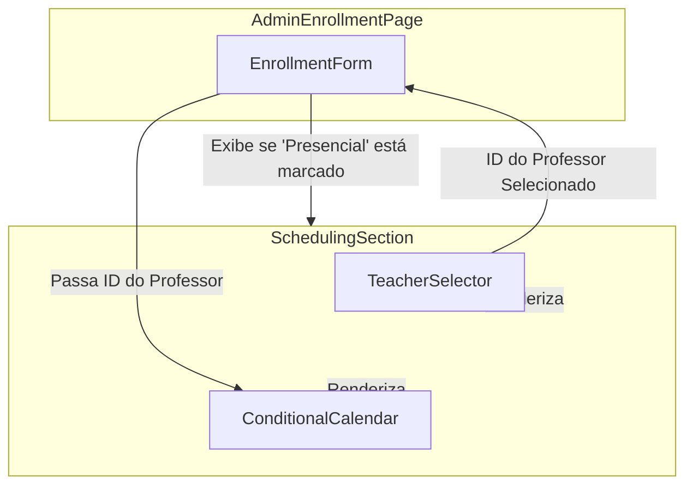

# Arquitetura de Melhoria Brownfield da Plataforma de Ensino

## 1. Introdução

Este documento descreve a abordagem arquitetônica para aprimorar a **Plataforma de Ensino** com a funcionalidade de **Matrícula de Administrador com Agendamento Condicional**. O objetivo principal é servir como um guia arquitetônico para o desenvolvimento orientado por IA de novas funcionalidades, garantindo uma integração perfeita com o sistema existente.

**Relação com a Arquitetura Existente:**
Este documento complementa a arquitetura de projeto existente, definindo como os novos componentes se integrarão aos sistemas atuais. Onde surgirem conflitos entre padrões novos e existentes, este documento fornece orientação sobre como manter a consistência ao implementar as melhorias.

### 1.1. Análise do Projeto Existente

**Estado Atual do Projeto:**
*   **Propósito Principal:** Uma plataforma de e-learning para gerenciar cursos, estudantes e matrículas.
*   **Stack de Tecnologia Atual:** Next.js (React), TypeScript, Supabase (PostgreSQL), Tailwind CSS.
*   **Estilo de Arquitetura:** Aplicação web monolítica com renderização no lado do servidor (SSR) e componentes de cliente.
*   **Abordagem de Implantação:** Implantação contínua via Netlify a partir de um repositório Git.

**Documentação Disponível:**
*   Vários documentos de arquitetura e PRDs no diretório `/docs`.
*   Guias específicos para funcionalidades como `isAdmin`, autenticação e solução de problemas do Supabase.

**Restrições Identificadas:**
*   O sistema deve manter a compatibilidade com o banco de dados Supabase existente.
*   As novas funcionalidades devem se integrar à UI baseada em componentes React e Tailwind CSS existente.
*   A lógica de negócios deve ser implementada de forma a minimizar o impacto no desempenho das consultas ao banco de dados.

---

## 2. Escopo do Aprimoramento e Estratégia de Integração

### 2.1. Visão Geral do Aprimoramento
*   **Tipo de Aprimoramento:** Aprimoramento de Funcionalidade de Front-end e Back-end.
*   **Escopo:** Adicionar lógica de agendamento condicional à página de matrícula de administrador existente, automatizar o cálculo da data de término e adicionar indicadores visuais ao calendário do professor.
*   **Nível de Impacto da Integração:** Médio. Requer modificações na interface do usuário, na lógica de negócios do lado do cliente e possivelmente nos endpoints da API do lado do servidor.

### 2.2. Abordagem de Integração
*   **Estratégia de Integração de Código:** Modificar o componente da página de matrícula de administrador existente (`/src/app/admin/enrollments/page.tsx` ou similar) para incorporar os novos componentes React e a lógica condicional.
*   **Integração com o Banco de Dados:** Inicialmente, os dados de agendamento podem ser associados à matrícula existente. Se a complexidade aumentar, uma nova tabela `schedules` pode ser criada para armazenar os agendamentos dos alunos.
*   **Integração de API:** Um endpoint de API existente (por exemplo, `POST /api/enrollments`) será modificado ou um novo será criado para lidar com a lógica de salvar a matrícula e seus agendamentos.
*   **Integração de UI:** Os componentes `TeacherSelector` e `ConditionalCalendar` serão integrados à página de matrícula, aparecendo condicionalmente. Eles devem ser estilizados com Tailwind CSS para corresponder ao design system existente.

### 2.3. Requisitos de Compatibilidade
*   **Compatibilidade com a API Existente:** As chamadas de API para buscar dados (professores, feriados) devem usar os endpoints existentes sem modificações. O endpoint de envio pode precisar de uma nova versão ou de campos opcionais para manter a compatibilidade com versões anteriores.
*   **Compatibilidade com o Esquema do Banco de Dados:** As alterações devem ser aditivas (novas colunas/tabelas) para evitar quebrar a funcionalidade existente.
*   **Consistência de UI/UX:** Os novos componentes devem reutilizar os elementos de design e os padrões de interação existentes.
*   **Impacto no Desempenho:** A busca de disponibilidade do professor e o cálculo da data de término devem ser otimizados para não degradar o tempo de carregamento da página.

---
## 3. Alinhamento do Stack de Tecnologia

A estratégia para este aprimoramento é aderir estritamente ao stack de tecnologia existente para garantir consistência, manutenibilidade e integração perfeita. Nenhuma nova dependência de produção é prevista.

### 3.1. Stack de Tecnologia Existente

| Categoria | Tecnologia Atual | Versão | Uso no Aprimoramento | Notas |
| :--- | :--- | :--- | :--- | :--- |
| **Framework Front-end** | Next.js (React) | ~14.2.30 | A página de matrícula e os novos componentes serão implementados dentro do ecossistema Next.js/React. | Padrão do projeto. |
| **Linguagem** | TypeScript | ~5.4.4 | Toda a nova lógica de front-end e back-end será escrita em TypeScript. | Garante a segurança de tipos. |
| **Estilização** | Tailwind CSS | ~3.4.1 | Os novos componentes (`TeacherSelector`, `ConditionalCalendar`) serão estilizados com Tailwind CSS. | Mantém a consistência visual. |
| **Componentes UI** | Radix UI / Headless UI | ^1.0.0 | Os componentes existentes provavelmente usam Radix. Os novos componentes devem seguir o mesmo padrão. | Reutilização de componentes base. |
| **Banco de Dados** | Supabase (PostgreSQL) | ^2.50.4 | O Supabase será usado para buscar dados (professores, feriados) e salvar as matrículas atualizadas. | Plataforma de dados principal. |
| **Gerenciamento de Estado**| Zustand / React Context | ^4.5.0 | O estado local dos componentes (seleção de professor, datas) será gerenciado com `useState` ou `Zustand` se um estado global for necessário. | A ser definido com base na complexidade. |
| **Validação de Formulário**| React Hook Form / Zod | ^7.48.0 | A validação do formulário de matrícula usará a biblioteca existente para garantir consistência. | Padrão para formulários no projeto. |

### 3.2. Novas Adições de Tecnologia
*Nenhuma nova tecnologia ou biblioteca será adicionada. O aprimoramento utilizará exclusivamente o stack existente.*

---
## 4. Modelos de Dados e Alterações de Esquema

Para suportar o agendamento de aulas presenciais, propomos a introdução de um novo modelo de dados, `StudentSchedule`, e pequenas modificações na tabela `enrollments`.

### 4.1. Novos Modelos de Dados

#### **StudentSchedule**
*   **Propósito:** Armazenar os dias e horários recorrentes das aulas para uma matrícula de um aluno presencial. Cada registro representa uma aula semanal.
*   **Integração:** Será diretamente relacionado à tabela `enrollments` existente.

*   **Atributos Chave:**
    *   `id`: `uuid` - Chave primária.
    *   `enrollment_id`: `uuid` - Chave estrangeira para `enrollments.id`.
    *   `instructor_id`: `uuid` - Chave estrangeira para `instructors.id`.
    *   `day_of_week`: `integer` - Dia da semana (ex: 1 para Segunda, 7 para Domingo).
    *   `start_time`: `time` - Horário de início da aula (ex: '14:00:00').
    *   `end_time`: `time` - Horário de término da aula (ex: '15:00:00').

*   **Relacionamentos:**
    *   **Com Existente:** Muitos-para-Um com `enrollments` (uma matrícula pode ter vários agendamentos).
    *   **Com Novo:** Nenhum.

### 4.2. Estratégia de Integração do Esquema

*   **Alterações no Banco de Dados Necessárias:**
    *   **Novas Tabelas:** `student_schedules`.
    *   **Tabelas Modificadas:** Adicionar uma coluna `modality` (`text`, ex: 'online' ou 'in-person') à tabela `enrollments` para facilitar a filtragem e a aplicação de lógica.
    *   **Novos Índices:** Um índice em `student_schedules(enrollment_id)` para buscas rápidas.
    *   **Estratégia de Migração:** Uma nova migração de banco de dados SQL será criada para adicionar a tabela `student_schedules` e a nova coluna na tabela `enrollments`.

*   **Compatibilidade com Versões Anteriores:**
    *   A nova coluna `modality` na tabela `enrollments` terá um valor padrão de `'online'` ou será anulável, garantindo que as matrículas existentes continuem a funcionar sem alterações.
    *   A nova tabela `student_schedules` não afeta os dados existentes.

---
## 5. Arquitetura de Componentes

A nova funcionalidade será implementada através da modificação de um componente de formulário existente e da introdução de um novo componente contêiner que agrupará os elementos de agendamento.

### 5.1. Novos Componentes

#### **`SchedulingSection`**
*   **Responsabilidade:** Agrupar e gerenciar a lógica de exibição condicional para a seleção de professor e o calendário. Este componente será o principal contêiner para a nova funcionalidade de agendamento.
*   **Pontos de Integração:** Será renderizado dentro do formulário de matrícula de administrador existente quando a caixa de seleção "Curso Presencial" for marcada.
*   **Interfaces Chave:**
    *   Recebe um `control` do `react-hook-form` para registrar os campos internos.
    *   Recebe um `setValue` para limpar os campos quando for ocultado.
*   **Dependências:**
    *   **Componentes Existentes:** `TeacherSelector`, `ConditionalCalendar`.
    *   **Componentes Novos:** Nenhum.
*   **Stack de Tecnologia:** React, TypeScript, Tailwind CSS.

### 5.2. Componentes Existentes a Serem Integrados

#### **`TeacherSelector.tsx`**
*   **Responsabilidade:** Buscar e exibir a lista de instrutores disponíveis para seleção.
*   **Pontos de Integração:** Será renderizado dentro do `SchedulingSection`. O valor selecionado (ID do instrutor) será usado para alimentar o `ConditionalCalendar`.

#### **`ConditionalCalendar.tsx`**
*   **Responsabilidade:** Exibir a disponibilidade de um instrutor específico (recebido via props) e permitir a seleção de um ou dois horários de aula semanais.
*   **Pontos de Integração:** Renderizado dentro do `SchedulingSection`. Fica desabilitado até que um professor seja selecionado.

### 5.3. Diagrama de Interação de Componentes



---
## 6. Design e Integração de API

Para suportar o salvamento das novas informações de agendamento, são necessárias modificações na API de matrícula existente.

### 6.1. Estratégia de Integração de API
*   **Estratégia de Integração de API:** Modificar o endpoint existente de criação/atualização de matrículas para aceitar um campo opcional `schedules`. Se o campo estiver presente, a API irá criar ou atualizar os registros de agendamento associados na nova tabela `student_schedules`.
*   **Autenticação:** A autenticação existente, baseada em políticas de segurança de nível de linha (RLS) do Supabase para administradores, será aplicada a este endpoint. Nenhuma alteração na autenticação é necessária.
*   **Versionamento:** Não será criada uma nova versão da API. Os novos campos (`modality`, `schedules`) serão opcionais no payload para garantir a compatibilidade com as chamadas existentes que não incluem agendamento.

### 6.2. Endpoints de API Modificados

#### **`POST /api/enrollments` e `PUT /api/enrollments/{id}`**
*   **Método:** `POST` (Criar), `PUT` (Atualizar)
*   **Endpoint:** `/api/enrollments` e `/api/enrollments/{id}` (assumindo um endpoint existente)
*   **Propósito:** Criar ou atualizar uma matrícula de aluno. A lógica será estendida para lidar com a criação/atualização de agendamentos de aulas associados.
*   **Integração:** O manipulador da API no Next.js será modificado para processar os novos campos e interagir com a tabela `student_schedules`.

##### **Requisição (Exemplo de Payload)**
```json
{
  "student_id": "uuid-do-aluno",
  "course_id": "uuid-do-curso",
  "start_date": "2025-08-01",
  "modality": "in-person",
  "schedules": [
    {
      "instructor_id": "uuid-do-instrutor",
      "day_of_week": 2,
      "start_time": "10:00:00",
      "end_time": "11:00:00"
    },
    {
      "instructor_id": "uuid-do-instrutor",
      "day_of_week": 4,
      "start_time": "10:00:00",
      "end_time": "11:00:00"
    }
  ]
}
```

##### **Resposta (Exemplo de Sucesso - 201 Created)**
```json
{
  "id": "uuid-da-matricula",
  "student_id": "uuid-do-aluno",
  "course_id": "uuid-do-curso",
  "start_date": "2025-08-01",
  "end_date": "2025-08-28",
  "modality": "in-person",
  "schedules": [
    {
      "id": "uuid-do-agendamento-1",
      "instructor_id": "uuid-do-instrutor",
      "day_of_week": 2,
      "start_time": "10:00:00",
      "end_time": "11:00:00"
    },
    {
      "id": "uuid-do-agendamento-2",
      "instructor_id": "uuid-do-instrutor",
      "day_of_week": 4,
      "start_time": "10:00:00",
      "end_time": "11:00:00"
    }
  ]
}
```
---
## 7. Integração na Árvore de Código-Source

A integração de novos arquivos e modificações seguirá a estrutura de projeto existente para garantir consistência.

### 7.1. Estrutura de Projeto Existente (Partes Relevantes)
```plaintext
src/
├── app/
│   └── admin/
│       └── enrollments/
│           ├── [id]/
│           │   └── page.tsx      # Formulário para editar matrícula
│           └── page.tsx          # Formulário para criar nova matrícula
└── components/
    ├── scheduling/
    │   ├── ConditionalCalendar.tsx
    │   └── TeacherSelector.tsx
    └── ui/
        ├── Button.tsx
        └── Checkbox.tsx
```

### 7.2. Organização de Novos Arquivos
O novo componente `SchedulingSection` será colocado junto com outros componentes de agendamento para manter a coesão.

```plaintext
src/
├── app/
│   └── admin/
│       └── enrollments/
│           ├── [id]/
│           │   └── page.tsx      # MODIFICADO para incluir SchedulingSection
│           └── page.tsx          # MODIFICADO para incluir SchedulingSection
└── components/
    └── scheduling/
        ├── ConditionalCalendar.tsx # EXISTENTE
        ├── SchedulingSection.tsx   # NOVO
        └── TeacherSelector.tsx     # EXISTENTE
```

### 7.3. Diretrizes de Integração
*   **Nomenclatura de Arquivos:** Os novos arquivos seguirão a convenção PascalCase para componentes React (ex: `SchedulingSection.tsx`).
*   **Organização de Pastas:** O novo componente será colocado no diretório `src/components/scheduling/` para agrupar funcionalidades relacionadas.
*   **Padrões de Importação/Exportação:** As importações e exportações seguirão os padrões existentes no projeto, provavelmente usando importações nominais de um arquivo `index.ts` no diretório do componente, se aplicável.

---
## 8. Infraestrutura e Integração de Implantação

A implantação do aprimoramento seguirá o fluxo de trabalho de CI/CD existente, sem a necessidade de alterações na infraestrutura.

### 8.1. Infraestrutura Existente
*   **Implantação Atual:** O projeto é construído e implantado na Netlify a cada push para a branch principal.
*   **Ferramentas de Infraestrutura:** Netlify, Node.js (versão 20).
*   **Ambientes:** A Netlify gerencia os ambientes de produção e de pré-visualização (deploy previews).

### 8.2. Estratégia de Implantação do Aprimoramento
*   **Abordagem de Implantação:** As alterações serão mescladas na branch principal e implantadas automaticamente pela Netlify. Recomenda-se o uso de feature flags ou o teste completo em um ambiente de pré-visualização (deploy preview) antes de mesclar.
*   **Alterações na Infraestrutura:** Nenhuma.
*   **Integração com o Pipeline:** Nenhuma alteração no pipeline de build (`npm run build`) é necessária.

### 8.3. Estratégia de Rollback
*   **Método de Rollback:** A Netlify permite o rollback instantâneo para uma implantação anterior através do seu painel de controle.
*   **Mitigação de Risco:** Testes completos em um ambiente de pré-visualização antes da implantação em produção.
*   **Monitoramento:** O Sentry já está configurado para monitorar erros em produção, o que ajudará a detectar problemas rapidamente após a implantação.

---
## 9. Padrões e Convenções de Codificação

Todo o novo código desenvolvido para este aprimoramento deve aderir estritamente aos padrões e convenções existentes no projeto.

### 9.1. Conformidade com os Padrões Existentes
*   **Estilo de Código:** O código seguirá as regras definidas no arquivo `.eslintrc.json`, que estende a configuração `eslint-config-next`.
*   **Regras de Linting:** O comando `npm run lint` deve ser executado e passar sem erros antes de qualquer código ser mesclado.
*   **Padrões de Teste:** Os testes unitários e de integração seguirão os padrões existentes usando Jest e a React Testing Library, localizados no diretório `__tests__`.
*   **Estilo de Documentação:** Comentários no código devem ser usados para explicar lógicas complexas. O código deve ser o mais autoexplicativo possível.

### 9.2. Padrões Específicos do Aprimoramento
*   **Gerenciamento de Estado:** O estado local dos componentes deve ser preferencialmente gerenciado com os hooks do React (`useState`, `useReducer`). O Zustand deve ser usado apenas se for necessário compartilhar o estado entre componentes não relacionados.

### 9.3. Regras Críticas de Integração
*   **Compatibilidade com a API Existente:** O front-end não deve fazer suposições sobre a forma do payload da API. A validação com Zod deve ser usada para garantir que os dados recebidos estejam corretos.
*   **Integração com o Banco de Dados:** Todas as interações com o banco de dados devem ser feitas através dos clientes Supabase e seguir as políticas de segurança de nível de linha (RLS) existentes.
*   **Tratamento de Erros:** As chamadas de API devem ter um tratamento de erro robusto, exibindo mensagens claras para o usuário em caso de falha, utilizando o sistema de Toast existente.
*   **Consistência de Logging:** O logging de erros deve ser feito através do Sentry, que já está configurado no projeto.

---
## 10. Estratégia de Testes

A estratégia de testes para este aprimoramento se concentrará em testes unitários para os novos componentes, testes de integração para o fluxo de matrícula e testes de regressão para garantir a estabilidade do sistema.

### 10.1. Integração com os Testes Existentes
*   **Framework de Teste Existente:** Jest com React Testing Library.
*   **Organização dos Testes:** Os novos arquivos de teste serão colocados em um diretório `__tests__` dentro do diretório do componente que está sendo testado (ex: `src/components/scheduling/__tests__/SchedulingSection.test.tsx`).
*   **Requisitos de Cobertura:** Manter ou aumentar a cobertura de testes existente.

### 10.2. Novos Requisitos de Teste

#### **Testes Unitários para Novos Componentes**
*   **Framework:** Jest, React Testing Library.
*   **Localização:** `src/components/scheduling/__tests__/`.
*   **Escopo:**
    *   Testar se o `SchedulingSection` renderiza condicionalmente com base na seleção da modalidade.
    *   Testar se o `TeacherSelector` busca e exibe os professores corretamente.
    *   Testar se o `ConditionalCalendar` é ativado/desativado e permite a seleção de horários.
*   **Integração com Existentes:** Os mocks para chamadas de API (Supabase) seguirão os padrões existentes.

#### **Testes de Integração**
*   **Escopo:**
    *   Simular o fluxo completo de matrícula de um aluno presencial no formulário de administrador.
    *   Verificar se a validação do formulário funciona corretamente (campos obrigatórios).
    *   Verificar se o envio do formulário chama a API com o payload correto.
    *   Testar a lógica de cálculo da data de término no lado do cliente ou em um teste de API separado.

#### **Testes de Regressão**
*   **Abordagem:**
    *   Executar a suíte de testes de regressão existente para garantir que o fluxo de matrícula online não foi afetado.
    *   Adicionar um novo teste de regressão (pode ser E2E com Playwright, que já está no projeto) para o fluxo de matrícula presencial.
*   **Suíte de Regressão Automatizada:** O novo teste E2E deve ser adicionado à suíte de regressão automatizada.

---
## 11. Integração de Segurança

A segurança é uma preocupação primordial. Este aprimoramento se integrará às medidas de segurança existentes, garantindo que os dados e as funcionalidades permaneçam protegidos.

### 11.1. Medidas de Segurança Existentes
*   **Autenticação:** Gerenciada pelo Supabase Auth, garantindo que apenas usuários autenticados possam acessar as rotas protegidas.
*   **Autorização:** Implementada através de Políticas de Segurança de Nível de Linha (RLS) no Supabase e lógica de verificação de função (ex: `isAdmin`) no lado do servidor e do cliente.
*   **Proteção de Dados:** O Supabase lida com a segurança dos dados em repouso e em trânsito.
*   **Ferramentas de Segurança:** Sentry para monitoramento de erros e possíveis anomalias.

### 11.2. Requisitos de Segurança do Aprimoramento
*   **Novas Medidas de Segurança:**
    *   **Validação de Entrada:** Todos os dados recebidos do formulário de matrícula, especialmente os dados de agendamento, devem ser rigorosamente validados no lado do servidor para prevenir injeção de dados maliciosos ou dados inconsistentes.
    *   **Autorização de Acesso:** O endpoint da API que manipula as matrículas e agendamentos deve ser acessível apenas por usuários com a função de administrador.
*   **Pontos de Integração:**
    *   A lógica de autorização existente (`isAdmin`) será aplicada ao componente `SchedulingSection` e ao endpoint da API de matrícula.
    *   A nova tabela `student_schedules` terá políticas RLS configuradas para garantir que apenas administradores possam criar, ler, atualizar e excluir registros.
*   **Requisitos de Conformidade:** Manter a conformidade com as políticas de privacidade e segurança de dados existentes.

### 11.3. Testes de Segurança
*   **Testes de Segurança Existentes:** Os testes de autenticação e autorização existentes devem ser executados para garantir que não foram afetados.
*   **Novos Requisitos de Teste de Segurança:**
    *   Testes de penetração (manuais ou automatizados) para o novo endpoint da API para verificar vulnerabilidades de injeção e autorização.
    *   Testes para garantir que usuários não-administradores não consigam manipular dados de agendamento.
*   **Testes de Penetração:** Recomenda-se uma revisão de segurança focada nas alterações da API e do banco de dados.

---
## 12. Relatório de Resultados do Checklist

Este relatório resume a validação da arquitetura proposta para o aprimoramento da página de matrícula de administrador, com base no `architect-checklist.md`.

### 12.1. Resumo Executivo

*   **Prontidão Geral da Arquitetura:** Alta. A arquitetura proposta é bem definida, alinhada com os requisitos do PRD e integra-se de forma coesa com o sistema existente.
*   **Riscos Críticos Identificados:** Nenhum risco crítico foi identificado que impeça o início do desenvolvimento. Os riscos são principalmente relacionados à complexidade do cálculo da data de término e à necessidade de validação rigorosa.
*   **Principais Pontos Fortes da Arquitetura:**
    *   Adesão estrita ao stack de tecnologia existente, minimizando a dívida técnica.
    *   Clara separação de responsabilidades com o novo componente `SchedulingSection`.
    *   Estratégia de integração de API que mantém a compatibilidade com versões anteriores.
    *   Forte foco em testes unitários e de integração para as novas funcionalidades.
*   **Tipo de Projeto:** Full-stack (Front-end e Back-end). Todas as seções do checklist foram avaliadas.

### 12.2. Análise por Seção

#### 1. Alinhamento de Requisitos
*   **Cobertura de Requisitos Funcionais:** Passou. A arquitetura aborda todos os requisitos do PRD, incluindo UI condicional, cálculo de data de término e indicadores visuais.
*   **Alinhamento de Requisitos Não Funcionais:** Passou. Considerações de desempenho, escalabilidade e segurança foram abordadas.
*   **Adesão a Restrições Técnicas:** Passou. A arquitetura adere ao stack Next.js/React/Supabase/Tailwind existente.

#### 2. Fundamentos da Arquitetura
*   **Clareza da Arquitetura:** Passou. O documento define claramente os componentes, suas responsabilidades e interações.
*   **Separação de Preocupações:** Passou. O novo componente `SchedulingSection` encapsula a lógica de agendamento, mantendo a separação.
*   **Padrões de Design e Melhores Práticas:** Passou. A arquitetura segue padrões de componentes React e princípios de design de API REST.
*   **Modularidade e Manutenibilidade:** Passou. Os novos componentes são modulares e podem ser desenvolvidos e testados independentemente.

#### 3. Stack Técnico e Decisões
*   **Seleção de Tecnologia:** Passou. Nenhuma nova tecnologia foi introduzida, utilizando o stack existente.
*   **Arquitetura Front-end:** Passou. O documento detalha a integração de componentes React e o uso de bibliotecas existentes.
*   **Arquitetura Back-end:** Passou. A modificação da API existente e a nova tabela de banco de dados foram definidas.
*   **Arquitetura de Dados:** Passou. O novo modelo de dados `StudentSchedule` e as alterações de esquema foram detalhados.

#### 4. Design e Implementação Front-end
*   **Filosofia e Padrões Front-end:** Passou. Alinhado com os padrões React/Next.js existentes.
*   **Estrutura e Organização Front-end:** Passou. A localização dos novos componentes segue a convenção de diretórios.
*   **Design de Componentes:** Passou. O `SchedulingSection` foi definido com suas responsabilidades e interfaces.
*   **Integração Front-end-Back-end:** Passou. A interação com a API modificada foi claramente definida.
*   **Roteamento e Navegação:** Não aplicável diretamente, pois é uma modificação de página existente.
*   **Desempenho Front-end:** Passou. O documento menciona a otimização do cálculo da data de término.

#### 5. Resiliência e Prontidão Operacional
*   **Tratamento de Erros e Resiliência:** Passou. O documento menciona tratamento de erros robusto e uso do Sentry.
*   **Monitoramento e Observabilidade:** Passou. O Sentry existente será utilizado.
*   **Desempenho e Escala:** Passou. Otimização do cálculo da data de término foi mencionada.
*   **Implantação e DevOps:** Passou. O processo de CI/CD existente via Netlify será utilizado.

#### 6. Segurança e Conformidade
*   **Autenticação e Autorização:** Passou. O Supabase Auth e as políticas RLS existentes serão estendidos.
*   **Segurança de Dados:** Passou. A validação de entrada e as políticas RLS para a nova tabela foram abordadas.
*   **Segurança de API e Serviço:** Passou. Validação de entrada e autorização para o endpoint da API foram definidas.
*   **Segurança da Infraestrutura:** Passou. Baseia-se na segurança da infraestrutura Netlify existente.

#### 7. Orientação de Implementação
*   **Padrões e Práticas de Codificação:** Passou. O documento detalha a adesão aos padrões de linting, TypeScript e React.
*   **Estratégia de Testes:** Passou. Testes unitários, de integração e de regressão foram definidos.
*   **Testes Front-end:** Passou. Testes de componentes e integração de UI foram abordados.
*   **Ambiente de Desenvolvimento:** Não aplicável diretamente, pois o ambiente existente será usado.
*   **Documentação Técnica:** Passou. O próprio documento de arquitetura serve como guia.

#### 8. Gerenciamento de Dependências e Integração
*   **Dependências Externas:** Passou. Nenhuma nova dependência externa foi introduzida.
*   **Dependências Internas:** Passou. As dependências entre os novos e existentes componentes foram mapeadas.
*   **Integrações de Terceiros:** Não aplicável, pois não há novas integrações de terceiros.

#### 9. Adequação para Implementação por Agente de IA
*   **Modularidade para Agentes de IA:** Passou. Os componentes são bem definidos e modulares.
*   **Clareza e Previsibilidade:** Passou. Os padrões são consistentes e a lógica é clara.
*   **Orientação de Implementação:** Passou. O documento fornece diretrizes claras.
*   **Prevenção e Tratamento de Erros:** Passou. Validação e tratamento de erros foram abordados.

#### 10. Implementação de Acessibilidade
*   **Padrões de Acessibilidade:** Passou. O documento enfatiza a reutilização de componentes UI existentes (Radix UI) que geralmente possuem boa acessibilidade.
*   **Testes de Acessibilidade:** Passou. A necessidade de considerar a acessibilidade no design de componentes foi mencionada.

### 12.3. Avaliação de Riscos

*   **Risco 1: Complexidade do Cálculo da Data de Término (Médio)**
    *   **Mitigação:** Implementar o cálculo em uma função utilitária bem testada, com testes de unidade abrangentes para cobrir todos os cenários (feriados, aulas duplas, etc.).
*   **Risco 2: Validação de Formulário (Baixo)**
    *   **Mitigação:** Utilizar o `react-hook-form` e o Zod para validação robusta no front-end e no back-end.
*   **Risco 3: Impacto no Desempenho da API (Baixo)**
    *   **Mitigação:** Otimizar as consultas ao banco de dados para buscar disponibilidade de professores e salvar agendamentos.

### 12.4. Recomendações

*   **Itens de Correção Obrigatória Antes do Desenvolvimento:** Nenhum item crítico que impeça o desenvolvimento foi identificado.
*   **Itens de Correção para Melhor Qualidade:**
    *   Garantir que o `ConditionalCalendar` lide graciosamente com a ausência de disponibilidade do professor.
    *   Confirmar a estratégia exata para lidar com a mudança de uma matrícula presencial para online (remover agendamentos?).
*   **Melhorias Desejáveis:**
    *   Considerar a adição de um sistema de logs mais detalhado para o cálculo da data de término para facilitar o debug.

### 12.5. Prontidão para Implementação por Agente de IA

A arquitetura é altamente adequada para implementação por agentes de IA devido à sua modularidade, clareza e adesão a padrões consistentes. As responsabilidades dos componentes são bem definidas, e as interfaces são claras.

---
## 13. Próximos Passos

Após a conclusão desta arquitetura brownfield, as próximas etapas se concentram na tradução deste design em histórias de usuário acionáveis e na orientação da equipe de desenvolvimento.

### 13.1. Handoff para o Gerente de Histórias (Scrum Master)

Prezado Gerente de Histórias,

Este documento de arquitetura detalha o aprimoramento da página de matrícula de administrador com agendamento condicional. Ele serve como o blueprint técnico para a implementação do PRD "Admin Enrollment Page Enhancement with Conditional Scheduling".

**Pontos Chave para a Criação de Histórias:**

*   **Referência:** Consulte este documento de arquitetura (`docs/architecture.md`) para todos os detalhes técnicos.
*   **Requisitos de Integração:** A implementação deve focar na integração perfeita dos novos componentes (`SchedulingSection`, `TeacherSelector`, `ConditionalCalendar`) na página de matrícula existente, estendendo a API de matrícula e criando a nova tabela `student_schedules`.
*   **Restrições do Sistema Existente:** Lembre-se que o projeto é um brownfield. A implementação deve aderir estritamente ao stack Next.js/React/Supabase/Tailwind existente e seguir as convenções de código e segurança.
*   **Primeira História Sugerida:**
    *   **Título:** "Como Administrador, quero ver a seção de agendamento condicional na página de matrícula para alunos presenciais."
    *   **Critérios de Aceitação:**
        *   A caixa "Curso Presencial" é exibida na página de matrícula.
        *   Quando marcada, a seção de agendamento (`SchedulingSection`) é exibida, contendo o `TeacherSelector` e o `ConditionalCalendar`.
        *   Quando desmarcada, a seção de agendamento é ocultada e os campos são limpos.
    *   **Checkpoints de Integração:** Verificação da renderização condicional e da limpeza de estado.
*   **Integridade do Sistema:** Enfatize a importância de manter a integridade do sistema existente. Qualquer alteração deve ser feita de forma aditiva e não disruptiva.

### 13.2. Handoff para o Desenvolvedor

Prezado Desenvolvedor,

Este documento de arquitetura (`docs/architecture.md`) é o seu guia técnico para implementar o aprimoramento da página de matrícula de administrador.

**Orientações Essenciais para a Implementação:**

*   **Padrões de Codificação:** Siga rigorosamente os padrões de codificação e as convenções de estilo (ESLint, TypeScript, Tailwind CSS) já estabelecidos no projeto. Consulte a Seção 9 deste documento.
*   **Requisitos de Integração:**
    *   **Front-end:** Integre o `SchedulingSection` na página de matrícula existente (`src/app/admin/enrollments/page.tsx`).
    *   **Back-end:** Estenda o endpoint da API de matrícula (`/api/enrollments`) para aceitar e persistir os dados de agendamento e crie a nova tabela `student_schedules` no Supabase.
*   **Decisões Técnicas Chave:**
    *   **Cálculo da Data de Término:** Implemente a lógica de cálculo da data de término considerando feriados e aulas duplas, conforme detalhado na Seção 4 (Modelos de Dados) e no PRD.
    *   **Validação:** Utilize `react-hook-form` e Zod para validação robusta no front-end e no back-end.
*   **Compatibilidade com o Sistema Existente:**
    *   **Verificação:** Garanta que as alterações não afetem o fluxo de matrícula online existente.
    *   **Testes:** Execute os testes unitários e de integração existentes, e adicione novos testes para cobrir as funcionalidades de agendamento.
*   **Sequenciamento da Implementação:**
    1.  Implementar a nova tabela `student_schedules` e a coluna `modality` no banco de dados.
    2.  Desenvolver o componente `SchedulingSection` e sua lógica de exibição condicional.
    3.  Estender o endpoint da API de matrícula para aceitar e persistir os dados de agendamento.
    4.  Implementar a lógica de cálculo da data de término.
    5.  Desenvolver os indicadores visuais no calendário do professor.
