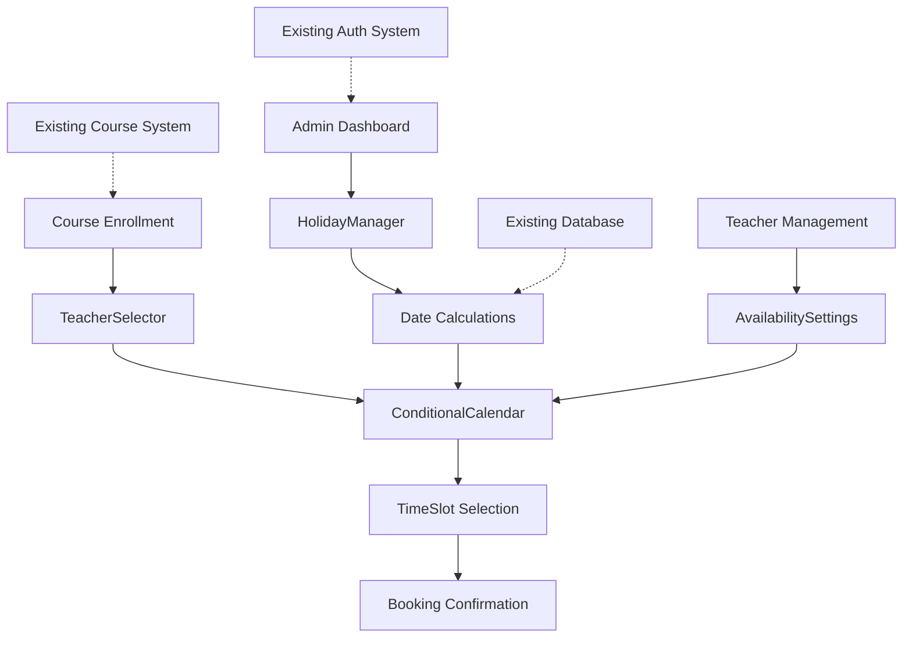

# Component Architecture

## New Components

### TeacherSelector
**Responsibility:** Dropdown component for selecting a specific teacher during course enrollment
**Integration Points:** Course enrollment flow, existing enrollment forms

**Key Interfaces:**
- onTeacherSelect(teacherId: string) callback
- Teachers fetched via existing Supabase client patterns

**Dependencies:**
- **Existing Components:** Form components, existing teacher data
- **New Components:** ConditionalCalendar (triggers calendar display)

**Technology Stack:** TypeScript React component with Zustand state, Radix UI Select

### ConditionalCalendar
**Responsibility:** Display available time slots for selected teacher with capacity information
**Integration Points:** Enrollment flow after teacher selection

**Key Interfaces:**
- teacherId prop to filter availability
- onTimeSlotSelect callback for booking

**Dependencies:**
- **Existing Components:** Existing calendar components as foundation
- **New Components:** TeacherSelector (receives teacher selection)

**Technology Stack:** Server Component with client interactivity, date calculation utilities

### HolidayManager
**Responsibility:** Admin interface for managing holidays and viewing their impact on scheduling
**Integration Points:** Admin dashboard, protected by existing admin middleware

**Key Interfaces:**
- CRUD operations for holidays
- Year-based organization and navigation

**Dependencies:**
- **Existing Components:** Admin layout, form components, data tables
- **New Components:** Date calculation utilities

**Technology Stack:** Admin-only component with React Hook Form + Zod validation

## Component Interaction Diagram



## Component Specifications

### TeacherSelector Component

**File:** `src/components/scheduling/TeacherSelector.tsx`

**Props Interface:**
```typescript
interface TeacherSelectorProps {
  courseId: string;
  onTeacherSelect: (teacherId: string, teacher: Teacher) => void;
  disabled?: boolean;
  className?: string;
}
```

**State Management:**
```typescript
interface TeacherSelectorState {
  teachers: Teacher[];
  loading: boolean;
  error: string | null;
  selectedTeacher: Teacher | null;
}
```

**Key Features:**
- Real-time teacher availability preview
- Responsive dropdown with search functionality
- Integration with existing form validation
- Loading states and error handling
- Accessibility compliance (ARIA labels, keyboard navigation)

### ConditionalCalendar Component

**File:** `src/components/scheduling/ConditionalCalendar.tsx`

**Props Interface:**
```typescript
interface ConditionalCalendarProps {
  teacherId: string;
  courseId: string;
  onTimeSlotSelect: (slot: TimeSlot) => void;
  dateRange?: { start: Date; end: Date };
  className?: string;
}
```

**Features:**
- Holiday exclusion in date calculations
- Real-time availability updates via Supabase realtime
- Capacity indicators (available/full slots)
- Mobile-responsive touch targets
- Lazy loading for performance optimization

### HolidayManager Component

**File:** `src/components/scheduling/HolidayManager.tsx`

**Props Interface:**
```typescript
interface HolidayManagerProps {
  year?: number;
  onHolidayChange?: (holidays: Holiday[]) => void;
  readonly?: boolean;
}
```

**Features:**
- Year-based holiday management
- Bulk import/export functionality
- Holiday impact visualization
- Form validation with Zod schemas
- Admin-only access control

## Shared Utilities

### Date Calculation Utilities

**File:** `src/utils/dateCalculations.ts`

**Key Functions:**
```typescript
export function calculateCourseEndDate(
  startDate: Date,
  courseHours: number,
  weeklyClasses: number,
  holidayDates: Date[]
): CourseSchedule;

export function getHolidaysInRange(
  startDate: Date,
  endDate: Date,
  holidays: Holiday[]
): Holiday[];

export function isBusinessDay(
  date: Date,
  holidays: Holiday[]
): boolean;
```

### Holiday Management Utilities

**File:** `src/utils/holidayUtils.ts`

**Key Functions:**
```typescript
export function validateHolidayData(
  holiday: Partial<Holiday>
): ValidationResult;

export function importHolidaysFromCSV(
  csvData: string
): Promise<Holiday[]>;

export function generateHolidayImpactReport(
  holidays: Holiday[],
  dateRange: DateRange
): ImpactReport;
```

## Integration Patterns

### With Existing Enrollment Flow
1. **Pre-Integration:** Student selects course from catalog
2. **Teacher Selection:** TeacherSelector component renders in enrollment form
3. **Calendar Display:** ConditionalCalendar appears after teacher selection
4. **Booking Completion:** Integration with existing payment and confirmation flow

### With Admin Dashboard
1. **Access Control:** HolidayManager protected by existing admin middleware
2. **Navigation:** Integration with existing admin menu structure
3. **Data Management:** CRUD operations follow existing admin patterns
4. **Notifications:** Integration with existing alert/notification system

### With Database Layer
1. **Real-time Updates:** Supabase realtime for availability changes
2. **Optimistic Updates:** Local state updates with server reconciliation
3. **Caching Strategy:** Integration with existing Next.js caching
4. **Error Handling:** Consistent error patterns across components

## Performance Considerations

### Component Optimization
- **Lazy Loading:** Calendar months loaded on demand
- **Memoization:** React.memo for expensive calculations
- **Virtual Scrolling:** For large teacher lists or date ranges
- **Debounced Updates:** Teacher availability updates

### Bundle Size Impact
- **Code Splitting:** Calendar components loaded dynamically
- **Tree Shaking:** Unused date utilities eliminated
- **Shared Dependencies:** Reuse existing UI component library
- **Asset Optimization:** Minimal additional assets required