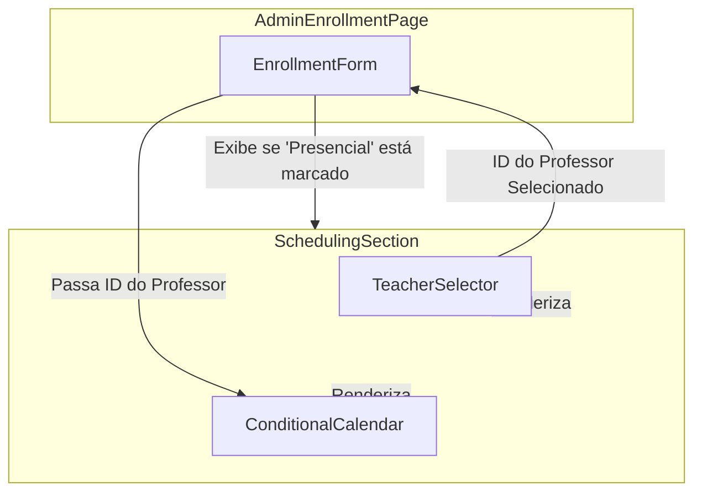

# 5. Arquitetura de Componentes

A nova funcionalidade será implementada através da modificação de um componente de formulário existente e da introdução de um novo componente contêiner que agrupará os elementos de agendamento.

## 5.1. Novos Componentes

### **`SchedulingSection`**
*   **Responsabilidade:** Agrupar e gerenciar a lógica de exibição condicional para a seleção de professor e o calendário. Este componente será o principal contêiner para a nova funcionalidade de agendamento.
*   **Pontos de Integração:** Será renderizado dentro do formulário de matrícula de administrador existente quando a caixa de seleção "Curso Presencial" for marcada.
*   **Interfaces Chave:**
    *   Recebe um `control` do `react-hook-form` para registrar os campos internos.
    *   Recebe um `setValue` para limpar os campos quando for ocultado.
*   **Dependências:**
    *   **Componentes Existentes:** `TeacherSelector`, `ConditionalCalendar`.
    *   **Componentes Novos:** Nenhum.
*   **Stack de Tecnologia:** React, TypeScript, Tailwind CSS.

## 5.2. Componentes Existentes a Serem Integrados

### **`TeacherSelector.tsx`**
*   **Responsabilidade:** Buscar e exibir a lista de instrutores disponíveis para seleção.
*   **Pontos de Integração:** Será renderizado dentro do `SchedulingSection`. O valor selecionado (ID do instrutor) será usado para alimentar o `ConditionalCalendar`.

### **`ConditionalCalendar.tsx`**
*   **Responsabilidade:** Exibir a disponibilidade de um instrutor específico (recebido via props) e permitir a seleção de um ou dois horários de aula semanais.
*   **Pontos de Integração:** Renderizado dentro do `SchedulingSection`. Fica desabilitado até que um professor seja selecionado.

## 5.3. Diagrama de Interação de Componentes

---