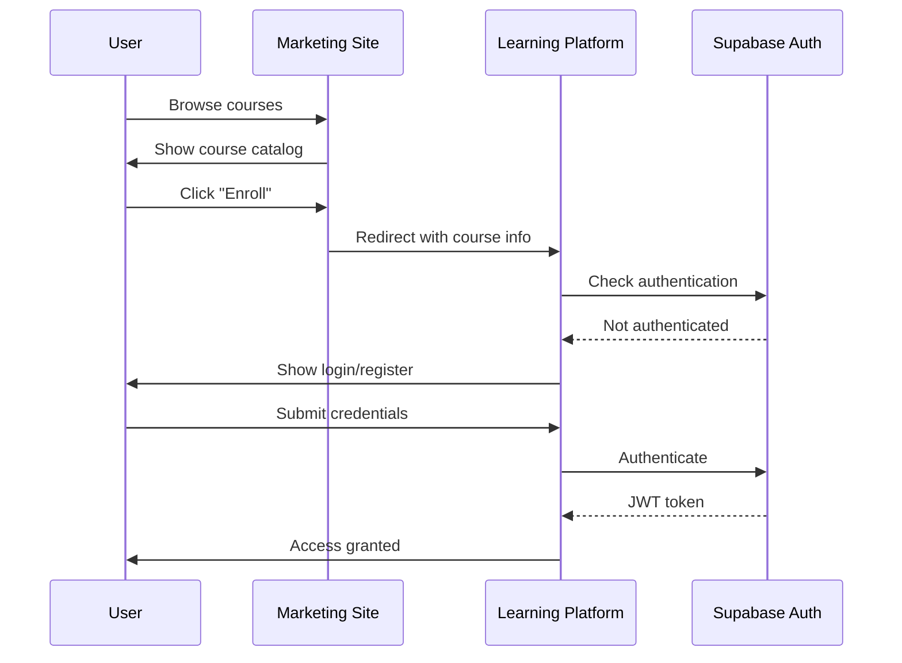

# PRD Section 2: System Architecture
[← Back to Index](./index.md) | [← Previous: Executive Overview](./01-executive-overview.md) | [Next: User Requirements →](./03-user-requirements.md)

---

## Architectural Overview

### Design Philosophy
The Escola Habilidade platform employs a **dual-architecture strategy** that separates concerns between marketing/lead generation and educational content delivery. This approach optimizes each system for its specific purpose while maintaining a cohesive user experience.

### System Diagram
```
┌─────────────────────────────────────────────────────────────┐
│                     User Entry Points                       │
├─────────────────────┬───────────────────────────────────────┤
│   Marketing Site    │        Learning Platform              │
│  (React + Vite)     │      (Next.js + Supabase)            │
├─────────────────────┼───────────────────────────────────────┤
│                     │                                       │
│  • Course Catalog   │  • Student Dashboard                  │
│  • Lead Generation  │  • Course Player                      │
│  • Brand Presence   │  • Assessments                        │
│  • Contact Forms    │  • Progress Tracking                  │
│                     │  • Admin Panel                        │
├─────────────────────┼───────────────────────────────────────┤
│     Netlify CDN     │         Vercel/Netlify               │
├─────────────────────┴───────────────────────────────────────┤
│                    Shared Services                          │
│  • Supabase (Auth, Database, Storage)                      │
│  • EmailJS (Notifications)                                  │
│  • Mux (Video Streaming)                                    │
│  • Sentry (Error Tracking)                                  │
└─────────────────────────────────────────────────────────────┘
```

---

## Marketing Website Architecture

### Technology Stack
| Layer | Technology | Purpose |
|-------|------------|---------|
| Frontend | React 19 | UI framework |
| Build Tool | Vite 7 | Fast development & optimized builds |
| Styling | Tailwind CSS 4 | Utility-first CSS |
| Routing | React Router v6 | Client-side navigation |
| Icons | Phosphor React | Consistent iconography |
| Forms | EmailJS | Contact form handling |
| Animation | Custom CSS | Performance-optimized animations |

### Performance Architecture
```
Performance Optimization Stack
├── Custom Memory Manager
│   ├── Resource pooling
│   ├── Garbage collection optimization
│   └── Memory leak prevention
├── Lazy Loading System
│   ├── Route-based code splitting
│   ├── Component lazy loading
│   └── Image lazy loading
├── Background Animation Engine
│   ├── GPU acceleration
│   ├── Frame rate limiting
│   └── Adaptive quality
└── Resource Preloading
    ├── Critical CSS
    ├── Font preloading
    └── Next page prediction
```

### Build Configuration
```javascript
// Vite optimization strategy
{
  build: {
    // Manual chunking for optimal loading
    manualChunks: {
      'vendor': ['react', 'react-dom'],
      'router': ['react-router-dom'],
      'utils': ['./src/utils/'],
      'backgrounds': ['./src/components/backgrounds/']
    },
    // Tree shaking and minification
    rollupOptions: {
      treeshake: true,
      minify: 'terser'
    }
  }
}
```

### Deployment Architecture
- **Platform:** Netlify
- **CI/CD:** GitHub Actions
- **Branch Strategy:**
  - `main`: Production (auto-deploy)
  - `develop`: Staging
  - `feature/*`: Development
- **CDN:** Netlify Edge Network
- **SSL:** Auto-provisioned Let's Encrypt

---

## Learning Platform Architecture

### Technology Stack
| Layer | Technology | Purpose |
|-------|------------|---------|
| Framework | Next.js 14.2.x | Full-stack React framework |
| Language | TypeScript | Type safety |
| Database | Supabase (PostgreSQL) | Data persistence |
| Authentication | Supabase Auth | User management |
| State Management | Zustand | Client state |
| Forms | React Hook Form + Zod | Form handling & validation |
| UI Components | Radix UI + Headless UI | Accessible components |
| Animations | Framer Motion | Smooth transitions |
| Error Tracking | Sentry | Production monitoring |

### Application Architecture
```
Next.js App Router Structure
├── app/                    # App Router pages
│   ├── (auth)/            # Auth-related pages
│   ├── (platform)/        # Main platform pages
│   ├── admin/             # Admin dashboard
│   └── api/               # API routes
├── components/            # Reusable components
│   ├── ui/               # Design system
│   ├── lesson/           # Lesson-specific
│   └── admin/            # Admin components
├── lib/                   # Core libraries
│   ├── supabase/         # Database clients
│   └── utils/            # Utilities
└── middleware.ts          # Auth & routing logic
```

### Server Components Strategy
```typescript
// Optimized data fetching pattern
// app/course/[slug]/page.tsx
export default async function CoursePage({ params }) {
  // Server-side data fetching
  const course = await getCourse(params.slug);
  
  return (
    <CourseLayout>
      {/* Server Component for SEO */}
      <CourseHeader course={course} />
      
      {/* Client Component for interactivity */}
      <Suspense fallback={<Loading />}>
        <CoursePlayer courseId={course.id} />
      </Suspense>
    </CourseLayout>
  );
}
```

### Database Architecture
```sql
-- Optimized schema with indexes
CREATE TABLE courses (
  id UUID PRIMARY KEY DEFAULT gen_random_uuid(),
  slug VARCHAR(255) UNIQUE NOT NULL,
  title VARCHAR(255) NOT NULL,
  -- Indexes for performance
  INDEX idx_courses_slug (slug),
  INDEX idx_courses_published (published)
);

-- Row Level Security
ALTER TABLE courses ENABLE ROW LEVEL SECURITY;
CREATE POLICY "Public courses are viewable by everyone"
  ON courses FOR SELECT
  USING (published = true);
```

---

## Integration Architecture

### Service Integration Map
```
┌─────────────────┐     ┌─────────────────┐
│  Marketing Site │────▶│ Learning Platform│
│                 │     │                 │
└────────┬────────┘     └────────┬────────┘
         │                       │
         ▼                       ▼
    ┌─────────────────────────────────┐
    │         Supabase                │
    │  ┌─────────┐  ┌─────────────┐  │
    │  │  Auth   │  │  Database   │  │
    │  └─────────┘  └─────────────┘  │
    │  ┌─────────┐  ┌─────────────┐  │
    │  │ Storage │  │  Realtime   │  │
    │  └─────────┘  └─────────────┘  │
    └─────────────────────────────────┘
              │
              ▼
    ┌─────────────────┐
    │ External Services│
    ├─────────────────┤
    │ • EmailJS       │
    │ • Mux Video     │
    │ • Sentry        │
    │ • PDF.js        │
    └─────────────────┘
```

### Authentication Flow


### Data Synchronization
- **Course Data:** Single source of truth in Supabase
- **User Progress:** Real-time sync via Supabase Realtime
- **Analytics:** Unified tracking across both platforms
- **Cache Strategy:** 
  - Static content: 1 hour
  - User data: No cache
  - Course content: 5 minutes

---

## Infrastructure Architecture

### Cloud Infrastructure
```
Production Environment
├── Frontend Hosting
│   ├── Marketing Site: Netlify
│   └── Learning Platform: Vercel/Netlify
├── Backend Services
│   ├── Database: Supabase (AWS us-east-1)
│   ├── File Storage: Supabase Storage
│   └── Video CDN: Mux
├── Monitoring
│   ├── Error Tracking: Sentry
│   ├── Analytics: Google Analytics 4
│   └── Performance: Lighthouse CI
└── Security
    ├── WAF: Cloudflare
    ├── DDoS Protection: Included
    └── SSL: Auto-provisioned
```

### Scaling Strategy
| Component | Current | Target | Scaling Method |
|-----------|---------|--------|----------------|
| Database | 2 vCPU, 4GB RAM | 8 vCPU, 32GB RAM | Vertical scaling |
| API | 100 req/min limit | 1000 req/min | Horizontal scaling |
| Video Streaming | 100 concurrent | 1000 concurrent | CDN distribution |
| Storage | 100GB | 1TB | Automatic scaling |

### Disaster Recovery
- **Backup Schedule:** Daily automated backups
- **Backup Retention:** 30 days
- **Recovery Time Objective (RTO):** 4 hours
- **Recovery Point Objective (RPO):** 24 hours
- **Failover Strategy:** Multi-region deployment ready

---

## Development Architecture

### Development Environment
```bash
# Local development setup
├── Frontend (Marketing)
│   └── localhost:5173 (Vite dev server)
├── Frontend (Platform)
│   └── localhost:3000 (Next.js dev server)
├── Backend Services
│   └── Supabase local instance
└── Testing
    ├── Unit tests: Jest
    ├── E2E tests: Playwright
    └── Performance: Lighthouse
```

### Code Organization Principles
1. **Separation of Concerns:** Clear boundaries between layers
2. **DRY (Don't Repeat Yourself):** Shared utilities and components
3. **SOLID Principles:** Maintainable, extensible code
4. **Component-Based:** Reusable UI components
5. **Type Safety:** Full TypeScript coverage in platform

### Version Control Strategy
```
Git Flow
├── main (production)
├── develop (integration)
├── feature/* (new features)
├── bugfix/* (bug fixes)
├── hotfix/* (urgent fixes)
└── release/* (release preparation)
```

---

## Security Architecture

### Security Layers
```
Security Stack
├── Network Security
│   ├── SSL/TLS encryption
│   ├── DDoS protection
│   └── Rate limiting
├── Application Security
│   ├── Input validation
│   ├── XSS prevention
│   ├── CSRF protection
│   └── SQL injection prevention
├── Data Security
│   ├── Encryption at rest
│   ├── Encryption in transit
│   └── PII handling
└── Access Control
    ├── Role-based access (RBAC)
    ├── Row Level Security (RLS)
    └── API key management
```

### Authentication & Authorization
- **Method:** JWT with refresh tokens
- **Storage:** HttpOnly cookies
- **Expiration:** 7 days (refresh: 30 days)
- **Roles:** Student, Instructor, Admin
- **Permissions:** Granular per resource

---

[Next Section: User Requirements →](./03-user-requirements.md)

---

**Document Version:** 1.0  
**Last Updated:** 2025-01-22  
**Section Owner:** Engineering Team