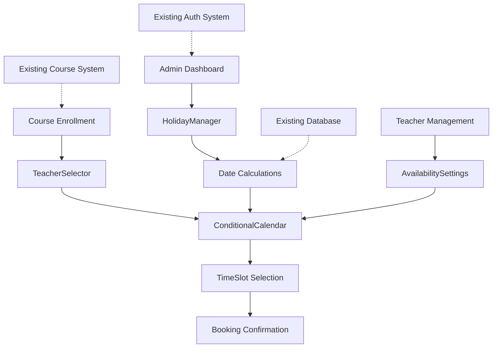

# Escola Habilidade Scheduling System Brownfield Enhancement Architecture

## Introduction

This document outlines the architectural approach for enhancing the Escola Habilidade learning platform with an advanced scheduling system featuring individual teacher calendars and automated holiday management. Its primary goal is to serve as the guiding architectural blueprint for AI-driven development of new features while ensuring seamless integration with the existing Next.js + TypeScript + Supabase system.

**Relationship to Existing Architecture:**
This document supplements existing project architecture by defining how new scheduling components will integrate with current systems. Where conflicts arise between new and existing patterns, this document provides guidance on maintaining consistency while implementing enhancements.

### Existing Project Analysis

#### Current Project State
- **Primary Purpose:** Educational Learning Management System (LMS) for Escola Habilidade
- **Current Tech Stack:** Next.js 14.2.x + TypeScript + Supabase (PostgreSQL + Auth + Storage)
- **Architecture Style:** App Router with Server Components, Row Level Security (RLS)
- **Deployment Method:** Planned for Vercel (optimal for Next.js) or Netlify

#### Available Documentation
- Complete database schema in `database/schema.sql` with RLS policies
- CLAUDE.md with comprehensive development guidelines
- TypeScript types in `/types/` directory
- Middleware-based authentication system
- Design system documentation with Habilidade brand colors

#### Identified Constraints
- Must maintain existing authentication and user management system
- Cannot break existing course enrollment and progress tracking
- Must preserve current UI/UX consistency with design system
- Database changes require migration strategy for production data
- Performance must remain optimal for existing user base

### Change Log

| Change | Date | Version | Description | Author |
|--------|------|---------|-------------|---------|
| Initial Creation | 2025-01-22 | 1.0 | Brownfield architecture for scheduling enhancement | Claude Code |

## Enhancement Scope and Integration Strategy

### Enhancement Overview
**Enhancement Type:** Major Feature Addition with Database Schema Changes
**Scope:** Individual teacher calendars, holiday management system, automated date calculations
**Integration Impact:** Medium - requires new database tables, API endpoints, and UI components

### Integration Approach
**Code Integration Strategy:** Extend existing Next.js app structure following current patterns
**Database Integration:** Add new tables with foreign key relationships to existing users/courses
**API Integration:** Create new API routes following existing `/api/` structure with middleware auth
**UI Integration:** New components using existing design system and Tailwind CSS setup

### Compatibility Requirements
- **Existing API Compatibility:** New APIs only - no breaking changes to existing endpoints
- **Database Schema Compatibility:** Additive only - new tables and columns, no modifications to existing
- **UI/UX Consistency:** Use existing design system (Habilidade colors, Tailwind, component patterns)
- **Performance Impact:** Minimal - new features are opt-in, existing performance unaffected

## Tech Stack Alignment

### Existing Technology Stack

| Category | Current Technology | Version | Usage in Enhancement | Notes |
|----------|-------------------|---------|---------------------|--------|
| Frontend | Next.js | 14.2.x | All new UI components | App Router with Server Components |
| Language | TypeScript | Latest | All new code | Strict typing required |
| Database | Supabase (PostgreSQL) | Latest | New tables and queries | Use existing RLS patterns |
| Authentication | Supabase Auth | Latest | Extend existing auth | Role-based access for admin features |
| Styling | Tailwind CSS | Latest | New component styling | Follow existing design system |
| State Management | Zustand | Latest | Teacher/calendar state | Use existing patterns |
| Forms | React Hook Form + Zod | Latest | Holiday management forms | Follow existing validation patterns |
| UI Components | Radix UI + Headless UI | Latest | Calendar and form components | Use existing component library |

### New Technology Additions
*No new technologies required - enhancement uses existing stack exclusively*

## Data Models and Schema Changes

### New Data Models

#### holidays
**Purpose:** Store national and regional holidays for accurate course date calculations
**Integration:** Standalone table referenced by date calculation utilities

**Key Attributes:**
- id: UUID (Primary Key) - Unique identifier
- date: DATE - Holiday date
- name: VARCHAR(255) - Holiday name
- year: INTEGER - Year for organization
- is_national: BOOLEAN - National vs regional flag
- created_at/updated_at: TIMESTAMP - Audit fields

**Relationships:**
- **With Existing:** No direct relationships, used in calculations
- **With New:** Referenced by teacher_availability for scheduling

#### teacher_availability
**Purpose:** Define when teachers are available and their capacity
**Integration:** Links to existing teachers table, defines scheduling constraints

**Key Attributes:**
- id: UUID (Primary Key) - Unique identifier
- teacher_id: UUID (Foreign Key) - References existing teachers table
- day_of_week: INTEGER - 0=Sunday through 6=Saturday
- start_time/end_time: TIME - Available time window
- max_students: INTEGER - Capacity for this time slot
- is_active: BOOLEAN - Enable/disable availability

**Relationships:**
- **With Existing:** REFERENCES teachers(id) ON DELETE CASCADE
- **With New:** Used by scheduling algorithms and calendar display

#### Enhanced teachers table
**Purpose:** Extend existing teachers with scheduling-specific settings
**Integration:** Add columns to existing table (backward compatible)

**New Attributes:**
- max_students_per_class: INTEGER DEFAULT 10 - Default class capacity
- calendar_settings: JSONB DEFAULT '{}' - Flexible scheduling preferences

### Schema Integration Strategy
**Database Changes Required:**
- **New Tables:** holidays, teacher_availability
- **Modified Tables:** teachers (add 2 columns)
- **New Indexes:** holidays(date), holidays(year), teacher_availability(teacher_id, day_of_week)
- **Migration Strategy:** Additive migrations only, populate with default/sample data

**Backward Compatibility:**
- All existing queries continue to work unchanged
- New columns have DEFAULT values to prevent breaking changes
- Foreign key constraints prevent data integrity issues

## Component Architecture

### New Components

#### TeacherSelector
**Responsibility:** Dropdown component for selecting a specific teacher during course enrollment
**Integration Points:** Course enrollment flow, existing enrollment forms

**Key Interfaces:**
- onTeacherSelect(teacherId: string) callback
- Teachers fetched via existing Supabase client patterns

**Dependencies:**
- **Existing Components:** Form components, existing teacher data
- **New Components:** ConditionalCalendar (triggers calendar display)

**Technology Stack:** TypeScript React component with Zustand state, Radix UI Select

#### ConditionalCalendar
**Responsibility:** Display available time slots for selected teacher with capacity information
**Integration Points:** Enrollment flow after teacher selection

**Key Interfaces:**
- teacherId prop to filter availability
- onTimeSlotSelect callback for booking

**Dependencies:**
- **Existing Components:** Existing calendar components as foundation
- **New Components:** TeacherSelector (receives teacher selection)

**Technology Stack:** Server Component with client interactivity, date calculation utilities

#### HolidayManager
**Responsibility:** Admin interface for managing holidays and viewing their impact on scheduling
**Integration Points:** Admin dashboard, protected by existing admin middleware

**Key Interfaces:**
- CRUD operations for holidays
- Year-based organization and navigation

**Dependencies:**
- **Existing Components:** Admin layout, form components, data tables
- **New Components:** Date calculation utilities

**Technology Stack:** Admin-only component with React Hook Form + Zod validation

### Component Interaction Diagram



## API Design and Integration

### API Integration Strategy
**API Integration Strategy:** Extend existing `/api/` structure with new routes for scheduling features
**Authentication:** Use existing Supabase Auth middleware, admin-only routes protected
**Versioning:** No versioning needed - new endpoints only, no breaking changes

### New API Endpoints

#### Holidays API
- **Method:** GET
- **Endpoint:** `/api/holidays`
- **Purpose:** Retrieve holidays for date calculations and admin display
- **Integration:** Extends existing API patterns with query parameters

**Request**
```json
{
  "year": 2025,
  "month": 3
}
```

**Response**
```json
{
  "holidays": [
    {
      "id": "uuid",
      "date": "2025-03-03",
      "name": "Carnaval",
      "year": 2025,
      "is_national": true
    }
  ]
}
```

#### Teachers Availability API
- **Method:** GET
- **Endpoint:** `/api/teachers/[id]/availability`
- **Purpose:** Get available time slots for specific teacher
- **Integration:** Follows existing teacher API patterns

**Request**
```json
{
  "date_range": {
    "start": "2025-02-01",
    "end": "2025-02-28"
  }
}
```

**Response**
```json
{
  "availability": [
    {
      "date": "2025-02-03",
      "time_slots": [
        {
          "start_time": "09:00",
          "end_time": "10:00",
          "available_spots": 8,
          "max_students": 10
        }
      ]
    }
  ]
}
```

#### Course End Date Calculation API
- **Method:** POST
- **Endpoint:** `/api/calculate-end-date`
- **Purpose:** Calculate course completion date considering holidays and teacher availability
- **Integration:** Utility endpoint for enrollment process

**Request**
```json
{
  "start_date": "2025-02-03",
  "course_hours": 40,
  "weekly_classes": 2,
  "teacher_id": "teacher-uuid"
}
```

**Response**
```json
{
  "end_date": "2025-04-28",
  "total_weeks": 11,
  "holidays_excluded": ["2025-03-03", "2025-03-04", "2025-04-18"],
  "actual_class_days": 20
}
```

## Source Tree Integration

### Existing Project Structure
```plaintext
plataforma-ensino/
├── src/
│   ├── app/                    # Next.js App Router
│   ├── components/             # Reusable components
│   ├── lib/                    # Utilities and configurations
│   ├── types/                  # TypeScript type definitions
│   └── utils/                  # Helper functions
├── database/
│   └── schema.sql              # Complete database schema
├── middleware.ts               # Authentication middleware
└── package.json
```

### New File Organization
```plaintext
plataforma-ensino/
├── src/
│   ├── app/
│   │   ├── api/
│   │   │   ├── holidays/               # Holiday management API
│   │   │   │   ├── route.ts
│   │   │   │   └── [id]/route.ts
│   │   │   ├── teachers/
│   │   │   │   └── [id]/
│   │   │   │       └── availability/   # Teacher availability API
│   │   │   │           └── route.ts
│   │   │   └── calculate-end-date/     # Date calculation API
│   │   │       └── route.ts
│   │   └── admin/
│   │       └── scheduling/             # Admin scheduling interface
│   │           ├── page.tsx
│   │           └── holidays/
│   │               └── page.tsx
│   ├── components/
│   │   ├── scheduling/                 # New scheduling components
│   │   │   ├── TeacherSelector.tsx
│   │   │   ├── ConditionalCalendar.tsx
│   │   │   ├── HolidayManager.tsx
│   │   │   └── AvailabilitySettings.tsx
│   │   └── ui/                         # Existing UI components (reused)
│   ├── types/
│   │   └── scheduling.ts               # New scheduling types
│   └── utils/
│       ├── dateCalculations.ts         # Date calculation utilities
│       └── holidayUtils.ts             # Holiday management utilities
├── database/
│   ├── migrations/                     # New database migrations
│   │   ├── 001_add_holidays_table.sql
│   │   ├── 002_add_teacher_availability.sql
│   │   └── 003_extend_teachers_table.sql
│   └── schema.sql                      # Updated schema
```

### Integration Guidelines
- **File Naming:** Follow existing camelCase for components, kebab-case for API routes
- **Folder Organization:** Group by feature (scheduling) within existing structure
- **Import/Export Patterns:** Use absolute imports with @ alias, named exports for components

## Infrastructure and Deployment Integration

### Existing Infrastructure
**Current Deployment:** Manual deployment planned for Vercel or Netlify
**Infrastructure Tools:** Supabase managed database and authentication
**Environments:** Development (local) and Production (cloud)

### Enhancement Deployment Strategy
**Deployment Approach:** Deploy with existing application - no separate infrastructure needed
**Infrastructure Changes:** Database migrations only - no new services required
**Pipeline Integration:** Database migrations run before deployment, feature flags for gradual rollout

### Rollback Strategy
**Rollback Method:** Database migration rollback scripts, feature flag disable
**Risk Mitigation:** Additive-only schema changes, backward compatibility maintained
**Monitoring:** Supabase dashboard, existing error tracking with Sentry

## Coding Standards and Conventions

### Existing Standards Compliance
**Code Style:** TypeScript strict mode, ESLint + Prettier configuration
**Linting Rules:** Existing ESLint configuration in project
**Testing Patterns:** Jest + Playwright for testing (configured but tests pending)
**Documentation Style:** TypeScript JSDoc comments, inline documentation

### Enhancement-Specific Standards
- **Scheduling Components:** Prefix all scheduling components with descriptive names
- **API Routes:** Follow existing `/api/` patterns with proper error handling
- **Database Queries:** Use existing Supabase client patterns with proper type safety
- **Error Handling:** Integrate with existing Sentry error tracking

### Critical Integration Rules
- **Existing API Compatibility:** No modifications to existing API endpoints
- **Database Integration:** All changes additive only, maintain RLS policies
- **Error Handling:** Use existing error patterns, integrate with Sentry
- **Logging Consistency:** Use existing logging patterns for debugging

## Testing Strategy

### Integration with Existing Tests
**Existing Test Framework:** Jest + Playwright configured (test implementation pending)
**Test Organization:** Tests alongside components in `/src/__tests__/` structure
**Coverage Requirements:** Maintain >80% coverage for new business logic

### New Testing Requirements

#### Unit Tests for New Components
- **Framework:** Jest with React Testing Library
- **Location:** `/src/components/scheduling/__tests__/`
- **Coverage Target:** 90% for date calculation utilities, 80% for components
- **Integration with Existing:** Use existing test configuration and patterns

#### Integration Tests
- **Scope:** API endpoints, database operations, component interactions
- **Existing System Verification:** Ensure no regression in existing enrollment flow
- **New Feature Testing:** Complete scheduling flow from teacher selection to booking

#### Regression Testing
- **Existing Feature Verification:** Automated tests for existing enrollment without teacher selection
- **Automated Regression Suite:** Extend existing test suite with backward compatibility tests
- **Manual Testing Requirements:** Admin holiday management interface, calendar display accuracy

## Security Integration

### Existing Security Measures
**Authentication:** Supabase Auth with JWT tokens, middleware protection
**Authorization:** Role-based access (student, instructor, admin) with RLS policies
**Data Protection:** RLS policies on all database tables, input validation
**Security Tools:** Supabase built-in security features, middleware route protection

### Enhancement Security Requirements
**New Security Measures:** Admin-only access for holiday management, teacher availability settings
**Integration Points:** Extend existing RLS policies to new tables, use existing role checks
**Compliance Requirements:** Maintain existing LGPD compliance, no additional PII collected

### Security Testing
**Existing Security Tests:** Authentication flow tests (configured, implementation pending)
**New Security Test Requirements:** Admin route protection, RLS policy validation for new tables
**Penetration Testing:** Include new endpoints in existing security review process

## Implementation Phases

### Phase 1: Database Foundation (Week 1)
1. Create database migrations for new tables
2. Implement holiday data seeding with 2025 Brazilian holidays
3. Set up basic API routes for holidays CRUD
4. Create TypeScript types for new data models

### Phase 2: Core Logic Implementation (Week 2)
1. Implement date calculation utilities with holiday exclusion
2. Create teacher availability API endpoints
3. Build TeacherSelector component with existing design patterns
4. Implement ConditionalCalendar with availability display

### Phase 3: User Interface Integration (Weeks 3-4)
1. Integrate components into existing enrollment flow
2. Build HolidayManager admin interface
3. Add teacher availability settings to admin panel
4. Complete testing and documentation
5. Deploy with feature flags for gradual rollout

## Next Steps

### Story Manager Handoff
Create epic and user stories for the scheduling enhancement implementation:
- **Reference:** This architecture document and sistema-agendamento-prd.md
- **Key Integration Requirements:** Maintain backward compatibility with existing enrollment system
- **Existing System Constraints:** Must work within Next.js App Router, Supabase RLS policies
- **First Story:** Implement holidays table and basic API (foundation for all other features)
- **Integration Checkpoints:** Verify existing enrollment flow remains unaffected after each story

### Developer Handoff
Implementation guidelines for development team:
- **Reference:** This architecture document and existing CLAUDE.md guidelines
- **Integration Requirements:** Follow existing TypeScript patterns, use established component structure
- **Technical Decisions:** All new code must pass existing linting rules, maintain test coverage
- **Compatibility Requirements:** Run existing test suite after each component to ensure no regressions
- **Implementation Sequence:** Database first, then APIs, then UI components to minimize risk

---

**Document Status:** Ready for Implementation
**Last Updated:** 2025-01-22
**Next Review:** After Phase 1 completion (2025-01-29)