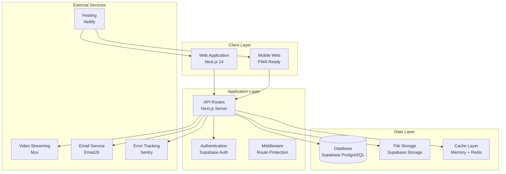
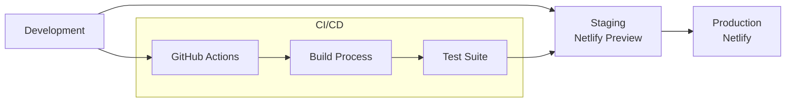

# System Architecture

## Overview

The Stelarow Habilidade Learning Platform is a modern educational management system built with a microservices-oriented architecture using Next.js 14, Supabase, and cloud-native technologies.

## High-Level Architecture



## System Components

### 1. Frontend Architecture

#### Next.js 14 App Router
- **Server Components**: Default rendering for optimal performance
- **Client Components**: Interactive elements with 'use client' directive
- **Streaming**: Progressive page loading with React Suspense
- **Metadata API**: Dynamic SEO optimization

#### Key Directories
```
src/
├── app/                    # App Router pages and layouts
│   ├── (auth)/            # Authentication routes group
│   ├── admin/             # Admin panel routes
│   ├── course/            # Course pages
│   └── api/               # API routes
├── components/            # Reusable UI components
├── lib/                   # Utility libraries and configurations
├── hooks/                 # Custom React hooks
├── types/                 # TypeScript type definitions
└── utils/                 # Helper functions
```

#### Component Architecture Pattern
```typescript
// Component Structure Pattern
interface ComponentProps {
  // Props with explicit types
}

export function Component({ prop }: ComponentProps) {
  // 1. Hooks and state
  // 2. Event handlers
  // 3. Effects and side effects
  // 4. Render logic
}

// Export default with display name
Component.displayName = 'Component'
export default Component
```

### 2. Backend Architecture

#### API Layer Design
- **Route Handlers**: Next.js 14 App Router API routes
- **Middleware**: Authentication and request processing
- **Response Helpers**: Standardized API responses
- **Error Handling**: Centralized error management

#### Database Architecture
- **Primary**: Supabase PostgreSQL with Row Level Security (RLS)
- **Real-time**: Supabase Realtime subscriptions
- **File Storage**: Supabase Storage with CDN
- **Caching**: Node-cache for application-level caching

#### Authentication Flow
```typescript
// Authentication Architecture
User Request → Middleware → Supabase Auth → RLS Check → Response

// Role-based Access Control
type UserRole = 'student' | 'instructor' | 'admin'

interface User {
  id: string
  role: UserRole
  permissions: Permission[]
}
```

### 3. Data Architecture

#### Database Schema Overview
```sql
-- Core entities
users (extends auth.users)
categories
courses
lessons
instructors
enrollments
progress
```

#### Relationships
- **Users** → Multiple **Enrollments** → Single **Course**
- **Courses** → Multiple **Lessons** → Multiple **Materials**
- **Users** → Multiple **Progress** records per **Lesson**
- **Instructors** → Multiple **Courses** (one-to-many)

#### Data Flow Patterns
1. **Read Operations**: Client → API → Supabase → Cache → Response
2. **Write Operations**: Client → API → Validation → Supabase → Real-time Update
3. **File Uploads**: Client → API → Supabase Storage → URL → Database

### 4. Security Architecture

#### Multi-Layer Security
```typescript
// Security Layers
1. Network Layer: HTTPS, CSP Headers
2. Application Layer: Authentication, Authorization
3. Database Layer: RLS Policies, Input Validation
4. File Layer: Signed URLs, Access Controls
```

#### Row Level Security (RLS) Policies
```sql
-- Example RLS Policy
CREATE POLICY "Users can only see their own enrollments" 
ON enrollments FOR SELECT 
USING (auth.uid() = user_id);

-- Admin override policy
CREATE POLICY "Admins can see all enrollments" 
ON enrollments FOR ALL 
USING (
  EXISTS (
    SELECT 1 FROM users 
    WHERE id = auth.uid() AND role = 'admin'
  )
);
```

## Architecture Patterns

### 1. Component Composition Pattern
```typescript
// Compound Component Pattern
export function LessonPage({ children }: { children: React.ReactNode }) {
  return (
    <LessonProvider>
      <LessonLayout>
        {children}
      </LessonLayout>
    </LessonProvider>
  )
}

LessonPage.Header = LessonHeader
LessonPage.Video = VideoSection
LessonPage.Materials = MaterialsSection
```

### 2. Hook-based State Management
```typescript
// Custom hook pattern for complex state
export function useLessonProgress(lessonId: string) {
  const [progress, setProgress] = useState<Progress | null>(null)
  const [loading, setLoading] = useState(true)
  
  // State management logic
  return { progress, loading, updateProgress }
}
```

### 3. API Response Standardization
```typescript
// Standardized API response structure
interface ApiResponse<T> {
  data: T
  error?: string
  message?: string
}

// Usage in API routes
export async function GET() {
  try {
    const data = await fetchData()
    return NextResponse.json({ data })
  } catch (error) {
    return NextResponse.json(
      { error: 'Internal server error' },
      { status: 500 }
    )
  }
}
```

## Scalability Considerations

### 1. Performance Optimization
- **Image Optimization**: Next.js Image component with WebP/AVIF
- **Code Splitting**: Dynamic imports and lazy loading
- **Bundle Analysis**: Webpack bundle analyzer integration
- **Caching Strategy**: Multi-level caching (browser, CDN, application)

### 2. Database Optimization
- **Connection Pooling**: Supabase built-in pooling
- **Query Optimization**: Indexed queries and efficient joins
- **Real-time Subscriptions**: Selective subscriptions to minimize load

### 3. Deployment Architecture


## Environment Configuration

### Development Environment
```typescript
// Environment variables structure
interface EnvironmentConfig {
  NEXT_PUBLIC_SUPABASE_URL: string
  NEXT_PUBLIC_SUPABASE_ANON_KEY: string
  SUPABASE_SERVICE_ROLE_KEY: string
  MUX_TOKEN_ID: string
  MUX_TOKEN_SECRET: string
  SENTRY_DSN: string
  EMAILJS_SERVICE_ID: string
}
```

### Build Configuration
```javascript
// next.config.mjs key configurations
export default {
  experimental: {
    optimizePackageImports: ['@radix-ui/react-icons'],
    serverComponentsExternalPackages: ['pdfjs-dist']
  },
  images: {
    domains: ['localhost', 'supabase.co'],
    formats: ['image/webp', 'image/avif']
  },
  webpack: (config) => {
    // PDF.js configuration
    config.resolve.alias.canvas = false
    return config
  }
}
```

## Integration Points

### 1. Marketing Website Integration
- **Shared Design System**: Common UI components and styles
- **User Flow**: Seamless transition from marketing to platform
- **Data Synchronization**: Course previews and instructor profiles

### 2. Third-party Services
- **Video Processing**: Mux for video streaming and processing
- **File Storage**: Supabase Storage for PDFs and materials
- **Email Communication**: EmailJS for transactional emails
- **Error Tracking**: Sentry for production error monitoring

## Troubleshooting Architecture Issues

### Common Issues
1. **Authentication Loops**: Check middleware configuration
2. **Database Connection**: Verify Supabase environment variables
3. **Build Failures**: Check webpack configuration for PDF.js
4. **Performance Issues**: Analyze bundle size and optimize imports

### Debugging Tools
- **Next.js DevTools**: Built-in performance analysis
- **Supabase Dashboard**: Real-time database monitoring
- **Network Tab**: API call analysis
- **Bundle Analyzer**: Code splitting analysis

## Future Architecture Considerations

### Planned Enhancements
1. **Microservices**: Gradual extraction of services
2. **GraphQL API**: Consider Apollo Server integration
3. **Mobile Apps**: React Native development
4. **Advanced Analytics**: Custom analytics implementation
5. **AI Integration**: Enhanced MCP integrations

### Scalability Roadmap
1. **Phase 1**: Current monolithic Next.js architecture
2. **Phase 2**: Service extraction (video, notifications)
3. **Phase 3**: Microservices with API Gateway
4. **Phase 4**: Multi-region deployment

This architecture provides a solid foundation for the educational platform while maintaining flexibility for future growth and enhancements.