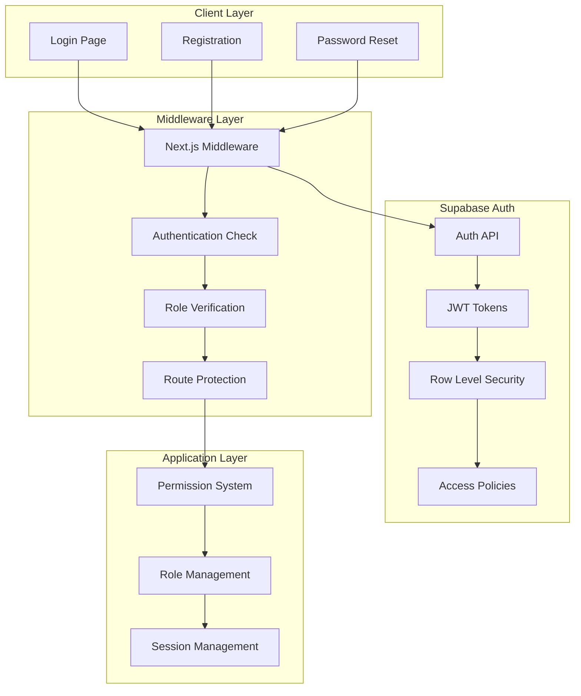

# Authentication System Documentation

## Overview

The Stelarow Habilidade platform implements a comprehensive authentication system using Supabase Auth with role-based access control (RBAC), middleware protection, and secure session management.

## Authentication Architecture



## User Roles and Permissions

### Role Hierarchy
```typescript
type UserRole = 'student' | 'instructor' | 'admin'

// Role inheritance (each role includes permissions of roles below)
// admin > instructor > student
```

### Permission System
```typescript
export type Permission = 
  // Admin permissions
  | 'admin.view'
  | 'admin.users.view' | 'admin.users.create' | 'admin.users.edit' | 'admin.users.delete'
  | 'admin.courses.view' | 'admin.courses.create' | 'admin.courses.edit' | 'admin.courses.delete'
  | 'admin.enrollments.view' | 'admin.enrollments.create' | 'admin.enrollments.edit'
  | 'admin.reports.view'
  | 'admin.settings.view' | 'admin.settings.edit'
  
  // Instructor permissions
  | 'instructor.courses.view' | 'instructor.courses.create' | 'instructor.courses.edit'
  | 'instructor.lessons.create' | 'instructor.lessons.edit' | 'instructor.lessons.delete'
  
  // Student permissions
  | 'student.courses.view'
  | 'student.progress.view' | 'student.progress.update'

export const rolePermissions: Record<UserRole, Permission[]> = {
  admin: [
    // All admin permissions
    'admin.view', 'admin.users.view', 'admin.users.create', /* ... */
    // All instructor permissions
    'instructor.courses.view', 'instructor.courses.create', /* ... */
    // All student permissions
    'student.courses.view', 'student.progress.view', 'student.progress.update'
  ],
  instructor: [
    // Instructor permissions
    'instructor.courses.view', 'instructor.courses.create', /* ... */
    // Student permissions (instructors can view their students' progress)
    'student.courses.view', 'student.progress.view'
  ],
  student: [
    'student.courses.view',
    'student.progress.view',
    'student.progress.update'
  ]
}
```

## Authentication Flow

### 1. User Registration
```typescript
// Registration process
async function registerUser(userData: SignupForm) {
  const { data, error } = await supabase.auth.signUp({
    email: userData.email,
    password: userData.password,
    options: {
      data: {
        full_name: userData.fullName,
        role: 'student' // Default role
      }
    }
  })
  
  if (error) throw error
  
  // User profile is automatically created via database trigger
  return data
}
```

### 2. User Login
```typescript
// Login process with role-based redirect
async function loginUser(credentials: LoginForm) {
  const { data, error } = await supabase.auth.signInWithPassword({
    email: credentials.email,
    password: credentials.password
  })
  
  if (error) throw error
  
  // Get user profile with role
  const { data: profile } = await supabase
    .from('users')
    .select('*')
    .eq('id', data.user.id)
    .single()
  
  // Redirect based on role
  const redirectPath = getRedirectPath(profile.role)
  router.push(redirectPath)
  
  return { user: data.user, profile }
}

function getRedirectPath(role: UserRole): string {
  switch (role) {
    case 'admin': return '/admin'
    case 'instructor': return '/dashboard'
    case 'student': return '/courses'
    default: return '/'
  }
}
```

### 3. Session Management
```typescript
// Session persistence and validation
export function createClient() {
  return createBrowserClient(
    process.env.NEXT_PUBLIC_SUPABASE_URL!,
    process.env.NEXT_PUBLIC_SUPABASE_ANON_KEY!,
    {
      auth: {
        persistSession: true,
        storageKey: 'supabase.auth.token',
        autoRefreshToken: true,
        detectSessionInUrl: true,
        debug: process.env.NODE_ENV === 'development'
      }
    }
  )
}
```

## Middleware Implementation

### Route Protection
```typescript
// middleware.ts
import { createServerClient } from '@supabase/ssr'
import { NextResponse, type NextRequest } from 'next/server'

export async function middleware(request: NextRequest) {
  let response = NextResponse.next({
    request: {
      headers: request.headers,
    },
  })

  const supabase = createServerClient(
    process.env.NEXT_PUBLIC_SUPABASE_URL!,
    process.env.NEXT_PUBLIC_SUPABASE_ANON_KEY!,
    {
      cookies: {
        get(name: string) {
          return request.cookies.get(name)?.value
        },
        set(name: string, value: string, options: CookieOptions) {
          request.cookies.set({ name, value, ...options })
          response = NextResponse.next({
            request: { headers: request.headers },
          })
          response.cookies.set({ name, value, ...options })
        },
        remove(name: string, options: CookieOptions) {
          request.cookies.set({ name, value: '', ...options })
          response = NextResponse.next({
            request: { headers: request.headers },
          })
          response.cookies.set({ name, value: '', ...options })
        },
      },
    }
  )

  // Get user session
  const { data: { user } } = await supabase.auth.getUser()
  
  const path = request.nextUrl.pathname

  // Public routes that don't require authentication
  const publicRoutes = ['/', '/auth/login', '/auth/register', '/auth/forgot-password']
  
  // Protected routes with role requirements
  const adminRoutes = ['/admin']
  const instructorRoutes = ['/instructor']
  const studentRoutes = ['/courses', '/dashboard']

  // Redirect unauthenticated users
  if (!user && !publicRoutes.includes(path) && !path.startsWith('/auth/')) {
    return NextResponse.redirect(new URL('/auth/login', request.url))
  }

  // Redirect authenticated users from auth pages
  if (user && path.startsWith('/auth/')) {
    const profile = await getUserProfile(supabase, user.id)
    const redirectPath = getRedirectPath(profile?.role || 'student')
    return NextResponse.redirect(new URL(redirectPath, request.url))
  }

  // Role-based route protection
  if (user) {
    const profile = await getUserProfile(supabase, user.id)
    
    if (adminRoutes.some(route => path.startsWith(route)) && profile?.role !== 'admin') {
      return NextResponse.redirect(new URL('/unauthorized', request.url))
    }
    
    if (instructorRoutes.some(route => path.startsWith(route)) && 
        !['admin', 'instructor'].includes(profile?.role || '')) {
      return NextResponse.redirect(new URL('/unauthorized', request.url))
    }
  }

  // Pass user data to route handlers
  if (user) {
    const profile = await getUserProfile(supabase, user.id)
    response.headers.set('x-user-id', user.id)
    response.headers.set('x-user-email', user.email || '')
    response.headers.set('x-user-role', profile?.role || 'student')
    response.headers.set('x-user-name', profile?.full_name || '')
  }

  return response
}

export const config = {
  matcher: [
    '/((?!_next/static|_next/image|favicon.ico|.*\\.(?:svg|png|jpg|jpeg|gif|webp)$).*)',
  ],
}
```

## Permission Checking

### Server-Side Permissions
```typescript
// Server components and API routes
export async function getCurrentUser(): Promise<User | null> {
  const { headers } = await import('next/headers')
  const headerStore = headers()
  
  const userId = headerStore.get('x-user-id')
  const userRole = headerStore.get('x-user-role')
  const userEmail = headerStore.get('x-user-email')
  const userName = headerStore.get('x-user-name')
  
  if (!userId) return null

  return {
    id: userId,
    role: (userRole as UserRole) || 'student',
    email: userEmail || '',
    full_name: userName || '',
    created_at: new Date().toISOString(),
    updated_at: new Date().toISOString()
  }
}

export function hasPermission(user: User | null, permission: Permission): boolean {
  if (!user) return false
  
  const userPermissions = rolePermissions[user.role] || []
  return userPermissions.includes(permission)
}

export function requirePermission(user: User | null, permission: Permission): void {
  if (!hasPermission(user, permission)) {
    throw new Error(`Insufficient permissions: ${permission}`)
  }
}
```

### Client-Side Permissions
```typescript
// Client components
export async function getCurrentUserClient(): Promise<User | null> {
  const { createClient } = await import('../supabase/client')
  const supabase = createClient()
  
  const { data: { user } } = await supabase.auth.getUser()
  
  if (!user) return null

  const { data: profile } = await supabase
    .from('users')
    .select('*')
    .eq('id', user.id)
    .single()

  return profile
}

// Permission hook for React components
export function usePermissions() {
  const [user, setUser] = useState<User | null>(null)
  const [loading, setLoading] = useState(true)

  useEffect(() => {
    getCurrentUserClient().then(user => {
      setUser(user)
      setLoading(false)
    })
  }, [])

  const hasPermission = useCallback((permission: Permission) => {
    if (!user) return false
    const userPermissions = rolePermissions[user.role] || []
    return userPermissions.includes(permission)
  }, [user])

  return { user, hasPermission, loading }
}
```

## Row Level Security (RLS) Policies

### User Data Protection
```sql
-- Users can only see their own data
CREATE POLICY "Users can view own profile" ON users
  FOR SELECT USING (auth.uid() = id);

CREATE POLICY "Users can update own profile" ON users
  FOR UPDATE USING (auth.uid() = id);

-- Admins can see all users
CREATE POLICY "Admins can view all users" ON users
  FOR ALL USING (
    EXISTS (
      SELECT 1 FROM users 
      WHERE id = auth.uid() AND role = 'admin'
    )
  );
```

### Course Access Control
```sql
-- Students can only see published courses
CREATE POLICY "Students can view published courses" ON courses
  FOR SELECT USING (
    is_published = true OR
    EXISTS (
      SELECT 1 FROM users 
      WHERE id = auth.uid() AND role IN ('admin', 'instructor')
    )
  );

-- Instructors can manage their own courses
CREATE POLICY "Instructors can manage own courses" ON courses
  FOR ALL USING (
    instructor_id IN (
      SELECT id FROM instructors WHERE user_id = auth.uid()
    ) OR
    EXISTS (
      SELECT 1 FROM users 
      WHERE id = auth.uid() AND role = 'admin'
    )
  );
```

### Enrollment Protection
```sql
-- Students can only see their own enrollments
CREATE POLICY "Users can view own enrollments" ON enrollments
  FOR SELECT USING (
    user_id = auth.uid() OR
    EXISTS (
      SELECT 1 FROM users 
      WHERE id = auth.uid() AND role IN ('admin', 'instructor')
    )
  );

-- Users can only enroll themselves
CREATE POLICY "Users can create own enrollments" ON enrollments
  FOR INSERT WITH CHECK (user_id = auth.uid());
```

## Authentication Components

### Login Component
```typescript
// Login form with error handling
export function LoginForm() {
  const [loading, setLoading] = useState(false)
  const [error, setError] = useState<string | null>(null)
  const router = useRouter()

  async function handleLogin(formData: LoginForm) {
    setLoading(true)
    setError(null)

    try {
      const { data, error } = await supabase.auth.signInWithPassword({
        email: formData.email,
        password: formData.password
      })

      if (error) throw error

      // Get user profile for role-based redirect
      const { data: profile } = await supabase
        .from('users')
        .select('role')
        .eq('id', data.user.id)
        .single()

      // Redirect based on role
      const redirectPath = getRedirectPath(profile?.role || 'student')
      router.push(redirectPath)

    } catch (error: any) {
      setError(error.message)
    } finally {
      setLoading(false)
    }
  }

  return (
    <form onSubmit={handleSubmit(handleLogin)}>
      {/* Form fields */}
      {error && <div className="error">{error}</div>}
      <button type="submit" disabled={loading}>
        {loading ? 'Signing in...' : 'Sign in'}
      </button>
    </form>
  )
}
```

### Protected Route Component
```typescript
// Higher-order component for route protection
interface ProtectedRouteProps {
  children: React.ReactNode
  requiredRole?: UserRole
  requiredPermission?: Permission
}

export function ProtectedRoute({ 
  children, 
  requiredRole, 
  requiredPermission 
}: ProtectedRouteProps) {
  const { user, hasPermission, loading } = usePermissions()
  const router = useRouter()

  useEffect(() => {
    if (!loading && !user) {
      router.push('/auth/login')
      return
    }

    if (!loading && user) {
      // Check role requirement
      if (requiredRole && user.role !== requiredRole) {
        router.push('/unauthorized')
        return
      }

      // Check permission requirement
      if (requiredPermission && !hasPermission(requiredPermission)) {
        router.push('/unauthorized')
        return
      }
    }
  }, [user, loading, requiredRole, requiredPermission])

  if (loading) {
    return <div>Loading...</div>
  }

  if (!user) {
    return null // Will redirect to login
  }

  return <>{children}</>
}
```

## Session Hooks and Utilities

### Auth State Hook
```typescript
export function useAuth() {
  const [user, setUser] = useState<User | null>(null)
  const [loading, setLoading] = useState(true)
  const supabase = createClient()

  useEffect(() => {
    // Get initial session
    supabase.auth.getSession().then(({ data: { session } }) => {
      if (session?.user) {
        loadUserProfile(session.user.id)
      } else {
        setUser(null)
        setLoading(false)
      }
    })

    // Listen for auth changes
    const { data: { subscription } } = supabase.auth.onAuthStateChange(
      async (event, session) => {
        if (session?.user) {
          await loadUserProfile(session.user.id)
        } else {
          setUser(null)
          setLoading(false)
        }
      }
    )

    return () => subscription.unsubscribe()
  }, [])

  async function loadUserProfile(userId: string) {
    try {
      const { data: profile } = await supabase
        .from('users')
        .select('*')
        .eq('id', userId)
        .single()

      setUser(profile)
    } catch (error) {
      console.error('Error loading user profile:', error)
      setUser(null)
    } finally {
      setLoading(false)
    }
  }

  async function signOut() {
    const { error } = await supabase.auth.signOut()
    if (error) throw error
    setUser(null)
  }

  return {
    user,
    loading,
    signOut,
    isAdmin: user?.role === 'admin',
    isInstructor: user?.role === 'instructor',
    isStudent: user?.role === 'student'
  }
}
```

## Security Best Practices

### 1. Password Requirements
```typescript
const passwordRequirements = {
  minLength: 8,
  requireUppercase: true,
  requireLowercase: true,
  requireNumbers: true,
  requireSpecialChars: true
}

function validatePassword(password: string): boolean {
  const checks = [
    password.length >= passwordRequirements.minLength,
    /[A-Z]/.test(password),
    /[a-z]/.test(password),
    /[0-9]/.test(password),
    /[^A-Za-z0-9]/.test(password)
  ]
  
  return checks.every(Boolean)
}
```

### 2. JWT Token Validation
```typescript
// API route protection
export async function validateRequest(request: NextRequest) {
  const supabase = createServerClient(/* ... */)
  
  const { data: { user }, error } = await supabase.auth.getUser()
  
  if (error || !user) {
    return NextResponse.json(
      { error: 'Unauthorized' },
      { status: 401 }
    )
  }
  
  return user
}
```

### 3. Rate Limiting
```typescript
// Simple rate limiting for auth endpoints
const rateLimiter = new Map<string, { count: number; resetTime: number }>()

export function checkRateLimit(ip: string, limit: number = 5): boolean {
  const now = Date.now()
  const windowMs = 15 * 60 * 1000 // 15 minutes
  
  const record = rateLimiter.get(ip)
  
  if (!record || now > record.resetTime) {
    rateLimiter.set(ip, { count: 1, resetTime: now + windowMs })
    return true
  }
  
  if (record.count >= limit) {
    return false
  }
  
  record.count++
  return true
}
```

## Troubleshooting Authentication Issues

### Common Issues

1. **Session Not Persisting**
   - Check cookie settings in browser
   - Verify Supabase URL and keys
   - Ensure middleware is correctly configured

2. **Role-based Redirects Not Working**
   - Verify user profile exists in database
   - Check RLS policies on users table
   - Ensure middleware headers are set

3. **Permission Checks Failing**
   - Verify user role in database
   - Check permission mapping in rolePermissions
   - Ensure server/client context is correct

### Debug Utilities
```typescript
// Debug authentication state
export function debugAuth() {
  if (process.env.NODE_ENV === 'development') {
    console.log('Auth Debug Info:', {
      user: getCurrentUser(),
      session: 'Check browser cookies',
      middleware: 'Check network headers'
    })
  }
}
```

This comprehensive authentication system provides secure, role-based access control while maintaining a smooth user experience across the platform.