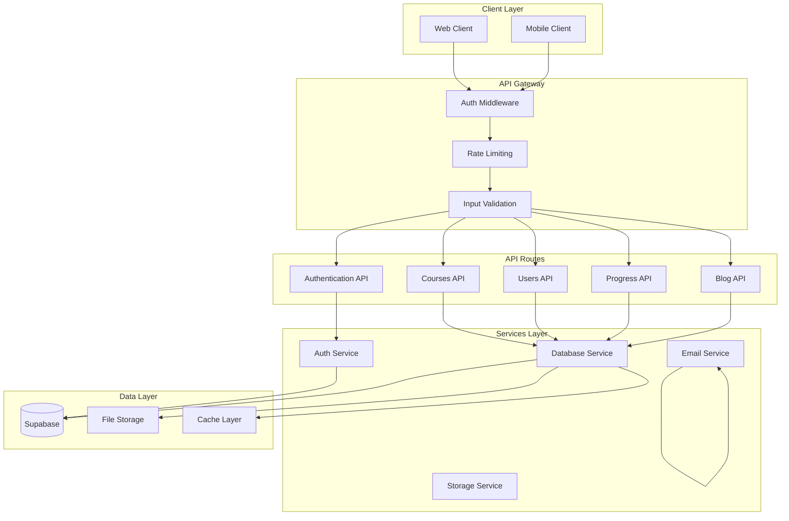

# API Design Documentation

## Overview

The Stelarow Habilidade platform uses Next.js 14 App Router API routes to create a RESTful API with standardized responses, comprehensive error handling, and role-based access control.

## API Architecture



## API Standards and Conventions

### 1. Response Format
All API endpoints follow a standardized response format:

```typescript
interface ApiResponse<T> {
  data: T
  error?: string
  message?: string
  meta?: {
    timestamp: string
    requestId: string
    version: string
  }
}

interface PaginatedResponse<T> {
  data: T[]
  pagination: {
    page: number
    pageSize: number
    total: number
    totalPages: number
    hasMore: boolean
  }
  error?: string
  message?: string
}
```

### 2. HTTP Status Codes
- `200` - Success
- `201` - Created
- `400` - Bad Request (validation errors)
- `401` - Unauthorized (authentication required)
- `403` - Forbidden (insufficient permissions)
- `404` - Not Found
- `409` - Conflict (duplicate resources)
- `422` - Unprocessable Entity (business logic errors)
- `429` - Too Many Requests (rate limiting)
- `500` - Internal Server Error

### 3. Error Handling
```typescript
// Standardized error response
interface ApiError {
  error: string
  message: string
  details?: any
  code?: string
  field?: string // For validation errors
}

// Error handling utility
export function handleApiError(error: any, context?: string): Response {
  const timestamp = new Date().toISOString()
  const requestId = crypto.randomUUID()
  
  // Log error for monitoring
  console.error(`API Error [${requestId}]:`, {
    error,
    context,
    timestamp
  })
  
  // Database connection errors
  if (error.code === 'CONNECTION_ERROR') {
    return NextResponse.json(
      {
        error: 'Database connection failed',
        message: 'Please try again later',
        code: 'DB_CONNECTION_ERROR',
        meta: { timestamp, requestId }
      },
      { status: 503 }
    )
  }
  
  // Validation errors
  if (error.name === 'ValidationError') {
    return NextResponse.json(
      {
        error: 'Validation failed',
        message: error.message,
        details: error.details,
        code: 'VALIDATION_ERROR',
        meta: { timestamp, requestId }
      },
      { status: 400 }
    )
  }
  
  // Permission errors
  if (error.message.includes('Insufficient permissions')) {
    return NextResponse.json(
      {
        error: 'Insufficient permissions',
        message: 'You do not have permission to perform this action',
        code: 'PERMISSION_DENIED',
        meta: { timestamp, requestId }
      },
      { status: 403 }
    )
  }
  
  // Default error
  return NextResponse.json(
    {
      error: 'Internal server error',
      message: 'An unexpected error occurred',
      code: 'INTERNAL_ERROR',
      meta: { timestamp, requestId }
    },
    { status: 500 }
  )
}
```

## Authentication & Authorization

### API Route Protection
```typescript
// Authentication middleware for API routes
export async function withAuth(
  handler: (request: NextRequest, user: User) => Promise<Response>,
  options?: {
    requiredRole?: UserRole
    requiredPermissions?: Permission[]
  }
) {
  return async function(request: NextRequest) {
    try {
      // Extract user from middleware headers
      const userId = request.headers.get('x-user-id')
      const userRole = request.headers.get('x-user-role') as UserRole
      const userEmail = request.headers.get('x-user-email')
      const userName = request.headers.get('x-user-name')
      
      if (!userId) {
        return NextResponse.json(
          { error: 'Authentication required' },
          { status: 401 }
        )
      }
      
      const user: User = {
        id: userId,
        email: userEmail || '',
        full_name: userName || '',
        role: userRole,
        created_at: new Date().toISOString(),
        updated_at: new Date().toISOString()
      }
      
      // Check role requirement
      if (options?.requiredRole && user.role !== options.requiredRole) {
        // Allow admin to access any role-protected route
        if (user.role !== 'admin') {
          return NextResponse.json(
            { error: 'Insufficient permissions' },
            { status: 403 }
          )
        }
      }
      
      // Check permissions
      if (options?.requiredPermissions) {
        const hasAllPermissions = options.requiredPermissions.every(
          permission => hasPermission(user, permission)
        )
        
        if (!hasAllPermissions) {
          return NextResponse.json(
            { error: 'Insufficient permissions' },
            { status: 403 }
          )
        }
      }
      
      return await handler(request, user)
      
    } catch (error) {
      return handleApiError(error, 'Authentication middleware')
    }
  }
}
```

### Usage Example
```typescript
// app/api/admin/users/route.ts
import { withAuth } from '@/lib/api/auth'

export const GET = withAuth(
  async (request: NextRequest, user: User) => {
    // Handler logic here
    const users = await getUsersList()
    return NextResponse.json({ data: users })
  },
  {
    requiredRole: 'admin',
    requiredPermissions: ['admin.users.view']
  }
)
```

## Core API Endpoints

### 1. Authentication API

#### POST /api/auth/register
```typescript
// Registration endpoint
interface RegisterRequest {
  email: string
  password: string
  fullName: string
  role?: UserRole
}

interface RegisterResponse {
  data: {
    user: User
    session: Session
  }
}

export async function POST(request: NextRequest) {
  try {
    const body: RegisterRequest = await request.json()
    
    // Validate input
    const validationResult = validateRegistration(body)
    if (!validationResult.success) {
      return NextResponse.json(
        { error: 'Validation failed', details: validationResult.errors },
        { status: 400 }
      )
    }
    
    // Create user account
    const { data, error } = await supabase.auth.signUp({
      email: body.email,
      password: body.password,
      options: {
        data: {
          full_name: body.fullName,
          role: body.role || 'student'
        }
      }
    })
    
    if (error) throw error
    
    return NextResponse.json({
      data: {
        user: data.user,
        session: data.session
      },
      message: 'Registration successful'
    }, { status: 201 })
    
  } catch (error) {
    return handleApiError(error, 'User registration')
  }
}
```

#### POST /api/auth/login
```typescript
interface LoginRequest {
  email: string
  password: string
}

export async function POST(request: NextRequest) {
  try {
    const body: LoginRequest = await request.json()
    
    const { data, error } = await supabase.auth.signInWithPassword(body)
    
    if (error) throw error
    
    // Update last login
    await supabase
      .from('users')
      .update({ last_login: new Date().toISOString() })
      .eq('id', data.user.id)
    
    return NextResponse.json({
      data: {
        user: data.user,
        session: data.session
      },
      message: 'Login successful'
    })
    
  } catch (error) {
    return handleApiError(error, 'User login')
  }
}
```

### 2. Users API

#### GET /api/users/profile
```typescript
export const GET = withAuth(async (request: NextRequest, user: User) => {
  try {
    const { data: profile, error } = await supabase
      .from('users')
      .select(`
        *,
        instructors (
          id,
          bio,
          expertise,
          rating,
          total_reviews
        )
      `)
      .eq('id', user.id)
      .single()
    
    if (error) throw error
    
    return NextResponse.json({ data: profile })
    
  } catch (error) {
    return handleApiError(error, 'Get user profile')
  }
})
```

#### PUT /api/users/profile
```typescript
interface UpdateProfileRequest {
  full_name?: string
  avatar_url?: string
  preferences?: Record<string, any>
}

export const PUT = withAuth(async (request: NextRequest, user: User) => {
  try {
    const body: UpdateProfileRequest = await request.json()
    
    const { data, error } = await supabase
      .from('users')
      .update({
        ...body,
        updated_at: new Date().toISOString()
      })
      .eq('id', user.id)
      .select()
      .single()
    
    if (error) throw error
    
    return NextResponse.json({
      data,
      message: 'Profile updated successfully'
    })
    
  } catch (error) {
    return handleApiError(error, 'Update user profile')
  }
})
```

### 3. Courses API

#### GET /api/courses
```typescript
interface CourseFilters {
  category?: string
  level?: 'beginner' | 'intermediate' | 'advanced'
  search?: string
  instructor?: string
  page?: number
  pageSize?: number
  sortBy?: 'created_at' | 'title' | 'rating' | 'price'
  sortOrder?: 'asc' | 'desc'
}

export async function GET(request: NextRequest) {
  try {
    const { searchParams } = new URL(request.url)
    const filters: CourseFilters = {
      category: searchParams.get('category') || undefined,
      level: searchParams.get('level') as any || undefined,
      search: searchParams.get('search') || undefined,
      instructor: searchParams.get('instructor') || undefined,
      page: parseInt(searchParams.get('page') || '1'),
      pageSize: parseInt(searchParams.get('pageSize') || '10'),
      sortBy: searchParams.get('sortBy') as any || 'created_at',
      sortOrder: searchParams.get('sortOrder') as any || 'desc'
    }
    
    let query = supabase
      .from('courses')
      .select(`
        *,
        categories (name, slug, color_theme),
        instructors (
          id,
          user_id,
          users (full_name, avatar_url)
        ),
        _count:lessons(count)
      `, { count: 'exact' })
      .eq('is_published', true)
    
    // Apply filters
    if (filters.category) {
      query = query.eq('categories.slug', filters.category)
    }
    
    if (filters.level) {
      query = query.eq('level', filters.level)
    }
    
    if (filters.search) {
      query = query.ilike('title', `%${filters.search}%`)
    }
    
    if (filters.instructor) {
      query = query.eq('instructor_id', filters.instructor)
    }
    
    // Apply sorting
    query = query.order(filters.sortBy, { ascending: filters.sortOrder === 'asc' })
    
    // Apply pagination
    const from = (filters.page - 1) * filters.pageSize
    const to = from + filters.pageSize - 1
    query = query.range(from, to)
    
    const { data: courses, error, count } = await query
    
    if (error) throw error
    
    const totalPages = Math.ceil((count || 0) / filters.pageSize)
    
    return NextResponse.json({
      data: courses,
      pagination: {
        page: filters.page,
        pageSize: filters.pageSize,
        total: count || 0,
        totalPages,
        hasMore: filters.page < totalPages
      }
    })
    
  } catch (error) {
    return handleApiError(error, 'Get courses')
  }
}
```

#### POST /api/courses
```typescript
interface CreateCourseRequest {
  title: string
  description: string
  short_description?: string
  category_id: string
  price: number
  level: 'beginner' | 'intermediate' | 'advanced'
  requirements: string[]
  what_you_learn: string[]
  thumbnail_url?: string
  video_preview_url?: string
}

export const POST = withAuth(
  async (request: NextRequest, user: User) => {
    try {
      const body: CreateCourseRequest = await request.json()
      
      // Get instructor record
      const { data: instructor } = await supabase
        .from('instructors')
        .select('id')
        .eq('user_id', user.id)
        .single()
      
      if (!instructor) {
        return NextResponse.json(
          { error: 'Instructor profile required' },
          { status: 400 }
        )
      }
      
      // Generate slug from title
      const slug = generateSlug(body.title)
      
      const { data: course, error } = await supabase
        .from('courses')
        .insert({
          ...body,
          slug,
          instructor_id: instructor.id,
          is_published: false
        })
        .select()
        .single()
      
      if (error) throw error
      
      return NextResponse.json({
        data: course,
        message: 'Course created successfully'
      }, { status: 201 })
      
    } catch (error) {
      return handleApiError(error, 'Create course')
    }
  },
  {
    requiredPermissions: ['instructor.courses.create']
  }
)
```

### 4. Enrollments API

#### POST /api/enrollments
```typescript
interface CreateEnrollmentRequest {
  course_id: string
  modality?: 'online' | 'in-person'
  schedule_preferences?: {
    days: number[]
    time_slots: string[]
    instructor_preference?: string
  }
}

export const POST = withAuth(async (request: NextRequest, user: User) => {
  try {
    const body: CreateEnrollmentRequest = await request.json()
    
    // Check if already enrolled
    const { data: existingEnrollment } = await supabase
      .from('enrollments')
      .select('id')
      .eq('user_id', user.id)
      .eq('course_id', body.course_id)
      .single()
    
    if (existingEnrollment) {
      return NextResponse.json(
        { error: 'Already enrolled in this course' },
        { status: 409 }
      )
    }
    
    // Create enrollment
    const { data: enrollment, error } = await supabase
      .from('enrollments')
      .insert({
        user_id: user.id,
        course_id: body.course_id,
        modality: body.modality || 'online',
        status: 'active'
      })
      .select()
      .single()
    
    if (error) throw error
    
    // Create schedule if in-person and preferences provided
    if (body.modality === 'in-person' && body.schedule_preferences) {
      // Schedule creation logic here
    }
    
    return NextResponse.json({
      data: enrollment,
      message: 'Enrollment created successfully'
    }, { status: 201 })
    
  } catch (error) {
    return handleApiError(error, 'Create enrollment')
  }
})
```

### 5. Progress API

#### GET /api/progress/:lessonId
```typescript
export const GET = withAuth(async (request: NextRequest, user: User) => {
  try {
    const lessonId = request.nextUrl.pathname.split('/').pop()
    
    const { data: progress, error } = await supabase
      .from('progress')
      .select(`
        *,
        lessons (
          id,
          title,
          video_duration,
          course_id
        )
      `)
      .eq('user_id', user.id)
      .eq('lesson_id', lessonId)
      .single()
    
    if (error && error.code !== 'PGRST116') throw error
    
    return NextResponse.json({
      data: progress || {
        user_id: user.id,
        lesson_id: lessonId,
        completed: false,
        last_position: 0,
        watch_time: 0
      }
    })
    
  } catch (error) {
    return handleApiError(error, 'Get lesson progress')
  }
})
```

#### PUT /api/progress/:lessonId
```typescript
interface UpdateProgressRequest {
  last_position: number
  watch_time: number
  completed?: boolean
}

export const PUT = withAuth(async (request: NextRequest, user: User) => {
  try {
    const lessonId = request.nextUrl.pathname.split('/').pop()
    const body: UpdateProgressRequest = await request.json()
    
    // Get enrollment for this lesson
    const { data: enrollment } = await supabase
      .from('enrollments')
      .select('id')
      .eq('user_id', user.id)
      .eq('course_id', (
        supabase
          .from('lessons')
          .select('course_id')
          .eq('id', lessonId)
          .single()
      ))
      .single()
    
    if (!enrollment) {
      return NextResponse.json(
        { error: 'Not enrolled in this course' },
        { status: 403 }
      )
    }
    
    const { data: progress, error } = await supabase
      .from('progress')
      .upsert({
        user_id: user.id,
        lesson_id: lessonId,
        enrollment_id: enrollment.id,
        ...body,
        completed_at: body.completed ? new Date().toISOString() : null,
        updated_at: new Date().toISOString()
      })
      .select()
      .single()
    
    if (error) throw error
    
    // Update enrollment progress percentage
    await updateEnrollmentProgress(enrollment.id)
    
    return NextResponse.json({
      data: progress,
      message: 'Progress updated successfully'
    })
    
  } catch (error) {
    return handleApiError(error, 'Update lesson progress')
  }
})
```

## Input Validation

### Validation Schemas
```typescript
import { z } from 'zod'

export const schemas = {
  // User registration
  registerUser: z.object({
    email: z.string().email('Invalid email address'),
    password: z.string()
      .min(8, 'Password must be at least 8 characters')
      .regex(/[A-Z]/, 'Password must contain uppercase letter')
      .regex(/[a-z]/, 'Password must contain lowercase letter')
      .regex(/[0-9]/, 'Password must contain number')
      .regex(/[^A-Za-z0-9]/, 'Password must contain special character'),
    fullName: z.string().min(2, 'Full name must be at least 2 characters'),
    role: z.enum(['student', 'instructor', 'admin']).optional()
  }),
  
  // Course creation
  createCourse: z.object({
    title: z.string().min(5, 'Title must be at least 5 characters'),
    description: z.string().min(50, 'Description must be at least 50 characters'),
    short_description: z.string().max(200, 'Short description too long').optional(),
    category_id: z.string().uuid('Invalid category ID'),
    price: z.number().min(0, 'Price cannot be negative'),
    level: z.enum(['beginner', 'intermediate', 'advanced']),
    requirements: z.array(z.string()).max(10, 'Too many requirements'),
    what_you_learn: z.array(z.string()).max(15, 'Too many learning objectives')
  }),
  
  // Progress update
  updateProgress: z.object({
    last_position: z.number().min(0, 'Position cannot be negative'),
    watch_time: z.number().min(0, 'Watch time cannot be negative'),
    completed: z.boolean().optional()
  })
}

// Validation middleware
export function validateRequest<T>(schema: z.ZodSchema<T>) {
  return async (request: NextRequest): Promise<T | Response> => {
    try {
      const body = await request.json()
      return schema.parse(body)
    } catch (error) {
      if (error instanceof z.ZodError) {
        return NextResponse.json(
          {
            error: 'Validation failed',
            details: error.errors.map(err => ({
              field: err.path.join('.'),
              message: err.message
            }))
          },
          { status: 400 }
        )
      }
      throw error
    }
  }
}
```

## Rate Limiting

```typescript
// Simple in-memory rate limiter
const rateLimiter = new Map<string, { count: number; resetTime: number }>()

export function rateLimit(
  identifier: string,
  maxRequests: number = 100,
  windowMs: number = 15 * 60 * 1000 // 15 minutes
): boolean {
  const now = Date.now()
  const record = rateLimiter.get(identifier)
  
  if (!record || now > record.resetTime) {
    rateLimiter.set(identifier, { count: 1, resetTime: now + windowMs })
    return true
  }
  
  if (record.count >= maxRequests) {
    return false
  }
  
  record.count++
  return true
}

// Rate limiting middleware
export function withRateLimit(
  handler: (request: NextRequest) => Promise<Response>,
  options: { maxRequests?: number; windowMs?: number } = {}
) {
  return async function(request: NextRequest) {
    const identifier = request.ip || request.headers.get('x-forwarded-for') || 'unknown'
    
    if (!rateLimit(identifier, options.maxRequests, options.windowMs)) {
      return NextResponse.json(
        {
          error: 'Too many requests',
          message: 'Rate limit exceeded. Please try again later.'
        },
        { status: 429 }
      )
    }
    
    return handler(request)
  }
}
```

## API Testing

### Test Utilities
```typescript
// API testing helper
export class ApiTestHelper {
  private baseUrl: string
  private headers: Record<string, string>
  
  constructor(baseUrl: string = 'http://localhost:3000/api') {
    this.baseUrl = baseUrl
    this.headers = { 'Content-Type': 'application/json' }
  }
  
  setAuth(token: string) {
    this.headers['Authorization'] = `Bearer ${token}`
  }
  
  async request(
    method: string,
    endpoint: string,
    data?: any
  ): Promise<{ status: number; data: any }> {
    const response = await fetch(`${this.baseUrl}${endpoint}`, {
      method,
      headers: this.headers,
      body: data ? JSON.stringify(data) : undefined
    })
    
    const responseData = await response.json()
    
    return {
      status: response.status,
      data: responseData
    }
  }
  
  // Convenience methods
  get = (endpoint: string) => this.request('GET', endpoint)
  post = (endpoint: string, data: any) => this.request('POST', endpoint, data)
  put = (endpoint: string, data: any) => this.request('PUT', endpoint, data)
  delete = (endpoint: string) => this.request('DELETE', endpoint)
}
```

### Example Tests
```typescript
import { ApiTestHelper } from './api-test-helper'

describe('Courses API', () => {
  const api = new ApiTestHelper()
  
  beforeAll(async () => {
    // Setup test authentication
    const loginResponse = await api.post('/auth/login', {
      email: 'test@example.com',
      password: 'testpass123'
    })
    
    api.setAuth(loginResponse.data.session.access_token)
  })
  
  test('GET /api/courses returns paginated courses', async () => {
    const response = await api.get('/courses?page=1&pageSize=5')
    
    expect(response.status).toBe(200)
    expect(response.data.data).toHaveLength(5)
    expect(response.data.pagination).toHaveProperty('total')
    expect(response.data.pagination).toHaveProperty('hasMore')
  })
  
  test('POST /api/courses creates new course with valid data', async () => {
    const courseData = {
      title: 'Test Course',
      description: 'A comprehensive test course for developers',
      category_id: 'uuid-here',
      price: 99.99,
      level: 'beginner',
      requirements: ['Basic programming knowledge'],
      what_you_learn: ['API design', 'Testing strategies']
    }
    
    const response = await api.post('/courses', courseData)
    
    expect(response.status).toBe(201)
    expect(response.data.data).toHaveProperty('id')
    expect(response.data.data.title).toBe(courseData.title)
  })
})
```

## Documentation Generation

### OpenAPI Schema
```typescript
// Generate OpenAPI documentation
export const openApiSpec = {
  openapi: '3.0.0',
  info: {
    title: 'Stelarow Habilidade API',
    version: '1.0.0',
    description: 'Educational platform API'
  },
  servers: [
    { url: 'https://api.habilidade.com', description: 'Production' },
    { url: 'http://localhost:3000/api', description: 'Development' }
  ],
  paths: {
    '/courses': {
      get: {
        summary: 'List courses',
        tags: ['Courses'],
        parameters: [
          {
            name: 'page',
            in: 'query',
            schema: { type: 'integer', default: 1 }
          },
          {
            name: 'pageSize',
            in: 'query',
            schema: { type: 'integer', default: 10 }
          }
        ],
        responses: {
          200: {
            description: 'List of courses',
            content: {
              'application/json': {
                schema: {
                  type: 'object',
                  properties: {
                    data: {
                      type: 'array',
                      items: { $ref: '#/components/schemas/Course' }
                    },
                    pagination: { $ref: '#/components/schemas/Pagination' }
                  }
                }
              }
            }
          }
        }
      }
    }
  },
  components: {
    schemas: {
      Course: {
        type: 'object',
        properties: {
          id: { type: 'string', format: 'uuid' },
          title: { type: 'string' },
          description: { type: 'string' },
          price: { type: 'number' },
          level: { type: 'string', enum: ['beginner', 'intermediate', 'advanced'] }
        }
      },
      Pagination: {
        type: 'object',
        properties: {
          page: { type: 'integer' },
          pageSize: { type: 'integer' },
          total: { type: 'integer' },
          totalPages: { type: 'integer' },
          hasMore: { type: 'boolean' }
        }
      }
    }
  }
}
```

This comprehensive API design provides a solid foundation for the educational platform with proper authentication, validation, error handling, and documentation.